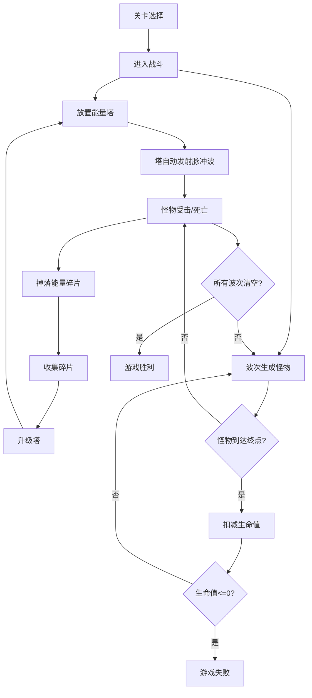

## 1. 产品概述

「能量潮汐」是一款赛博朋克风格的 2D 塔防游戏。玩家在地图上放置能量塔，塔周期性释放脉冲波击退从屏幕边缘涌来的暗影怪物。通过收集怪物掉落的能量碎片升级塔的能力，挑战多关卡递进式难度。
- 目标用户：休闲与中度策略游戏玩家
- 核心价值：融合策略布局与视觉冲击的沉浸式塔防体验

## 2. 核心功能

### 2.1 功能模块

1. **游戏战斗界面**：Canvas 画布渲染游戏场景，包括能量塔、怪物、脉冲波、粒子特效
2. **关卡选择界面**：展示多关卡入口，解锁进度
3. **游戏结束面板**：胜利/失败判定与统计

### 2.2 页面详情

| 页面名称 | 模块名称 | 功能描述 |
|---------|---------|---------|
| 游戏战斗界面 | Canvas 游戏区域 | 渲染能量塔、暗影怪物、脉冲波扩散、粒子拖尾、路径可视化 |
| 游戏战斗界面 | HUD 顶栏 | 显示当前波次、剩余生命值、能量碎片数量 |
| 游戏战斗界面 | 塔放置面板 | 点击地图空位放置能量塔，消耗碎片 |
| 游戏战斗界面 | 升级面板 | 选中塔后弹出毛玻璃面板，升级射程/伤害/射速 |
| 游戏战斗界面 | 攻击范围可视化 | 选中塔时显示霓虹圆环表示攻击范围 |
| 关卡选择界面 | 关卡地图 | 展示 3 个关卡节点，带解锁/锁定状态 |
| 游戏结束面板 | 胜利面板 | 显示关卡完成、碎片收益、进入下一关按钮 |
| 游戏结束面板 | 失败面板 | 显示失败原因、重试按钮 |

## 3. 核心流程

1. 玩家从关卡选择界面进入某一关卡
2. 关卡开始后，怪物按预设波次从路径起点沿路线行进
3. 玩家点击地图空位放置能量塔，塔自动对范围内敌人发射脉冲波
4. 脉冲波以光晕圆环扩散，对范围内怪物造成伤害
5. 怪物死亡后掉落能量碎片，玩家点击或自动收集
6. 玩家选中已有塔可消耗碎片升级（射程/伤害/射速）
7. 所有波次清空 → 胜利；怪物到达终点生命值归零 → 失败

## 4. 用户界面设计

### 4.1 设计风格

- **主色调**：深蓝紫渐变背景 (#0a0a2e → #1a0a3e)
- **辅助色**：霓虹青 (#00fff0)、霓虹粉 (#ff00aa)、霓虹紫 (#a855f7)
- **按钮风格**：圆角霓虹描边按钮，hover 时发光增强
- **字体**：Orbitron（标题/数字）、Rajdhani（正文/UI）
- **布局**：全屏 Canvas + 覆盖层毛玻璃面板
- **图标风格**：线条霓虹风，使用 lucide-react

### 4.2 页面设计概览

| 页面名称 | 模块名称 | UI 元素 |
|---------|---------|---------|
| 游戏战斗界面 | Canvas 区域 | 深蓝紫渐变背景、霓虹渐变色塔、暗影怪物、光晕脉冲波、粒子拖尾 |
| 游戏战斗界面 | HUD 顶栏 | 毛玻璃条、Orbitron 字体数字、lucide 图标 |
| 游戏战斗界面 | 升级面板 | 居中毛玻璃卡片、霓虹描边按钮、属性进度条 |
| 关卡选择界面 | 关卡节点 | 发光圆形节点、连线、锁定图标 |

### 4.3 响应式适配

- 桌面优先设计（1920×1080 基准）
- 平板适配（768px 以上），Canvas 等比缩放
- 触控支持：点击放置/选中、拖动地图

### 4.4 性能目标

- 60fps 稳定帧率
- 粒子数量上限控制（最大 500 个活跃粒子）
- Canvas 双缓冲渲染
- requestAnimationFrame 驱动主循环
