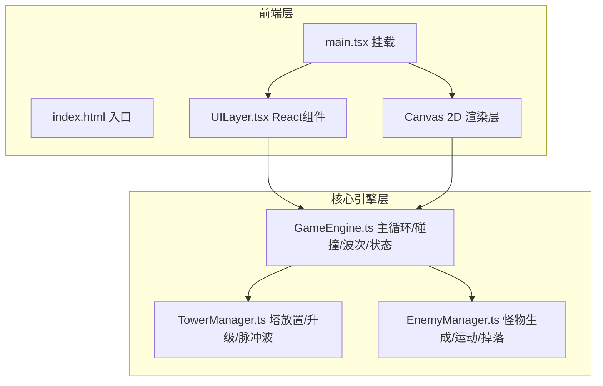

## 1. 架构设计



## 2. 技术说明

- 前端：React 18 + TypeScript + Vite
- 渲染：Canvas 2D API（无第三方渲染库）
- 状态管理：React useState/useRef + 游戏引擎内部状态
- 初始化工具：Vite (react-ts 模板)
- 后端：无
- 数据库：无（关卡数据内嵌）

## 3. 路由定义

| 路由 | 用途 |
|------|------|
| / | 游戏主入口，含关卡选择与战斗画面 |

## 4. 核心数据结构

### 4.1 关卡数据

```typescript
interface LevelData {
  id: number;
  name: string;
  pathPoints: { x: number; y: number }[];
  waves: WaveData[];
  startEnergy: number;
  maxLives: number;
}

interface WaveData {
  enemyCount: number;
  enemyHp: number;
  enemySpeed: number;
  spawnInterval: number;
}
```

### 4.2 能量塔数据

```typescript
interface Tower {
  id: number;
  x: number;
  y: number;
  level: number;
  range: number;
  damage: number;
  fireRate: number;
  lastFireTime: number;
  color: string;
}

interface PulseWave {
  x: number;
  y: number;
  radius: number;
  maxRadius: number;
  damage: number;
  alpha: number;
}
```

### 4.3 怪物数据

```typescript
interface Enemy {
  id: number;
  x: number;
  y: number;
  hp: number;
  maxHp: number;
  speed: number;
  pathIndex: number;
  pathProgress: number;
  dropValue: number;
}

interface EnergyShard {
  x: number;
  y: number;
  value: number;
  alpha: number;
  lifetime: number;
}
```

## 5. 渲染策略

- Canvas 双层：底层静态路径 + 顶层动态实体
- 主循环：requestAnimationFrame 驱动，deltaTime 计算保证帧率无关
- 碰撞检测：圆形碰撞（塔范围 vs 怪物位置，脉冲波半径 vs 怪物位置）
- 粒子系统：对象池复用，最大 500 活跃粒子
- 脉冲波渲染：渐变光晕圆环 + 透明度衰减
- 毛玻璃 UI：CSS backdrop-filter: blur() + 半透明背景
