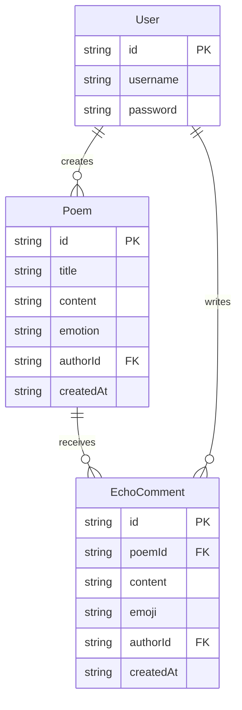

## 1. 架构设计

```mermaid
graph TB
    subgraph "前端 (React + TypeScript + Vite)"
        "页面路由" --> "诗歌列表页"
        "页面路由" --> "登录/注册页"
        "页面路由" --> "诗歌详情页"
        "PoemEngine.ts" --> "情感分析"
        "PoemEngine.ts" --> "插画参数计算"
        "VisualCanvas.ts" --> "粒子流渲染"
        "VisualCanvas.ts" --> "波动线条渲染"
        "PoemCard.tsx" --> "VisualCanvas.ts"
        "EchoComment.tsx" --> "评论列表"
        "api/index.ts" --> "FastAPI后端"
    end
    subgraph "后端 (FastAPI)"
        "诗歌CRUD API" --> "内存数据存储"
        "回声评论API" --> "内存数据存储"
    end
    subgraph "本地存储"
        "localStorage" --> "用户会话"
        "localStorage" --> "诗歌缓存"
    end
```

## 2. 技术说明

- **前端**：React@18 + TypeScript + Vite + Tailwind CSS@3 + Zustand
- **初始化工具**：vite-init (react-ts 模板)
- **后端**：FastAPI + Uvicorn (Python)
- **数据库**：内存数据存储 + localStorage（前端缓存和用户会话）
- **Canvas动画**：原生Canvas 2D API + requestAnimationFrame
- **路由**：react-router-dom@6
- **图标**：lucide-react

## 3. 路由定义

| 路由 | 用途 |
|------|------|
| `/login` | 登录/注册页 |
| `/` | 诗歌列表页（瀑布流） |
| `/poem/:id` | 诗歌详情页（含回声评论） |

## 4. API定义

### 4.1 诗歌相关

```typescript
interface Poem {
  id: string;
  title: string;
  content: string;
  emotion: "happy" | "sad" | "calm" | "angry" | "surprised";
  author: string;
  authorId: string;
  createdAt: string;
  illustration: IllustrationParams;
}

interface IllustrationParams {
  gradientColors: [string, string, string];
  particleCount: number;
  waveAmplitude: number;
  waveFrequency: number;
  particleSpeed: number;
  particleSize: number;
}

// GET /api/poems - 获取所有诗歌
// GET /api/poems/:id - 获取单首诗歌
// POST /api/poems - 创建诗歌
// DELETE /api/poems/:id - 删除诗歌
```

### 4.2 回声评论相关

```typescript
interface EchoComment {
  id: string;
  poemId: string;
  content: string;
  emoji: string;
  author: string;
  authorId: string;
  createdAt: string;
}

// GET /api/poems/:id/echoes - 获取诗歌的回声评论
// POST /api/poems/:id/echoes - 添加回声评论
```

### 4.3 用户相关

```typescript
interface User {
  id: string;
  username: string;
  password: string;
}

// 前端localStorage模拟，不走后端API
```

## 5. 服务器架构图

```mermaid
graph LR
    "FastAPI Router" --> "PoemService"
    "FastAPI Router" --> "EchoService"
    "PoemService" --> "内存数据存储"
    "EchoService" --> "内存数据存储"
```

## 6. 数据模型

### 6.1 数据模型定义



### 6.2 核心模块说明

**PoemEngine.ts（核心引擎）**
- 诗歌CRUD操作
- 情感分析：基于关键词映射（如"花开""阳光"→快乐，"落叶""孤独"→悲伤）
- 插画参数计算：根据情感标签和关键词生成颜色渐变方案、粒子数量/速度/大小、波动幅度/频率

**VisualCanvas.ts（Canvas绘图模块）**
- 粒子系统：根据IllustrationParams绘制飘浮粒子，支持缓动和交互响应
- 波动线条：正弦波叠加，根据情感调整振幅和频率
- 渐变背景：三色渐变，根据情感标签变化
- 60fps渲染循环，使用requestAnimationFrame

**api/index.ts（API封装层）**
- 封装所有与FastAPI后端的HTTP请求
- 包含降级策略：后端不可用时使用localStorage模拟数据
