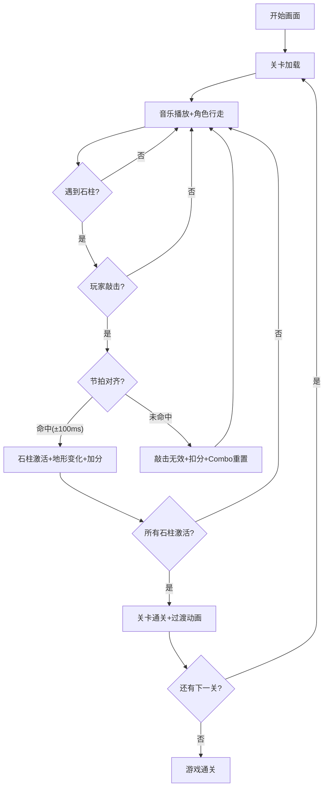

## 1. 产品概述

「图腾之息」是一款2D节奏解谜游戏，玩家扮演在大地之灵引导下的祭司，通过踩准背景音乐节拍敲击图腾石柱来改变地形和机关状态。游戏将节奏游戏的精准打击感与解谜游戏的策略性结合，配合原始部落风的视觉风格，创造独特的沉浸式体验。

- 目标用户：喜欢节奏游戏和解谜游戏的休闲及核心玩家
- 核心价值：将节拍精准度与地形操控机制融合，提供新颖的节奏解谜玩法

## 2. 核心功能

### 2.1 功能模块

1. **游戏主页面**：俯视视角的圆形祭坛场景，6根不同颜色图腾石柱，玩家自动行走，节拍条与评分系统
2. **关卡系统**：多关卡递进，不同BPM和音乐风格，关卡通关与失败判定
3. **节拍检测系统**：基于Web Audio API的节拍解析与同步，±100ms容差判定

### 2.2 页面详情

| 页面名称 | 模块名称 | 功能描述 |
|---------|---------|---------|
| 游戏主页面 | 祭坛场景 | Canvas绘制的俯视圆形祭坛，6根彩色图腾石柱环绕，玩家角色顺时针自动行走 |
| 游戏主页面 | 节拍条 | 底部半透明毛玻璃节拍条，显示强拍和弱拍，预判下一拍位置 |
| 游戏主页面 | 评分系统 | 左上角Combo连击计数，右上角关卡进度（已激活石柱数），敲击评分反馈 |
| 游戏主页面 | 石柱交互 | 按空格/点击敲击石柱，石柱发光+音效+符文脉冲动画，对应地形升降 |
| 关卡过渡 | 过渡动画 | 渐变图腾旋转动画，伴随低沉号角声 |
| 开始画面 | 标题画面 | 游戏标题"图腾之息"，开始按钮，部落风装饰元素 |

## 3. 核心流程

玩家进入游戏 → 选择关卡/开始游戏 → 玩家角色自动绕祭坛行走 → 背景音乐播放，节拍条显示节拍 → 玩家遇到石柱时按空格/点击 → 节拍检测判定是否命中 → 命中则石柱激活，地形变化 → 连续命中积累Combo → 激活所有石柱则通关 → 失败则重新开始本关卡

## 4. 用户界面设计

### 4.1 设计风格

- **主色调**：深棕(#3D2B1F)、赭石(#CC7722)、暗红(#8B1A1A)构成原始部落色系
- **辅助色**：石柱各有独立颜色（红、橙、黄、绿、青、紫），发光时饱和度提升
- **背景纹理**：木纹和皮革纹理，粗糙颗粒感，石柱有流线型符文
- **字体**：标题使用粗犷装饰性字体，正文使用易读的无衬线字体
- **布局**：中央祭坛占据主要画面，UI元素以HUD形式叠加
- **动画**：石柱符文发光脉冲、地形升降过渡、节拍条流动、Combo数字弹跳
- **按钮风格**：石材质感的圆角按钮，带刻痕纹理

### 4.2 页面设计概述

| 页面名称 | 模块名称 | UI元素 |
|---------|---------|--------|
| 游戏主页面 | 祭坛场景 | 深棕地面纹理，中央圆形祭坛，6根石柱（粗糙颗粒材质+流线型符文），玩家角色 |
| 游戏主页面 | 节拍条 | 底部半透明毛玻璃条，节拍标记（强点大/弱点小），从右向左流动 |
| 游戏主页面 | Combo计数 | 左上角大字体Combo数字，命中时弹跳放大，未命中时抖动变红 |
| 游戏主页面 | 关卡进度 | 右上角石柱图标阵列，已激活的亮起，未激活的暗淡 |
| 游戏主页面 | 敲击反馈 | 石柱发光+符文脉冲扩散环+对应颜色粒子 |
| 开始画面 | 标题区域 | "图腾之息"大标题，部落风装饰边框，背景火焰粒子 |
| 关卡过渡 | 过渡动画 | 图腾石柱旋转渐变，暗色遮罩，号角声 |

### 4.3 响应式适配

- 桌面端：键盘空格键为主要交互，Canvas全屏
- 移动端：触摸点击为主要交互，Canvas自适应缩放，UI元素尺寸适配
- 触摸优化：增大石柱点击区域，节拍条高度增加便于触控

### 4.4 2D场景渲染指导

- 使用HTML5 Canvas进行2D渲染，60fps目标帧率
- 祭坛和石柱使用程序化绘制（渐变、纹理叠加、阴影）
- 符文和脉冲环使用Canvas路径绘制+发光效果(shadowBlur)
- 地形升降使用平滑插值动画
- 玩家角色使用简单的圆形+三角形指示方向
- 粒子系统用于敲击反馈和背景氛围

## 5. 关卡设计

| 关卡 | 音乐风格 | BPM | 石柱数 | 特殊机制 |
|------|---------|-----|--------|---------|
| 第1关 | 部落鼓点 | 90 | 6 | 基础节拍，容差±100ms |
| 第2关 | 部落鼓点+人声 | 105 | 6 | 加入弱拍石柱 |
| 第3关 | 电子节拍混合 | 120 | 6 | 交替强弱拍 |
| 第4关 | 电子节拍 | 140 | 6 | 快速连击段 |
