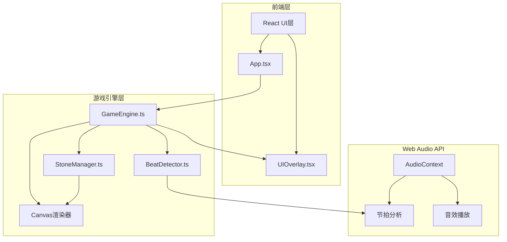

## 1. 架构设计



## 2. 技术说明

- **前端框架**：React@18 + TypeScript
- **构建工具**：Vite
- **样式方案**：Tailwind CSS + CSS自定义属性（部落风主题）
- **音频处理**：Web Audio API（节拍检测、音效合成）
- **渲染引擎**：HTML5 Canvas 2D（60fps游戏主场景）
- **状态管理**：Zustand（游戏状态与UI状态同步）
- **后端**：无（纯前端项目）
- **数据**：关卡配置为JSON内联数据

## 3. 路由定义

| 路由 | 用途 |
|------|------|
| / | 游戏主页面（含开始画面、游戏画面、过渡画面） |

## 4. 模块架构

### 4.1 GameEngine.ts — 主引擎

```
职责：
- 管理游戏主循环（requestAnimationFrame，60fps）
- 关卡切换与状态机（MENU / PLAYING / TRANSITION / GAME_OVER）
- 集成BeatDetector和StoneManager
- 节拍检测判定（±100ms容差）
- 评分系统（Combo、分数、关卡进度）
- Canvas场景渲染调度
- 键盘/触摸事件分发

核心接口：
- start(): void — 启动游戏循环
- stop(): void — 停止游戏循环
- loadLevel(level: LevelConfig): void — 加载关卡
- handleInput(): void — 处理玩家输入
- getCurrentState(): GameState — 获取当前游戏状态
```

### 4.2 BeatDetector.ts — 节拍检测器

```
职责：
- 从音频文件/合成节拍中解析BPM和节拍时间点
- 实时追踪当前节拍位置
- 判断玩家输入是否在节拍窗口内
- 提供节拍预判数据（供UI显示节拍条）

核心接口：
- loadBeatMap(config: BeatMapConfig): void — 加载节拍映射
- start(): void — 开始节拍追踪
- stop(): void — 停止
- checkBeat(inputTime: number): BeatResult — 检测输入是否命中节拍
- getNextBeats(count: number): BeatInfo[] — 获取未来N拍信息
- getCurrentBeatProgress(): number — 获取当前拍内进度
```

### 4.3 StoneManager.ts — 石柱管理器

```
职责：
- 管理6根图腾石柱的状态（未激活/已激活/失效）
- 石柱敲击动画（发光、符文脉冲、粒子效果）
- 地形变化管理（台阶升起/桥梁出现）
- 石柱音效触发

核心接口：
- initStones(stoneConfigs: StoneConfig[]): void — 初始化石柱
- activateStone(index: number): boolean — 激活石柱
- failStone(index: number): void — 石柱敲击失败
- update(deltaTime: number): void — 更新动画状态
- render(ctx: CanvasRenderingContext2D): void — 渲染石柱
- getTerrainState(): TerrainState — 获取当前地形状态
```

### 4.4 UIOverlay.tsx — UI叠加层

```
职责：
- Combo连击计数显示（左上角）
- 关卡进度显示（右上角，已激活石柱数）
- 节拍条（底部半透明毛玻璃，显示强拍弱拍）
- 敲击评分反馈（Perfect/Good/Miss文字动画）
- 开始画面与游戏结束画面

组件结构：
- UIOverlay — 主容器
  - ComboDisplay — 连击计数
  - ProgressDisplay — 关卡进度
  - BeatBar — 节拍条
  - ScoreFeedback — 评分反馈
  - StartScreen — 开始画面
  - GameOverScreen — 游戏结束画面
```

## 5. 数据模型

### 5.1 核心类型定义

```typescript
type GameState = 'MENU' | 'PLAYING' | 'TRANSITION' | 'GAME_OVER'

interface LevelConfig {
  id: number
  name: string
  bpm: number
  musicStyle: string
  beatMap: number[]
  stones: StoneConfig[]
  tolerance: number
}

interface StoneConfig {
  index: number
  color: string
  glowColor: string
  angle: number
  frequency: number
  terrainChange: TerrainChange
}

interface TerrainChange {
  type: 'bridge' | 'step'
  region: number
  direction: 'up' | 'down'
}

interface BeatResult {
  hit: boolean
  quality: 'perfect' | 'good' | 'miss'
  deviation: number
}

interface GameScore {
  combo: number
  maxCombo: number
  totalScore: number
  activatedStones: number
  totalStones: number
}
```

## 6. 音频架构

- 使用Web Audio API的OscillatorNode合成石柱音效（6种不同音高）
- 使用AudioBufferSourceNode播放背景节拍（程序化生成鼓点/电子节拍）
- 节拍条数据来源于BeatDetector的预判接口
- 关卡过渡号角声使用低频振荡器+滤波器合成

## 7. 性能要求

- Canvas渲染保持60fps
- 使用requestAnimationFrame，避免setTimeout
- 粒子数量上限100，超出时回收最旧粒子
- 音频节点及时释放，避免内存泄漏
- 移动端Canvas分辨率按devicePixelRatio缩放后限制最大2x
