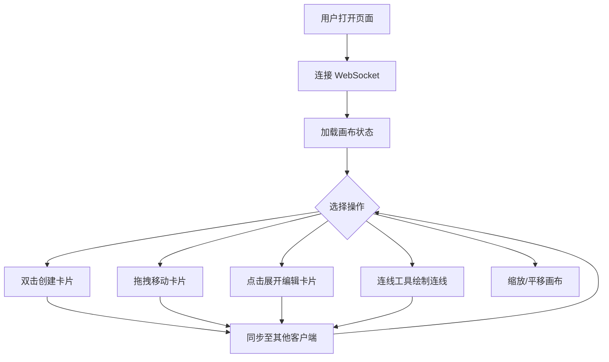

## 1. 产品概述

「灵感编织」是一款在线协作式头脑风暴白板工具，让团队可以在无限画布上自由创建便签卡片、绘制连线和箭头，以可视化的方式捕捉、连接和整理想法。支持多人实时协作编辑，所有修改通过 WebSocket 即时同步至所有客户端。

- **核心价值**：降低团队头脑风暴的协作门槛，让远程团队也能像站在同一块白板前一样高效地碰撞灵感
- **目标用户**：产品经理、设计师、开发者及任何需要进行远程头脑风暴和想法整理的团队

## 2. 核心功能

### 2.1 用户角色

| 角色 | 进入方式 | 核心权限 |
|------|----------|----------|
| 协作者 | 打开页面自动加入 | 创建/移动/删除卡片、绘制连线、编辑文字、变更颜色 |
| 观察者 | 只读模式加入 | 查看画布内容、缩放平移 |

### 2.2 功能模块

1. **画布工作区**：无限画布，支持缩放（0.25x ~ 3x）和平移，所有操作流畅响应
2. **便签卡片**：创建、移动、删除卡片；编辑文字内容；从预设色板变更颜色；点击展开查看详情
3. **连线系统**：在卡片之间绘制带箭头的连线，连线具有缓动流动动画
4. **实时协作**：多人同时编辑，所有操作通过 WebSocket 实时同步
5. **画布控制**：缩放滑块、平移切换、清空画布等控制组件

### 2.3 页面详情

| 页面名称 | 模块名称 | 功能描述 |
|----------|----------|----------|
| 画布工作区 | 无限画布 | 支持鼠标拖拽平移、滚轮缩放，双击创建新卡片 |
| 画布工作区 | 便签卡片 | 渲染单个便签，毛玻璃效果、阴影悬停、点击展开动画，支持编辑文字和变色 |
| 画布工作区 | 连线系统 | 卡片间连线，带箭头和流动动画，自动跟随卡片位置更新 |
| 画布工作区 | 画布控制栏 | 缩放滑块、适应画布按钮、清空画布按钮，毛玻璃面板样式 |
| 画布工作区 | 协作指示器 | 显示在线协作者数量，光标位置同步（轻量） |

## 3. 核心流程

用户进入页面后自动连接 WebSocket 并加入协作房间。在画布上双击可创建便签卡片，拖拽卡片可移动位置。点击卡片可展开查看并编辑详细信息。通过连线工具在两个卡片之间绘制带箭头的连线。所有操作（创建、移动、编辑、删除、连线）均实时同步到其他协作者。

## 4. 用户界面设计

### 4.1 设计风格

- **主色调**：米白色 (#FAFAF5) 作为画布背景，淡蓝色 (#E3F0FA) 作为强调色
- **卡片样式**：毛玻璃效果（backdrop-filter: blur），柔和圆角（12px），轻微发光边缘（box-shadow），阴影悬停效果
- **字体**：使用 Noto Sans SC 作为主字体，搭配一个柔和的标题字体
- **布局**：自由画布布局，底部悬浮控制栏，右上角协作指示器
- **图标**：使用 Lucide Icons 风格的线性图标
- **动画**：卡片展开使用 spring 缓动动画，连线流动使用虚线动画，悬停使用 CSS transition

### 4.2 页面设计概览

| 页面名称 | 模块名称 | UI 元素 |
|----------|----------|---------|
| 画布工作区 | 无限画布 | 米白色网格点阵背景，CSS transform 实现缩放平移 |
| 画布工作区 | 便签卡片 | 毛玻璃背景、圆角、悬停阴影加深、点击弹性展开动画、预设色板按钮 |
| 画布工作区 | 连线系统 | SVG 路径渲染、虚线流动动画（strokeDashoffset）、箭头标记 |
| 画布工作区 | 画布控制栏 | 底部居中浮动面板、毛玻璃背景、缩放滑块、清空按钮、重置视图按钮 |
| 画布工作区 | 协作指示器 | 右上角小徽章、显示在线人数、毛玻璃背景 |

### 4.3 响应式

- **桌面端优先**：1920x1080 为基准设计，支持 1366x768 及以上分辨率
- **平板适配**：768px ~ 1024px 触控优化，增大触控热区，支持手势缩放和平移
- **触控优化**：卡片拖拽支持 touch 事件，双指缩放和平移

### 4.4 性能目标

- 画布操作保持 60fps 流畅渲染
- WebSocket 消息延迟 < 100ms（局域网）
- 卡片数量 100+ 时仍保持流畅交互
- 连线流动动画使用 requestAnimationFrame 驱动
