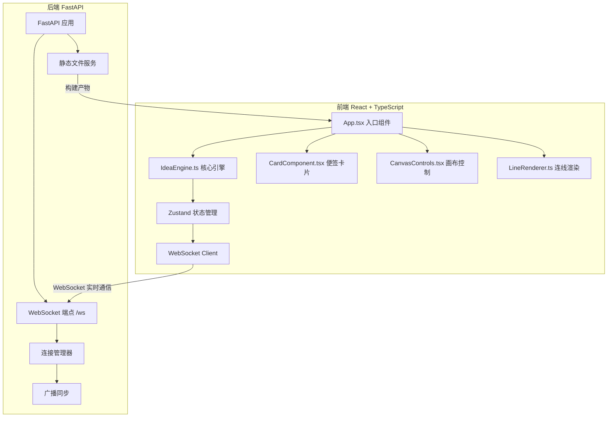
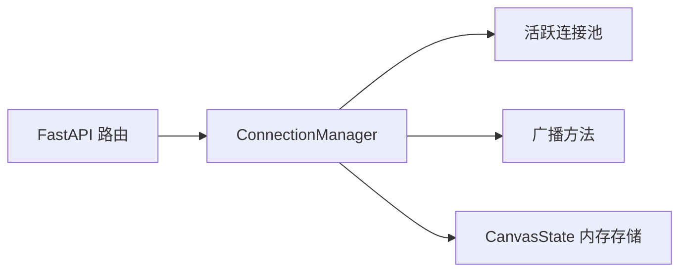
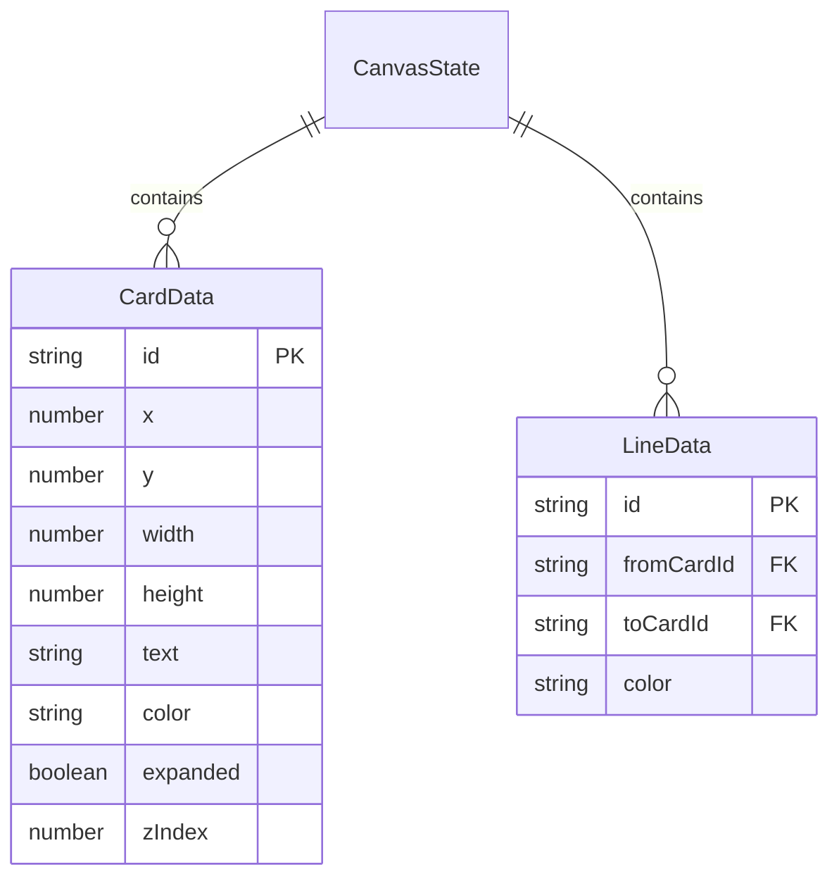

## 1. 架构设计



## 2. 技术说明

- **前端**：React 18 + TypeScript + Vite + Tailwind CSS + Zustand
- **初始化工具**：vite-init（react-ts 模板）
- **后端**：FastAPI (Python) + uvicorn，提供 WebSocket 端点和静态文件服务
- **数据库**：无（画布状态保存在内存中，由 FastAPI 服务端管理）
- **通信协议**：WebSocket，JSON 格式消息

## 3. 路由定义

| 路由 | 用途 |
|------|------|
| `/` | 主页面，加载 React 应用 |
| `/ws` | WebSocket 端点，实时同步画布状态 |

## 4. API 定义

### 4.1 WebSocket 消息类型

```typescript
interface WSMessage {
  type: 'card_create' | 'card_update' | 'card_delete' |
        'line_create' | 'line_delete' |
        'cursor_move' |
        'sync_full' | 'user_join' | 'user_leave';
  payload: Record<string, unknown>;
  userId: string;
  timestamp: number;
}

interface CardData {
  id: string;
  x: number;
  y: number;
  width: number;
  height: number;
  text: string;
  color: string;
  expanded: boolean;
  zIndex: number;
}

interface LineData {
  id: string;
  fromCardId: string;
  toCardId: string;
  color: string;
}

interface CanvasState {
  cards: Record<string, CardData>;
  lines: Record<string, LineData>;
}
```

### 4.2 消息流

- **客户端 → 服务端**：`card_create`, `card_update`, `card_delete`, `line_create`, `line_delete`, `cursor_move`
- **服务端 → 客户端**：`sync_full`（新用户加入时发送全量状态）、上述所有操作的广播、`user_join`, `user_leave`

## 5. 服务端架构



- **ConnectionManager**：管理所有 WebSocket 连接，维护画布状态，负责消息广播
- **CanvasState**：服务端内存中保存的画布状态，新用户连接时发送全量同步

## 6. 数据模型

### 6.1 数据模型定义



### 6.2 文件结构

```
├── api/                          # 后端 FastAPI
│   ├── main.py                   # FastAPI 应用入口
│   └── requirements.txt          # Python 依赖
├── src/                          # 前端源码
│   ├── IdeaEngine.ts             # 核心引擎（状态管理 + WebSocket 通信）
│   ├── CardComponent.tsx         # 便签卡片 React 组件
│   ├── CanvasControls.tsx        # 画布控制 React 组件
│   ├── LineRenderer.ts           # 连线渲染器
│   ├── App.tsx                   # 入口组件
│   ├── main.tsx                  # React 挂载点
│   └── index.css                 # 全局样式 + Tailwind
├── index.html                    # HTML 入口
├── package.json                  # 前端依赖和脚本
├── tsconfig.json                 # TypeScript 配置
├── vite.config.ts                # Vite 配置
├── tailwind.config.js            # Tailwind 配置
└── postcss.config.js             # PostCSS 配置
```
