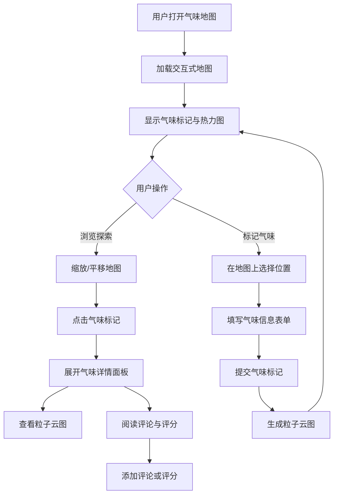

## 1. 产品概述

「气味地图」是一个在线交互式平台，让用户在地图上标记、分享和探索各种气味体验（咖啡香、雨后泥土味、海风咸腥等），通过热力图和粒子动画将抽象的嗅觉体验可视化为生动的数字景观。

- 目标用户：城市探索者、旅行爱好者、气味研究员、生活美学追求者
- 核心价值：将无形的嗅觉记忆转化为可浏览、可交互、可分享的数字地图，构建全球气味记忆社区

## 2. 核心功能

### 2.1 用户角色

| 角色 | 注册方式 | 核心权限 |
|------|----------|----------|
| 访客 | 无需注册 | 浏览地图、查看气味标记和热力图 |
| 用户 | 邮箱注册 | 标记气味、评分、评论、编辑/删除自己的标记 |

### 2.2 功能模块

1. **地图主页**：交互式地图、气味标记、热力图图层、控制面板
2. **气味详情面板**：气味信息卡片、粒子云图、评论区、评分

### 2.3 页面详情

| 页面名称 | 模块名称 | 功能描述 |
|----------|----------|----------|
| 地图主页 | 交互式地图 | 支持缩放和平移的地图画布，显示气味标记和热力图 |
| 地图主页 | 控制面板 | 毛玻璃效果面板，切换图层、筛选气味类型、搜索 |
| 地图主页 | 新增气味 | 点击地图位置弹出表单，填写气味名称、类型、情感标签 |
| 地图主页 | 热力图图层 | 基于气味密度和情感倾向的彩色热力图叠加层 |
| 地图主页 | 花粉粒子背景 | 飘浮的细小粒子营造自然氛围 |
| 气味详情面板 | 气味卡片 | 显示名称、emoji图标、评分、情感标签、编辑/删除按钮 |
| 气味详情面板 | 粒子云图 | 根据气味类型生成的动态粒子动画 |
| 气味详情面板 | 评论与评分 | 用户可添加评论和1-5星评分 |

## 3. 核心流程

**浏览与探索流程**：用户打开地图主页 → 地图加载显示所有气味标记和热力图 → 用户缩放/平移浏览不同区域 → 点击气味标记 → 展开气味详情面板查看粒子云图和评论 → 添加自己的评论或评分

**标记与分享流程**：用户在地图上长按/右键选择位置 → 弹出新增气味表单 → 填写气味名称、选择类型和情感标签 → 提交后标记出现在地图上 → 粒子云图自动生成 → 其他用户可见并可互动

## 4. 用户界面设计

### 4.1 设计风格

- 主色调：米白色（#FAF8F5）和淡绿色（#E8F0E4）
- 强调色：暖橙（#E8A87C）用于交互元素，深绿（#4A7C59）用于标题和重要信息
- 按钮风格：圆角胶囊按钮，柔和阴影，悬停时微微上浮
- 字体：标题使用 Playfair Display，正文使用 Noto Sans SC
- 布局风格：全屏地图为主画布，左侧毛玻璃侧边栏，右下角浮动控制面板
- 图标风格：简约线性图标（lucide-react），气味类型使用 emoji
- 毛玻璃效果：backdrop-filter: blur(20px)，半透明白色背景
- 柔和阴影：多层 box-shadow，低透明度，大扩散半径

### 4.2 页面设计概览

| 页面名称 | 模块名称 | UI 元素 |
|----------|----------|---------|
| 地图主页 | 交互式地图 | 全屏Canvas地图、气味标记点（emoji + 圆形底色）、热力图叠加层、缩放控件 |
| 地图主页 | 控制面板 | 毛玻璃侧边栏、气味类型筛选chips、搜索框、图层切换开关 |
| 地图主页 | 新增气味弹窗 | 居中模态框、气味名称输入、类型选择器、情感标签多选、位置确认 |
| 地图主页 | 花粉粒子背景 | 全屏Canvas、米白色半透明粒子、缓慢飘浮、大小和透明度随机 |
| 气味详情面板 | 气味卡片 | 毛玻璃卡片、emoji图标、气味名称、评分星级、情感标签pills、编辑/删除按钮 |
| 气味详情面板 | 粒子云图 | Canvas粒子动画、粒子大小和颜色根据气味类型变化、运动轨迹跟随情感倾向 |
| 气味详情面板 | 评论区 | 评论列表、评论输入框、用户头像、时间戳 |

### 4.3 响应式设计

- 桌面端（≥1024px）：全屏地图 + 左侧侧边栏 + 右侧详情面板
- 平板端（768px-1023px）：全屏地图 + 底部抽屉式面板 + 悬浮控制按钮
- 触摸优化：支持双指缩放、单指平移、长按添加标记
- 所有Canvas动画在低性能设备上自动降低粒子数量以维持60fps

### 4.4 动画与过渡

- 页面切换：缓动淡入动画（ease-out，300ms）
- 面板展开/收起：spring 弹性动画
- 卡片悬停：scale(1.02) + 阴影增强，200ms transition
- 热力图颜色过渡：300ms 缓动
- 粒子云图：持续60fps动画，粒子使用 requestAnimationFrame 驱动
- 气味标记出现：缩放弹入动画（scale 0→1，带 overshoot）
