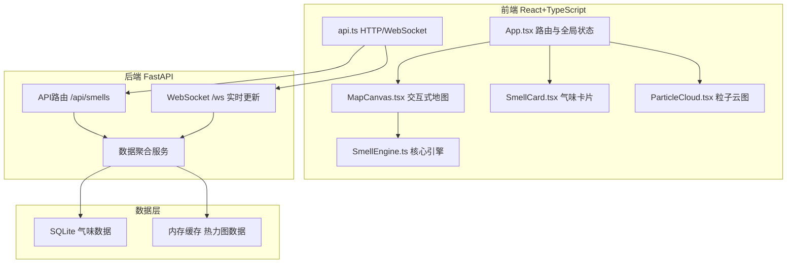
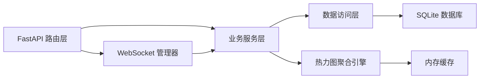
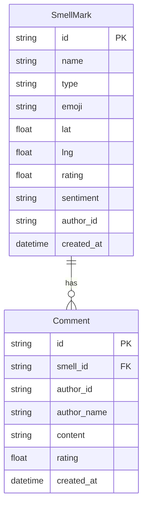

## 1. 架构设计



## 2. 技术说明

- 前端：React@18 + TypeScript + Vite + TailwindCSS + Zustand
- 初始化工具：vite-init (react-ts 模板)
- 后端：FastAPI (Python 3.11+)
- 数据库：SQLite（轻量级，无需额外安装）
- Canvas渲染：原生Canvas API（地图、热力图、粒子系统）
- 动画库：motion（React动画）
- 实时通信：WebSocket

## 3. 路由定义

| 路由 | 用途 |
|------|------|
| / | 地图主页，全屏交互式地图 |

（单页应用，所有交互在首页内完成，通过面板和弹窗展示不同功能）

## 4. API 定义

### 4.1 气味标记 CRUD

```typescript
interface SmellMark {
  id: string
  name: string
  type: SmellType
  emoji: string
  lat: number
  lng: number
  rating: number
  sentiment: Sentiment
  tags: string[]
  authorId: string
  createdAt: string
  comments: Comment[]
}

type SmellType = 'food' | 'nature' | 'urban' | 'floral' | 'industrial' | 'other'
type Sentiment = 'pleasant' | 'neutral' | 'unpleasant'

interface Comment {
  id: string
  authorId: string
  authorName: string
  content: string
  rating: number
  createdAt: string
}
```

### 4.2 REST 端点

| 方法 | 路径 | 请求体 | 响应 |
|------|------|--------|------|
| GET | /api/smells | - | SmellMark[] |
| GET | /api/smells/:id | - | SmellMark |
| POST | /api/smells | CreateSmellDTO | SmellMark |
| PUT | /api/smells/:id | UpdateSmellDTO | SmellMark |
| DELETE | /api/smells/:id | - | { success: boolean } |
| GET | /api/smells/heatmap | - | HeatmapData |
| POST | /api/smells/:id/comments | CreateCommentDTO | Comment |

### 4.3 WebSocket 消息

```typescript
interface WSMessage {
  type: 'smell_created' | 'smell_updated' | 'smell_deleted' | 'comment_added'
  payload: SmellMark | Comment | { id: string }
}
```

## 5. 服务端架构图



## 6. 数据模型

### 6.1 数据模型定义



### 6.2 数据定义语言

```sql
CREATE TABLE smell_marks (
  id TEXT PRIMARY KEY,
  name TEXT NOT NULL,
  type TEXT NOT NULL,
  emoji TEXT NOT NULL,
  lat REAL NOT NULL,
  lng REAL NOT NULL,
  rating REAL DEFAULT 0,
  sentiment TEXT DEFAULT 'neutral',
  tags TEXT DEFAULT '[]',
  author_id TEXT NOT NULL,
  created_at TEXT DEFAULT (datetime('now'))
);

CREATE TABLE comments (
  id TEXT PRIMARY KEY,
  smell_id TEXT NOT NULL REFERENCES smell_marks(id) ON DELETE CASCADE,
  author_id TEXT NOT NULL,
  author_name TEXT NOT NULL,
  content TEXT NOT NULL,
  rating INTEGER DEFAULT 5,
  created_at TEXT DEFAULT (datetime('now'))
);

CREATE INDEX idx_smells_location ON smell_marks(lat, lng);
CREATE INDEX idx_smells_type ON smell_marks(type);
CREATE INDEX idx_comments_smell ON comments(smell_id);
```
