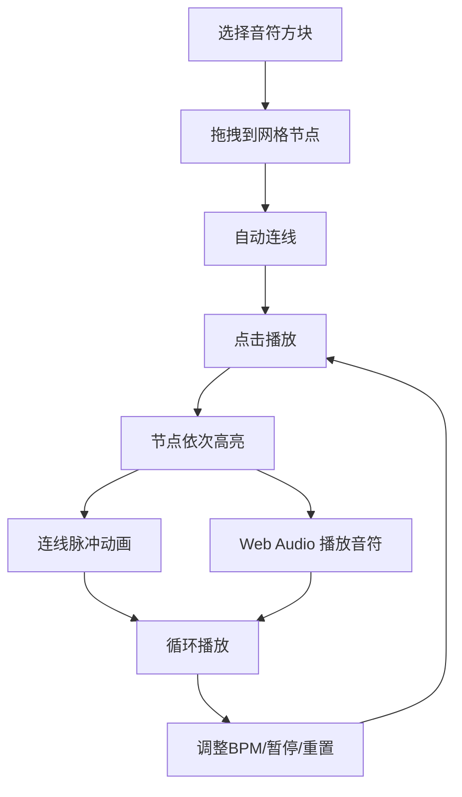

## 1. 产品概述

「幻音织网」是一款基于浏览器的2D音乐编织游戏，玩家在六边形网格上拖拽音符方块构建循环旋律路径，以赛博朋克霓虹风格呈现一张发光的音乐网。面向音乐爱好者、创意玩家和休闲用户，提供直觉式的音乐创作体验。

## 2. 核心功能

### 2.1 功能模块

1. **六边形网格画布**：可交互的六边形节点网格，支持音符方块的放置、拖拽和删除
2. **音符方块系统**：代表不同音高（C4-B5）和节奏（全音符/二分/四分/八分）的可拖拽方块
3. **连线与脉冲动画**：音符方块间自动连线，播放时产生节奏同步的脉冲光晕
4. **音频引擎**：基于 Web Audio API 的实时音高播放、BPM 控制、播放/暂停
5. **控制面板**：毛玻璃风格的播放控制、速度滑块、节拍指示器、重置按钮

### 2.2 页面详情

| 页面名称 | 模块名称 | 功能描述 |
|----------|----------|----------|
| 游戏主界面 | 六边形网格画布 | 渲染六边形网格、接受音符方块拖放、显示连线和脉冲动画 |
| 游戏主界面 | 音符方块面板 | 左侧音符选择面板，展示可用的音高和节奏类型 |
| 游戏主界面 | 控制面板 | 底部毛玻璃控制栏：播放/暂停、BPM滑块、节拍指示、重置按钮 |

## 3. 核心流程

1. 用户从音符面板选择音符方块（音高+节奏）
2. 拖拽方块到六边形网格的节点上
3. 相邻音符方块自动连线，形成旋律路径
4. 点击播放，高亮节点按节奏依次亮起，连线产生脉冲光晕
5. 同时 Web Audio API 按序播放对应音符
6. 用户可随时调整 BPM、暂停、重置

## 4. 用户界面设计

### 4.1 设计风格

- **主色调**：深黑背景 (#0a0a0f)，霓虹蓝 (#00d4ff) 到霓虹紫 (#b44aff) 渐变
- **辅助色**：霓虹粉 (#ff2d7b) 用于高亮活跃节点
- **方块样式**：圆角矩形，霓虹蓝紫渐变填充，外围发光阴影 (box-shadow glow)
- **连线样式**：半透明渐变线条，脉冲时亮度增强
- **字体**：Orbitron (科技感标题) + Exo 2 (正文/数字)
- **布局**：左侧音符面板 + 中央网格画布 + 底部控制栏
- **动画**：方块放置时缓动缩放 (scale 0→1 with ease-out)，拖拽时发光拖尾，连线脉冲发光

### 4.2 页面设计概览

| 页面名称 | 模块名称 | UI元素 |
|----------|----------|--------|
| 游戏主界面 | 六边形网格画布 | 深黑背景、半透明六边形轮廓线、节点悬停高亮、Canvas渲染 |
| 游戏主界面 | 音符方块面板 | 毛玻璃卡片、音高按钮行(C4-B5)、节奏类型行、当前选中高亮 |
| 游戏主界面 | 控制面板 | 毛玻璃底栏、播放/暂停图标按钮、BPM滑块(60-200)、节拍序号、重置按钮 |

### 4.3 响应式适配

- **桌面端**（≥1024px）：左侧面板 + 中央网格 + 底部控制栏三栏布局
- **平板端**（768px-1023px）：顶部面板折叠为水平条 + 中央网格 + 底部控制栏
- **触控优化**：方块拖拽支持触摸事件，按钮尺寸 ≥ 44px 触控区域

### 4.4 性能指标

- 帧率保持 60fps，使用 requestAnimationFrame 驱动渲染
- Canvas 渲染网格和连线动画，React 管理 UI 层
- 拖拽操作 16ms 内响应
