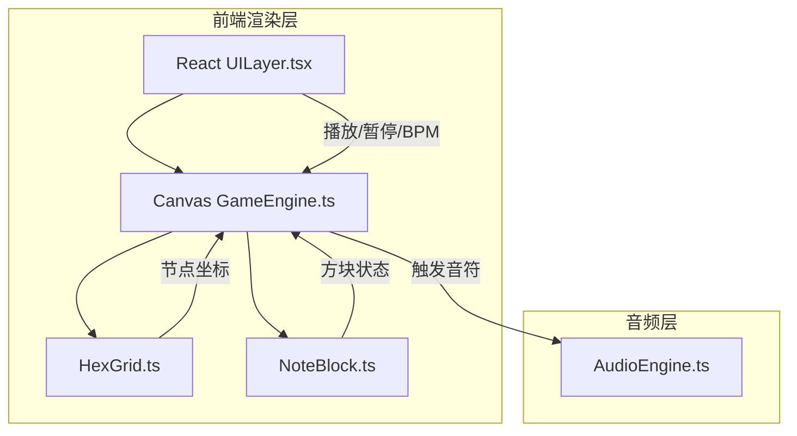

## 1. 架构设计



## 2. 技术选型

- **前端框架**：React 18 + TypeScript
- **构建工具**：Vite
- **样式方案**：Tailwind CSS + CSS Variables (霓虹色)
- **渲染方案**：HTML Canvas 2D (网格/连线/脉冲动画) + React DOM (控制面板)
- **音频**：Web Audio API (原生，无第三方库)
- **状态管理**：Zustand
- **图标**：lucide-react
- **字体**：Orbitron + Exo 2 (Google Fonts)

## 3. 路由定义

本项目为单页应用，无需路由。

| 路由 | 用途 |
|------|------|
| / | 游戏主界面 |

## 4. 文件结构

```
src/
  GameEngine.ts     — 核心引擎：requestAnimationFrame主循环、音符状态更新、连线脉冲动画、播放时序
  HexGrid.ts        — 六边形网格：网格生成、方块放置/删除、节点坐标转换（轴坐标→像素坐标）
  NoteBlock.ts      — 音符方块：渲染霓虹渐变方块、发光拖尾效果、拖拽和点击交互
  AudioEngine.ts    — 音频引擎：Web Audio API封装、音高映射、节奏播放、BPM/暂停控制
  UILayer.tsx       — UI层：React控制面板组件（播放/暂停、BPM滑块、节拍指示、毛玻璃重置按钮）
  store.ts          — Zustand全局状态：播放状态、BPM、当前选中音符、网格节点数据
  App.tsx           — 主入口：整合Canvas和React UI层
  main.tsx          — React渲染入口
  index.css         — 全局样式、CSS变量、字体引入
```

## 5. 核心模块设计

### 5.1 AudioEngine.ts

```typescript
class AudioEngine {
  private ctx: AudioContext
  private masterGain: GainNode
  private bpm: number
  private playing: boolean

  playNote(frequency: number, duration: number): void
  setBpm(bpm: number): void
  play(): void
  pause(): void
  getBeatDuration(): number
}
```

- 音高映射：C4(261.63) 到 B5(987.77)，12个半音
- 节奏映射：全音符(4拍)、二分(2拍)、四分(1拍)、八分(0.5拍)
- 使用 OscillatorNode + GainNode 包络（ADSR简化版）
- 空闲时 AudioContext 挂起，播放时恢复

### 5.2 HexGrid.ts

```typescript
class HexGrid {
  private cols: number
  private rows: number
  private hexSize: number
  private nodes: Map<string, HexNode>

  generate(): HexNode[]
  pixelToAxial(px: number, py: number): AxialCoord | null
  axialToPixel(q: number, r: number): { x: number; y: number }
  placeNote(coord: AxialCoord, note: NoteData): boolean
  removeNote(coord: AxialCoord): NoteData | null
  getNeighbors(coord: AxialCoord): AxialCoord[]
  getOccupiedNodes(): HexNode[]
}
```

- 六边形使用平顶(flat-top)布局，轴坐标系统 (q, r)
- 网格约 7 列 × 6 行，hexSize 约 45px
- pixelToAxial 用于鼠标点击/拖拽释放时定位节点

### 5.3 NoteBlock.ts

```typescript
class NoteBlock {
  data: NoteData
  position: { x: number; y: number }
  scale: number
  glowIntensity: number
  dragging: boolean

  render(ctx: CanvasRenderingContext2D): void
  startDrag(): void
  endDrag(): void
  update(dt: number): void
}
```

- 渲染：圆角矩形 + 霓虹蓝紫线性渐变 + 外发光 (shadowBlur)
- 动画：放置时 scale 从 0 缓动到 1（ease-out），播放时 glow 脉冲
- 拖拽：跟踪鼠标位置，渲染半透明拖尾

### 5.4 GameEngine.ts

```typescript
class GameEngine {
  private canvas: HTMLCanvasElement
  private grid: HexGrid
  private audioEngine: AudioEngine
  private noteBlocks: NoteBlock[]
  private connections: Connection[]
  private playing: boolean
  private currentBeat: number
  private lastBeatTime: number

  start(): void
  stop(): void
  tick(timestamp: number): void
  render(): void
  handleDrop(coord: AxialCoord, note: NoteData): void
  handleClick(px: number, py: number): void
  setBpm(bpm: number): void
  togglePlay(): void
  reset(): void
}
```

- 主循环：requestAnimationFrame 驱动 tick → update → render
- 播放逻辑：根据 BPM 计算节拍间隔，currentBeat 递增，触发对应音符和脉冲
- 连线渲染：相邻已占节点间绘制渐变线，脉冲时亮度 + 宽度增加
- 节拍指示：当前播放节点外围高亮环

### 5.5 UILayer.tsx

React 组件，使用 Zustand store 读取/更新状态：
- `PlayPauseButton`：播放/暂停切换，图标使用 lucide-react
- `BpmSlider`：范围 60-200，步进 1，显示当前值
- `BeatIndicator`：显示当前节拍序号 / 总节拍数
- `ResetButton`：清空所有音符方块和连线
- `NoteSelector`：音高选择 + 节奏选择，当前选中高亮
- 整体使用 `backdrop-filter: blur()` 毛玻璃效果

## 6. 数据模型

### 6.1 核心类型

```typescript
interface NoteData {
  pitch: PitchName
  octave: number
  rhythm: RhythmType
  frequency: number
  beatDuration: number
}

type PitchName = 'C' | 'D' | 'E' | 'F' | 'G' | 'A' | 'B'
type RhythmType = 'whole' | 'half' | 'quarter' | 'eighth'

interface AxialCoord {
  q: number
  r: number
}

interface HexNode {
  coord: AxialCoord
  pixel: { x: number; y: number }
  note: NoteData | null
  active: boolean
  pulseIntensity: number
}

interface Connection {
  from: AxialCoord
  to: AxialCoord
  pulsePhase: number
}
```

### 6.2 Zustand Store

```typescript
interface GameStore {
  playing: boolean
  bpm: number
  currentBeat: number
  totalBeats: number
  selectedPitch: PitchName
  selectedRhythm: RhythmType
  nodes: Map<string, HexNode>
  togglePlay: () => void
  setBpm: (bpm: number) => void
  setSelectedPitch: (pitch: PitchName) => void
  setSelectedRhythm: (rhythm: RhythmType) => void
  reset: () => void
}
```
