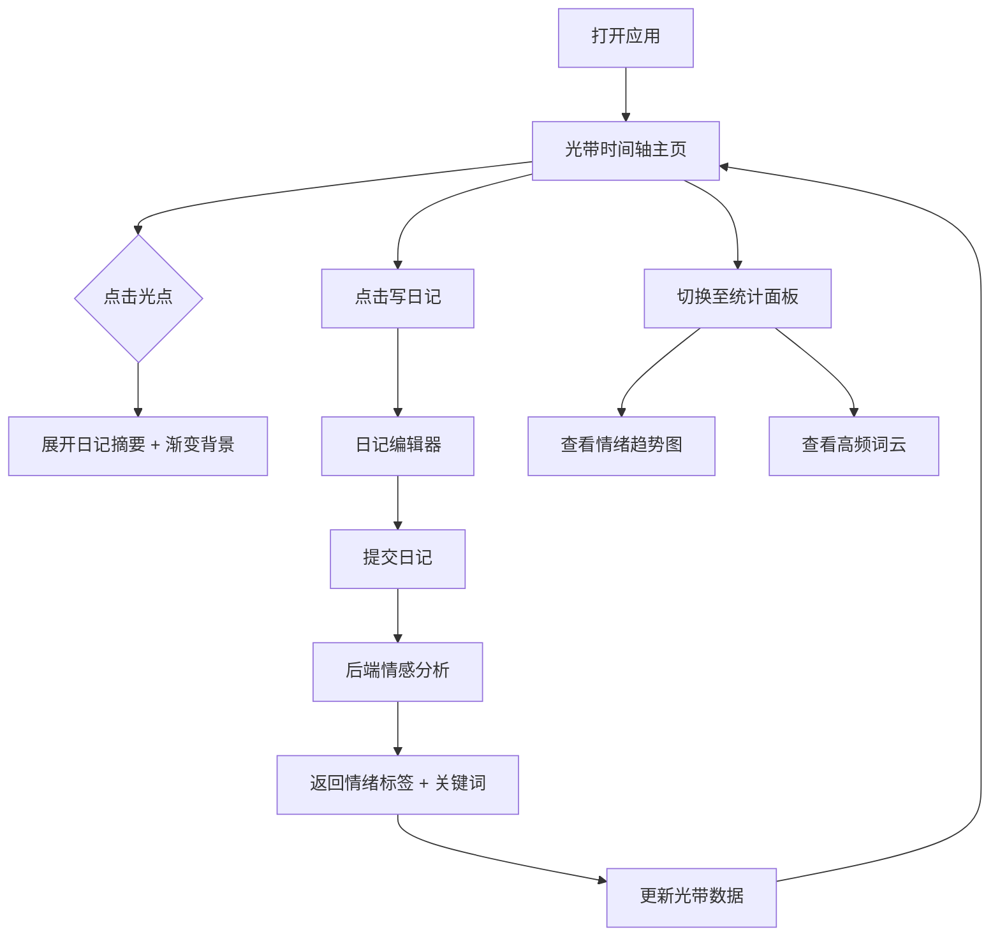

## 1. 产品概述

**记忆余晖** 是一款在线日记与情绪可视化平台，帮助用户通过每日书写记录内心世界，并以光带色彩的形式直观呈现情绪的流转与变化。目标用户为追求自我觉察与情感表达的青年群体，产品价值在于将抽象的情绪具象化为诗意的视觉体验，让回忆如余晖般温暖而绵长。

## 2. 核心功能

### 2.1 用户角色

| 角色 | 注册方式 | 核心权限 |
|------|----------|----------|
| 普通用户 | 无需注册（本地使用） | 创建、编辑、删除日记，查看情绪光带与统计 |

### 2.2 功能模块

1. **日记书写页**：日记编辑器、情感自动分析、保存与管理
2. **光带时间轴页**：Canvas 渲染的彩色光带时间轴，支持点击展开日记摘要
3. **统计面板页**：近一周情绪趋势折线图、高频情感词云

### 2.3 页面详情

| 页面名称 | 模块名称 | 功能描述 |
|----------|----------|----------|
| 日记书写页 | 日记编辑器 | 支持 Markdown 风格文本输入，自动保存草稿，创建/编辑/删除日记条目 |
| 日记书写页 | 情感分析提示 | 提交后自动调用后端情感分析 API，显示情感标签（积极/中性/消极） |
| 光带时间轴页 | 光带画布 | Canvas 绘制的水平流动光带，每天一个光点，颜色映射情绪（暖黄=积极、灰白=中性、冷蓝=消极） |
| 光带时间轴页 | 光点交互 | 悬停显示日期 tooltip，点击展开日记摘要卡片及抽象渐变背景 |
| 统计面板页 | 情绪趋势图 | Recharts 折线图展示近 7 天情绪分值变化趋势 |
| 统计面板页 | 词云展示 | 基于日记关键词生成的高频情感词云 |

## 3. 核心流程

用户打开应用后进入光带时间轴主页，可浏览历史情绪光点。点击"写日记"进入编辑页面，输入内容后提交，后端自动分析情感倾向并返回情绪标签和关键词。前端据此更新光带数据和统计面板。用户可随时切换至统计面板查看情绪趋势和词云。

## 4. 用户界面设计

### 4.1 设计风格

- **主色调**：米白色 (#FAF8F5) 和浅灰 (#E8E6E1) 底色
- **情绪色系**：暖黄 (#F5C542)、灰白 (#C8C8C8)、冷蓝 (#6BA3D6)
- **按钮风格**：圆角胶囊按钮，轻微发光边框，hover 时柔和放大
- **字体**：正文使用 Noto Serif SC（衬线体，诗意感），标题使用 ZCOOL XiaoWei
- **布局风格**：毛玻璃卡片居中布局，顶部导航切换页面
- **装饰风格**：背景缓慢飘浮的细小光点（黄昏飞尘效果），轻微的渐变叠加

### 4.2 页面设计概述

| 页面名称 | 模块名称 | UI 元素 |
|----------|----------|---------|
| 光带时间轴页 | 光带画布 | Canvas 全宽渲染，光点水平排列，缓动流动动画，悬停光晕效果 |
| 光带时间轴页 | 日记摘要弹窗 | 毛玻璃卡片，圆角 16px，内含日记摘要文本 + 抽象渐变背景图 |
| 日记书写页 | 编辑器区域 | 毛玻璃卡片内的 textarea，底部提交按钮带发光效果 |
| 日记书写页 | 情感标签 | 小圆角标签，颜色随情感变化，淡入动画 |
| 统计面板页 | 趋势折线图 | Recharts 折线图，柔和渐变填充，圆点标记 |
| 统计面板页 | 词云 | 自定义 Canvas 词云，字体大小映射词频，颜色映射情感 |

### 4.3 响应式设计

- 桌面端优先（≥1024px）：光带全宽展示，统计面板双列布局
- 平板端（768px-1023px）：光带适度缩放，统计面板单列
- 所有交互保持 60fps 流畅帧率
- Canvas 尺寸自适应容器宽度

### 4.4 动效设计

- 页面切换：缓动淡入淡出（ease-in-out，300ms）
- 光带光点：轻微呼吸脉冲动画
- 背景：CSS 关键帧驱动的光点飘浮效果
- 弹窗：scale + opacity 组合淡入
- 情感标签：fade-in 渐现
