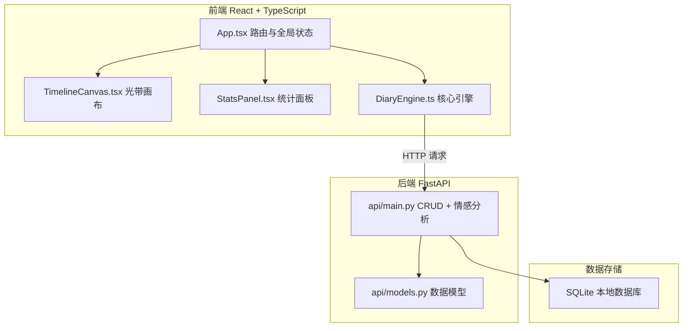
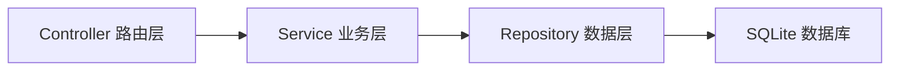
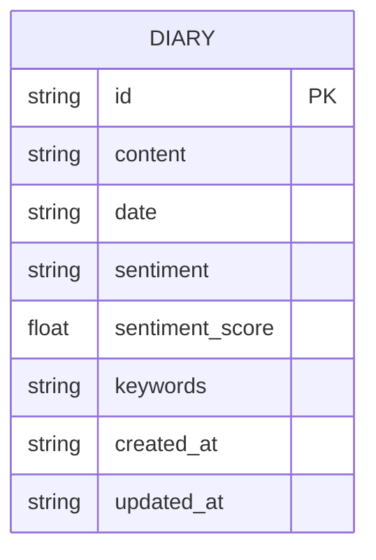

## 1. 架构设计



## 2. 技术说明

- **前端**：React 18 + TypeScript + Vite + Tailwind CSS + Zustand
- **初始化工具**：vite-init（react-ts 模板）
- **后端**：FastAPI + Uvicorn + TextBlob（情感分析）
- **数据库**：SQLite（通过 FastAPI 后端访问）
- **可视化库**：Recharts（折线图）、Canvas API（光带 + 词云）
- **动效**：CSS Keyframes + requestAnimationFrame

## 3. 路由定义

| 路由 | 用途 |
|------|------|
| `/` | 光带时间轴主页，展示情绪光带画布 |
| `/write` | 日记书写页，编辑和提交日记 |
| `/stats` | 统计面板页，情绪趋势和词云 |

## 4. API 定义

### 4.1 数据类型

```typescript
interface DiaryEntry {
  id: string;
  content: string;
  date: string;
  sentiment: "positive" | "neutral" | "negative";
  sentiment_score: number;
  keywords: string[];
  created_at: string;
  updated_at: string;
}

interface SentimentResponse {
  sentiment: "positive" | "neutral" | "negative";
  sentiment_score: number;
  keywords: string[];
}

interface TimelinePoint {
  date: string;
  sentiment: "positive" | "neutral" | "negative";
  sentiment_score: number;
  summary: string;
  keywords: string[];
}
```

### 4.2 API 端点

| 方法 | 路径 | 请求体 | 响应 | 说明 |
|------|------|--------|------|------|
| GET | `/api/diaries` | - | `DiaryEntry[]` | 获取所有日记 |
| GET | `/api/diaries/{id}` | - | `DiaryEntry` | 获取单条日记 |
| POST | `/api/diaries` | `{content: string, date: string}` | `DiaryEntry` | 创建日记（自动分析情感） |
| PUT | `/api/diaries/{id}` | `{content: string}` | `DiaryEntry` | 更新日记 |
| DELETE | `/api/diaries/{id}` | - | `{message: string}` | 删除日记 |
| POST | `/api/analyze` | `{content: string}` | `SentimentResponse` | 情感分析 |
| GET | `/api/timeline` | - | `TimelinePoint[]` | 获取光带时间轴数据 |

## 5. 服务端架构图



## 6. 数据模型

### 6.1 数据模型定义



### 6.2 数据定义语言

```sql
CREATE TABLE IF NOT EXISTS diaries (
    id TEXT PRIMARY KEY,
    content TEXT NOT NULL,
    date TEXT NOT NULL,
    sentiment TEXT NOT NULL CHECK(sentiment IN ('positive', 'neutral', 'negative')),
    sentiment_score REAL NOT NULL DEFAULT 0.0,
    keywords TEXT NOT NULL DEFAULT '[]',
    created_at TEXT NOT NULL,
    updated_at TEXT NOT NULL
);

CREATE INDEX IF NOT EXISTS idx_diaries_date ON diaries(date);
```
