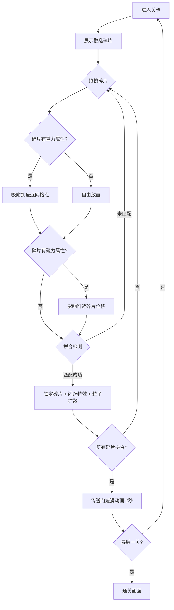

## 1. 产品概述

「虚境重构」是一款2D空间重构解谜游戏。玩家在由碎片化几何图形组成的无序场景中，通过点击和拖拽重新排列碎片，使其拼合成完整图案，从而开启通往下一关的传送门。目标用户为休闲解谜游戏爱好者，核心价值在于独特的空间思维挑战与极简未来风的视觉沉浸体验。

## 2. 核心功能

### 2.1 功能模块

1. **游戏主画面**：Canvas 渲染的碎片场景，支持拖拽交互、重力/磁力物理效果、拼合检测
2. **关卡系统**：至少5个关卡，每关碎片布局和拼合规则不同
3. **粒子特效系统**：拼合成功闪烁+光点扩散，传送门漩涡光纹动画
4. **UI 覆盖层**：关卡进度、步数统计、重置按钮、提示按钮

### 2.2 页面详情

| 页面名称 | 模块名称 | 功能描述 |
|---------|---------|---------|
| 游戏主画面 | 碎片场景 | Canvas 渲染碎片几何体，支持拖拽、碰撞检测、拼合判定 |
| 游戏主画面 | 传送门动画 | 所有碎片拼合成功后触发漩涡光纹动画，2秒后进入下一关 |
| 游戏主画面 | 关卡进度 | 右上角显示当前关卡编号和步数 |
| 游戏主画面 | 操作面板 | 左下角毛玻璃重置按钮和提示按钮（高亮下一个可交互碎片） |
| 游戏主画面 | 过关提示 | 拼合完成后显示过关动画，自动跳转下一关 |

## 3. 核心流程

1. 玩家进入关卡，看到散乱的几何碎片
2. 玩家点击并拖拽碎片到目标位置
3. 带重力属性的碎片拖拽释放时会吸附到最近网格点
4. 带磁力属性的碎片会吸引或排斥附近碎片
5. 碎片接近正确位置时触发拼合检测，匹配成功则锁定并触发闪烁+粒子特效
6. 所有碎片拼合完成后触发传送门漩涡动画
7. 漩涡动画持续2秒后自动进入下一关
8. 5关全部通过后显示通关画面

## 4. 用户界面设计

### 4.1 设计风格

- **主色调**：纯黑背景（#000000），碎片使用亮色半透明多边形（青色 #00FFD1、品红 #FF00AA、金色 #FFD700）
- **边缘光晕**：霓虹发光效果，使用 CSS shadow 和 Canvas glow 滤镜
- **按钮风格**：毛玻璃质感（backdrop-filter: blur），圆角，半透明白色边框
- **字体**：Orbitron（标题/数字），Rajdhani（正文/提示）
- **布局风格**：全屏 Canvas 游戏区域，UI 控件浮于画面之上
- **图标风格**：线条型图标，发光描边

### 4.2 页面设计概览

| 页面名称 | 模块名称 | UI 元素 |
|---------|---------|---------|
| 游戏主画面 | 碎片场景 | 纯黑背景，半透明霓虹多边形碎片，拖拽缓动跟随+弹性反馈 |
| 游戏主画面 | 传送门 | 漩涡状光纹动画，由内向外扩散的同心光环 |
| 游戏主画面 | 关卡进度 | 右上角半透明卡片，Orbitron 字体显示「LV.X」和步数 |
| 游戏主画面 | 操作面板 | 左下角毛玻璃按钮组，Reset 和 Hint 图标按钮 |
| 游戏主画面 | 粒子特效 | 拼合成功时光点向外扩散，渐变淡出 |

### 4.3 响应式适配

- 桌面端：Canvas 占满视口，UI 控件固定在角落
- 平板端：Canvas 自适应缩放，UI 控件适当放大（1.2x），触摸区域增大
- 移动端：UI 控件自动调整为更大尺寸（1.5x），按钮间距增加

### 4.4 关卡设计

| 关卡 | 碎片数 | 目标图案 | 特殊属性 | 难度 |
|------|-------|---------|---------|------|
| 第1关 | 4 | 正方形 | 无 | ★ |
| 第2关 | 6 | 三角形组合 | 2个碎片有重力属性 | ★★ |
| 第3关 | 8 | 六边形 | 3个碎片有磁力属性（吸引） | ★★★ |
| 第4关 | 10 | 菱形嵌套 | 重力+磁力（吸引+排斥） | ★★★★ |
| 第5关 | 12 | 星形 | 重力+磁力混合，碎片可旋转 | ★★★★★ |
