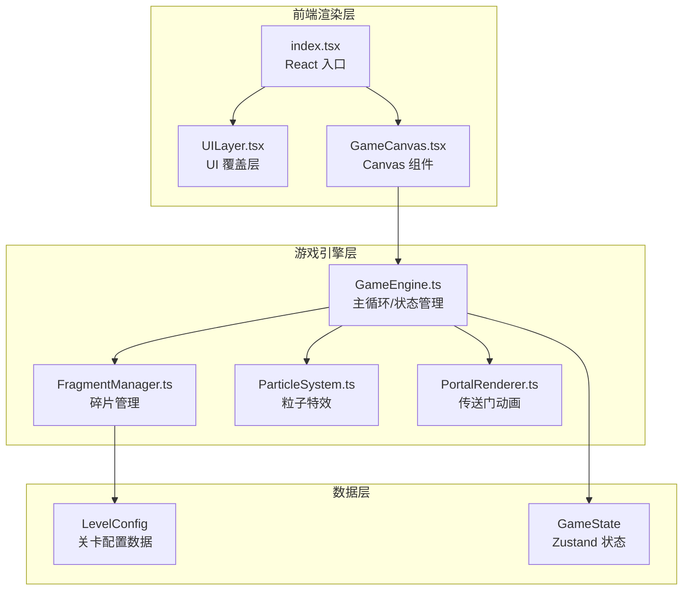

## 1. 架构设计



## 2. 技术说明

- **前端框架**：React 18 + TypeScript + Vite
- **样式方案**：TailwindCSS 3
- **状态管理**：Zustand（管理游戏状态、关卡进度、步数）
- **渲染引擎**：HTML5 Canvas 2D（requestAnimationFrame 驱动 60fps 主循环）
- **物理模拟**：自研轻量级物理（重力吸附、磁力影响），无第三方物理引擎
- **动画**：Canvas 绘制 + CSS 动画（UI 层）
- **初始化工具**：vite-init（react-ts 模板）

## 3. 路由定义

本项目为单页面游戏，无路由切换。所有内容在单一页面内通过状态切换呈现。

| 路由 | 用途 |
|------|------|
| / | 游戏主页面，包含所有关卡和 UI |

## 4. 核心模块设计

### 4.1 GameEngine.ts

- **主循环**：requestAnimationFrame 驱动，deltaTime 计算保证帧率无关
- **网格系统**：虚拟网格，碎片吸附到网格点
- **碰撞检测**：碎片间 AABB 碰撞检测
- **拼合判定**：碎片位置和旋转匹配目标时触发拼合
- **状态机**：IDLE → DRAGGING → SNAPPING → MERGED → PORTAL → NEXT_LEVEL

### 4.2 FragmentManager.ts

- **碎片生成**：根据关卡配置生成碎片实例
- **属性系统**：每个碎片可配置 gravity（重力）和 magnetic（磁力）属性
- **位置/旋转**：跟踪碎片当前位置、目标位置、旋转角度
- **缓动系统**：拖拽释放时缓动回弹，重力吸附时平滑过渡

### 4.3 ParticleSystem.ts

- **拼合粒子**：从碎片中心向外扩散的光点，渐变淡出
- **传送门粒子**：漩涡状光纹，同心环从内向外扩散
- **粒子池**：对象池管理粒子实例，避免 GC 压力

### 4.4 UILayer.tsx

- **关卡进度**：右上角显示 LV.X 和步数
- **重置按钮**：毛玻璃效果，重置当前关卡碎片位置
- **提示按钮**：高亮下一个可交互碎片（脉冲动画）
- **过关提示**：拼合完成后的过渡动画

### 4.5 关卡配置数据结构

```typescript
interface LevelConfig {
  id: number;
  fragmentCount: number;
  targetShape: 'square' | 'triangle' | 'hexagon' | 'diamond' | 'star';
  fragments: FragmentConfig[];
  gridSpacing: number;
}

interface FragmentConfig {
  shape: number[][]; // 多边形顶点
  color: string;
  targetPosition: { x: number; y: number };
  targetRotation: number;
  properties: {
    gravity: boolean;
    magnetic: 'attract' | 'repel' | 'none';
    magneticRange: number;
  };
}
```

## 5. 性能策略

- Canvas 2D 渲染，避免 DOM 操作开销
- 粒子对象池，减少内存分配
- requestAnimationFrame + deltaTime 保证帧率稳定
- 碎片碰撞检测使用空间哈希优化
- UI 层使用 React，游戏层使用 Canvas，两者解耦避免重渲染
