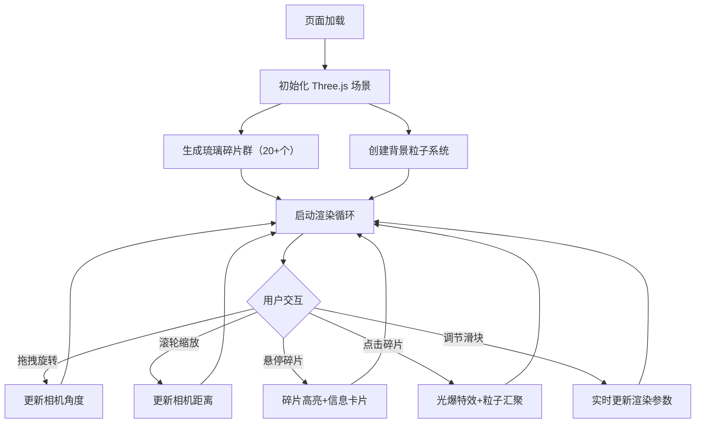

## 1. 产品概述

「琉璃光界」是一个基于 Three.js 的 3D 交互可视化项目，模拟彩色琉璃碎片在空间中悬浮旋转、折射光线并与鼠标产生动态光影交互。面向视觉艺术爱好者与前端技术展示场景，以梦幻琉璃美学打造沉浸式空间体验。

- 核心目标：通过自定义着色器实现真实感半透明多层折射效果，结合粒子系统与物理缓动呈现高质感 3D 交互场景
- 目标用户：视觉设计师、前端开发者、3D 艺术爱好者

## 2. 核心功能

### 2.1 功能模块

1. **3D 琉璃场景页**：悬浮琉璃碎片群、背景粒子、相机控制、交互反馈

### 2.2 页面详情

| 页面名称 | 模块名称 | 功能描述 |
|----------|----------|----------|
| 3D 琉璃场景 | 琉璃碎片系统 | 至少20个随机形状、大小、角度、半透明度的碎片，自定义着色器实现多层折射，围绕中心轴旋转+自转+浮动 |
| 3D 琉璃场景 | 鼠标悬停交互 | 碎片高亮发光、周围碎片变暗、毛玻璃信息卡片显示颜色/厚度/折射率 |
| 3D 琉璃场景 | 鼠标点击交互 | 光爆特效（碎片向外扩散0.5秒后归位）、背景粒子向点击位置汇聚闪烁 |
| 3D 琉璃场景 | 背景粒子系统 | 细小发光粒子如星光漂浮，受点击事件影响产生汇聚动画 |
| 3D 琉璃场景 | 控制面板 | 半透明毛玻璃面板，旋转速度/碎片透明度/折射强度三个滑块，重置视角按钮 |
| 3D 琉璃场景 | 相机控制 | 鼠标拖拽旋转视角、滚轮缩放、触摸板支持 |

## 3. 核心流程

用户打开页面后，场景自动加载并开始渲染：琉璃碎片群围绕中心轴缓慢旋转，每个碎片独立自转和浮动，背景星光粒子飘浮。用户可拖拽旋转视角和滚轮缩放来探索场景。悬停碎片时触发高亮+信息卡片，点击碎片触发光爆特效和粒子汇聚。通过右下角控制面板调节参数，所有操作实时生效。

## 4. 用户界面设计

### 4.1 设计风格

- **主色调**：浅灰渐变背景（#1a1a2e → #16213e → #0f3460），碎片为红橙黄绿蓝紫渐变半透明
- **碎片风格**：半透明彩色多边形，边缘柔和光晕（bloom 效果），自定义着色器实现多层折射
- **字体**：信息卡片使用圆润无衬线体，标题加粗
- **布局**：全屏3D场景，右下角悬浮控制面板
- **粒子风格**：细小圆形发光粒子，模拟星光效果
- **动效**：碎片旋转缓动（easing）、物理摆动、光爆扩散-归位动画

### 4.2 页面设计概览

| 页面名称 | 模块名称 | UI 元素 |
|----------|----------|---------|
| 3D 琉璃场景 | 3D 视口 | 全屏 Canvas，浅灰渐变背景色，碎片群居中分布 |
| 3D 琉璃场景 | 碎片信息卡片 | 毛玻璃效果（backdrop-filter: blur），显示颜色色块、厚度值、折射率值，圆角卡片 |
| 3D 琉璃场景 | 控制面板 | 毛玻璃半透明面板，三个自定义滑块（渐变轨道），重置按钮，位于右下角 |
| 3D 琉璃场景 | 粒子层 | 全场景散布的微小发光点，颜色为暖白色带微弱彩色 |

### 4.3 响应式设计

- 桌面端（≥1024px）：全屏3D场景，控制面板右下角悬浮
- 平板端（768px-1023px）：全屏3D场景，控制面板缩小但仍可操作，信息卡片字号适当缩小
- 触摸优化：支持触摸拖拽旋转和双指缩放

### 4.4 3D 场景指引

- **环境**：无 HDRI，使用自定义渐变背景色模拟深邃空间感
- **光照**：一个主方向光（模拟日光折射）+ 环境光（确保碎片可见）+ 点光源跟随鼠标产生动态光影
- **相机**：透视相机，FOV 60°，初始距离约12单位，轨道控制器（OrbitControls）
- **构图**：碎片群以球形分布围绕原点，中心区域碎片更密集
- **交互**：OrbitControls 拖拽旋转+缩放，Raycaster 实现碎片拾取
- **后处理**：UnrealBloomPass 产生碎片边缘光晕，增强梦幻感
- **性能预算**：20-30个碎片 + 500-1000个背景粒子，目标 60fps
