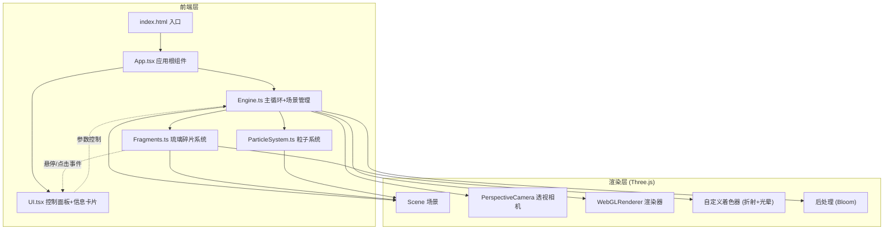

## 1. 架构设计



## 2. 技术说明

- **前端框架**：React 18 + TypeScript + Vite
- **3D 引擎**：Three.js + @react-three/fiber + @react-three/drei + @react-three/postprocessing
- **样式方案**：TailwindCSS 3
- **状态管理**：Zustand
- **初始化工具**：vite-init（react-ts 模板）
- **后端**：无

## 3. 路由定义

| 路由 | 用途 |
|------|------|
| / | 主页面，加载3D琉璃场景 |

## 4. 核心模块设计

### 4.1 Engine.ts — 主循环与场景管理

- 初始化 Three.js 场景、相机、渲染器
- 集成 OrbitControls 实现相机拖拽旋转和滚轮缩放
- 集成 EffectComposer + UnrealBloomPass 后处理
- 管理渲染循环（requestAnimationFrame）
- 帧率监控（FPS 计数器，开发模式下显示）
- 响应窗口 resize 事件

### 4.2 Fragments.ts — 琉璃碎片系统

- 生成 20+ 个随机多边形碎片（使用 ConvexGeometry 或自定义 BufferGeometry）
- 每个碎片属性：位置（球形分布）、旋转角度、大小、颜色（红橙黄绿蓝紫渐变）、厚度、折射率、透明度
- 自定义 ShaderMaterial 实现多层半透明折射效果：
  - 顶点着色器：传递法线和位置用于折射计算
  - 片元着色器：模拟光线穿过半透明介质的多层折射，基于视线角度和法线计算折射偏移和颜色叠加
- 鼠标悬停：Raycaster 检测，高亮碎片增加 emissive 强度，其他碎片降低透明度
- 鼠标点击：触发碎片向外扩散动画（0.5秒后归位），使用缓动函数
- 信息卡片数据：颜色名称、厚度、折射率

### 4.3 ParticleSystem.ts — 背景粒子系统

- 使用 Points + BufferGeometry 创建 500-1000 个发光粒子
- 粒子属性：位置（球形随机分布）、大小、透明度、漂移速度
- 每帧更新粒子位置实现缓慢漂浮
- 点击碎片时，粒子向点击位置汇聚（速度渐变），0.5秒后恢复漂浮
- 使用 PointsMaterial 或自定义着色器实现发光效果

### 4.4 UI.tsx — React 控制面板与信息卡片

- **控制面板**：右下角半透明毛玻璃面板
  - 旋转速度滑块（0.1x - 3.0x，默认 1.0x）
  - 碎片透明度滑块（0.1 - 1.0，默认 0.7）
  - 折射强度滑块（0.0 - 2.0，默认 1.0）
  - 重置视角按钮
- **信息卡片**：跟随悬停碎片位置的毛玻璃卡片
  - 显示碎片颜色（色块+名称）、厚度、折射率
  - 出现/消失动画（opacity + scale transition）
- 使用 Zustand store 管理全局状态（控制参数、悬停碎片信息）

## 5. 自定义着色器设计

### 5.1 碎片折射着色器

**顶点着色器**：
- 输入：position, normal, uv
- 输出：vNormal（世界空间法线）、vViewDir（视线方向）、vUv、vWorldPos
- 变换：模型→世界→观察空间

**片元着色器**：
- 基于视线角度和法线计算 Fresnel 效果（边缘更透明/反光）
- 多层折射模拟：根据法线偏移采样环境色，叠加碎片自身颜色
- 边缘光晕：基于 Fresnel 系数增加 emissive
- 透明度受全局滑块控制
- 悬停高亮时增加 emissive 强度

## 6. 状态管理（Zustand Store）

```typescript
interface AppState {
  rotationSpeed: number;
  fragmentOpacity: number;
  refractionIntensity: number;
  hoveredFragment: FragmentInfo | null;
  setRotationSpeed: (v: number) => void;
  setFragmentOpacity: (v: number) => void;
  setRefractionIntensity: (v: number) => void;
  setHoveredFragment: (info: FragmentInfo | null) => void;
}

interface FragmentInfo {
  id: number;
  color: string;
  colorName: string;
  thickness: number;
  refractionIndex: number;
  screenPosition: { x: number; y: number };
}
```

## 7. 性能优化策略

- 使用 InstancedMesh 或独立 Mesh（碎片数量较少，独立 Mesh 更灵活）
- 后处理 Bloom 仅在需要时启用
- 粒子系统使用 BufferGeometry 的 position attribute 直接更新
- Raycaster 仅在鼠标移动时触发，使用节流（throttle）
- 使用 WebGLRenderer 的 powerPreference: 'high-performance'
- 适配 devicePixelRatio，上限为 2
