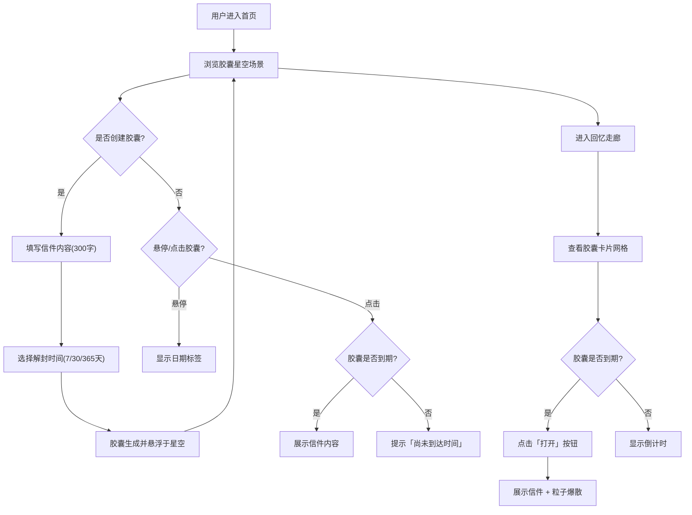

## 1. 产品概述

「记忆旅栈」是一个匿名时空胶囊分享平台，用户可以在虚拟旅栈中撰写给未来自己的信件，封装为发光的「记忆胶囊」悬浮于动态星空场景中。核心价值在于为用户提供一种富有仪式感和视觉美感的「时间对话」体验，让记忆的封存与开启成为一场温暖的旅程。

- 目标用户：希望在特定时刻给未来自己留言的普通用户
- 核心价值：仪式感 + 视觉沉浸 + 匿名隐私

## 2. 核心功能

### 2.1 用户角色

| 角色 | 注册方式 | 核心权限 |
|------|----------|----------|
| 匿名用户 | 无需注册 | 创建胶囊、浏览星空、查看回忆走廊 |

### 2.2 功能模块

1. **首页（时空旅栈）**：胶囊星空场景、胶囊悬停交互、胶囊点击查看、创建胶囊入口
2. **回忆走廊**：胶囊卡片网格、到期/未到期状态区分、打开胶囊粒子爆散动画

### 2.3 页面详情

| 页面名称 | 模块名称 | 功能描述 |
|----------|----------|----------|
| 首页 | 胶囊星空场景 | Canvas 绘制悬浮胶囊，每个胶囊有随机流光渐变色、自转动画、上下漂浮动画和脉冲光晕 |
| 首页 | 胶囊悬停交互 | 鼠标悬停胶囊时微微放大并显示日期标签 |
| 首页 | 胶囊点击查看 | 点击胶囊弹出半透明毛玻璃卡片，已到期展示信件内容，未到期提示「尚未到达时间」 |
| 首页 | 创建胶囊入口 | 点击「写信」按钮弹出创建表单：300字信件内容、选择解封时间（7天/30天/365天） |
| 回忆走廊 | 胶囊卡片网格 | 以网格排列所有胶囊卡片，带缓动淡入和微上滑动画 |
| 回忆走廊 | 到期/未到期区分 | 已到期卡片右下角显示「打开」按钮，未到期显示倒计时 |
| 回忆走廊 | 打开粒子爆散 | 点击「打开」按钮后展示信件内容并触发彩色粒子爆散动画 |

## 3. 核心流程

1. 用户进入首页，看到由无数发光胶囊组成的星空场景
2. 用户点击「写信」按钮，填写信件内容（限300字）并选择解封时间
3. 系统生成随机流光渐变色胶囊，信件数据存入 LocalStorage
4. 新胶囊出现在星空场景中，带有自转和漂浮动画
5. 用户可悬停查看胶囊日期，点击查看是否到期
6. 用户进入回忆走廊，查看所有胶囊卡片
7. 到期胶囊可点击「打开」，展示信件内容并触发粒子爆散动画

## 4. 用户界面设计

### 4.1 设计风格

- **主色调**：温暖木质风 — 浅褐色背景 (#F5E6D3)，配合琥珀色 (#D4915E) 和暖棕 (#8B6F47) 点缀
- **辅助色**：胶囊流光渐变随机色，脉冲光晕柔和发光
- **按钮风格**：圆角柔和按钮，带有轻微阴影和悬停效果
- **字体**：中文使用系统宋体/楷体增强文艺感，标题使用优雅衬线体
- **布局风格**：全屏沉浸式星空场景 + 毛玻璃卡片弹出层
- **图标风格**：简约线条图标 (lucide-react)
- **毛玻璃效果**：backdrop-filter: blur(12px)，半透明白色背景，轻微阴影

### 4.2 页面设计概览

| 页面名称 | 模块名称 | UI 元素 |
|----------|----------|---------|
| 首页 | 胶囊星空 | 全屏 Canvas，浅褐色背景带木纹纹理，胶囊为发光圆形/胶囊形，带旋转和漂浮 CSS 动画 |
| 首页 | 悬停效果 | 胶囊 hover 放大 1.15x，显示日期小标签（毛玻璃背景） |
| 首页 | 点击弹窗 | 居中毛玻璃卡片，圆角 16px，信件内容或提示文字，关闭按钮 |
| 首页 | 创建表单 | 毛玻璃卡片表单：textarea 300字、radio 选择解封时间、提交按钮 |
| 回忆走廊 | 卡片网格 | 响应式网格（桌面3列，平板2列，手机1列），卡片为毛玻璃效果，缓动淡入 + 微上滑 |
| 回忆走廊 | 打开按钮 | 已到期卡片右下角「打开」按钮，点击后卡片翻转展示内容 + 粒子爆散 |

### 4.3 响应式适配

- 桌面端优先设计，适配 1920px~1024px
- 平板端：胶囊场景自适应缩放，回忆走廊网格 2 列
- 移动端：胶囊场景触摸交互（触摸悬停替代），回忆走廊网格 1 列，卡片全宽

### 4.4 动画性能

- 胶囊漂浮和自转使用 CSS transform + requestAnimationFrame，确保 60fps
- 粒子爆散使用 Canvas 2D 绘制，限制粒子数量（≤100）避免性能问题
- 所有过渡动画使用 CSS transition + ease-out 曲线
