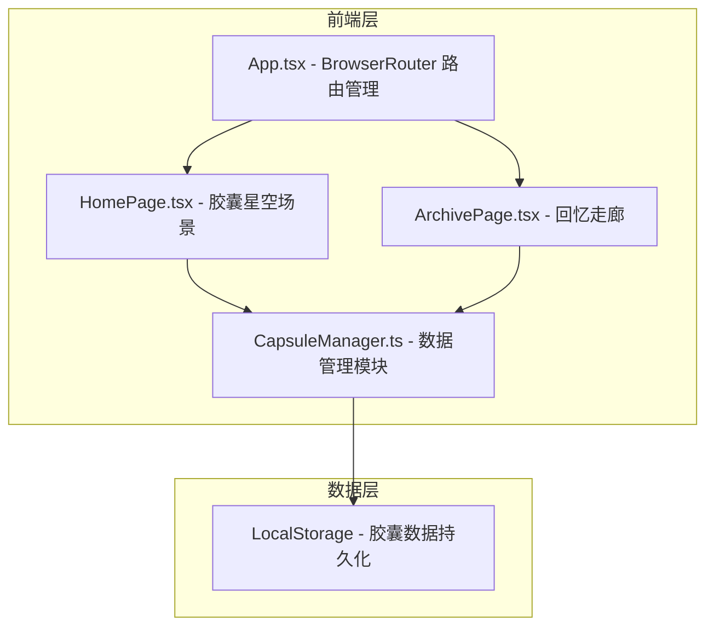
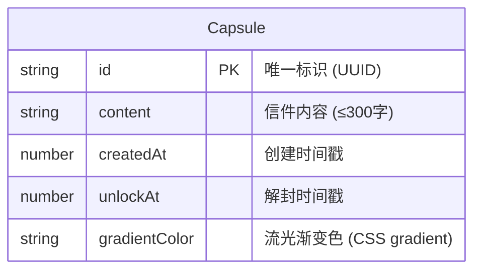

## 1. 架构设计



## 2. 技术说明

- **前端框架**：React 18 + TypeScript
- **构建工具**：Vite
- **路由**：React Router DOM v6
- **样式方案**：CSS Modules + 全局 CSS 变量
- **状态管理**：zustand（胶囊列表状态）
- **动画**：CSS Animations + requestAnimationFrame
- **数据持久化**：LocalStorage
- **图标**：lucide-react
- **无后端服务**

## 3. 路由定义

| 路由 | 用途 |
|------|------|
| `/` | 首页 — 胶囊星空场景，展示悬浮胶囊、创建胶囊入口 |
| `/archive` | 回忆走廊 — 胶囊卡片网格，到期/未到期区分 |

## 4. 数据模型

### 4.1 数据模型定义



### 4.2 数据结构

```typescript
interface Capsule {
  id: string;
  content: string;
  createdAt: number;
  unlockAt: number;
  gradientColor: string;
}
```

LocalStorage Key: `memory_inn_capsules`
存储格式：`Capsule[]` 的 JSON 字符串

## 5. 核心模块说明

### 5.1 CapsuleManager.ts

职责：
- `createCapsule(content, daysOffset)` — 创建胶囊，生成随机渐变色，存入 LocalStorage
- `getAllCapsules()` — 获取所有胶囊列表
- `isExpired(capsule)` — 判断胶囊是否到期
- `getRemainingTime(capsule)` — 获取剩余时间（天/时/分）
- `generateGradient()` — 生成随机流光渐变色

### 5.2 HomePage.tsx

职责：
- 渲染全屏胶囊星空场景（Canvas 或 DOM 元素 + CSS 动画）
- 处理胶囊悬停放大和日期标签显示
- 处理胶囊点击弹出毛玻璃详情卡片
- 提供创建胶囊入口（弹出表单模态框）

### 5.3 ArchivePage.tsx

职责：
- 渲染胶囊卡片网格布局
- 区分到期/未到期胶囊卡片样式
- 实现卡片缓动淡入和微上滑动画
- 处理到期胶囊「打开」按钮点击 → 展示信件 + 粒子爆散动画

### 5.4 App.tsx

职责：
- 配置 BrowserRouter 路由
- 导航栏（首页/回忆走廊切换）
- 全局布局和样式提供
