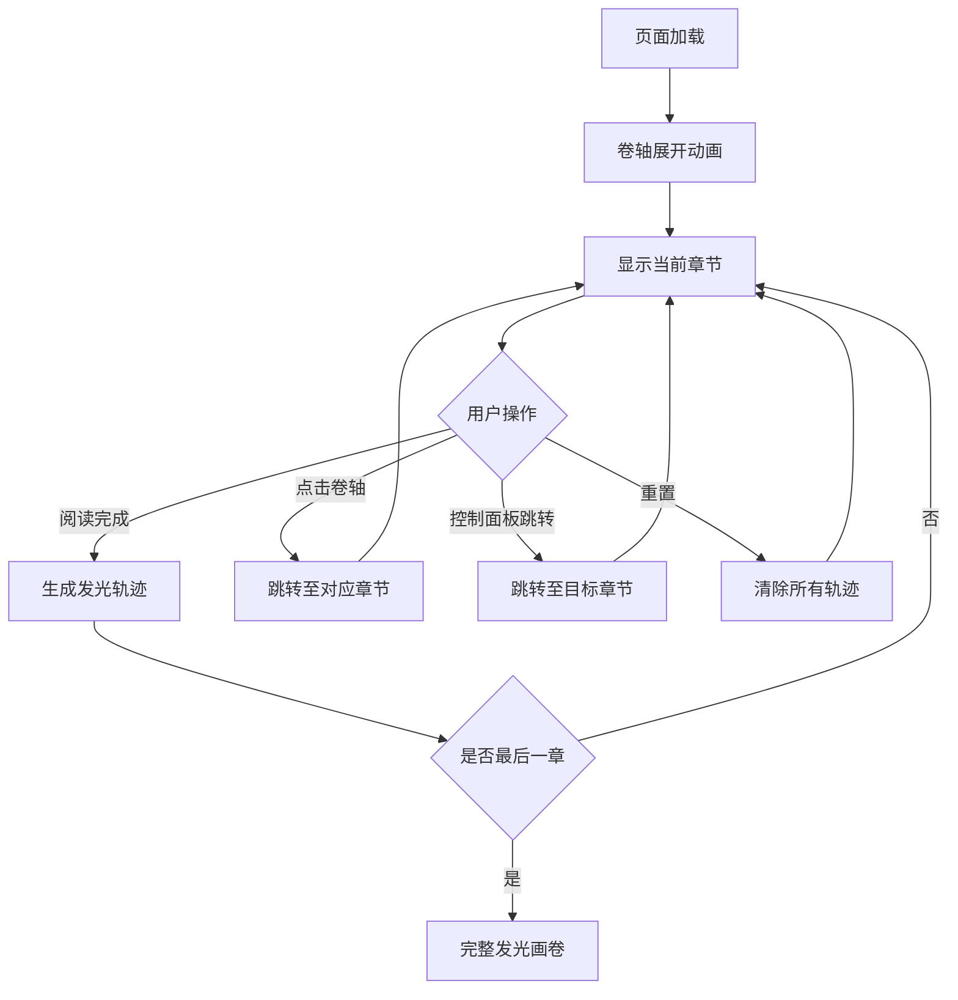

## 1. 产品概述

「流光书卷」是一款交互式阅读进度可视化工具，将传统书卷美学与现代极简设计融合。用户在卷轴界面中逐章阅读，每完成一章即在卷轴上留下从冷蓝到暖橙渐变的发光轨迹，最终所有轨迹汇成一幅完整的发光画卷。

- 核心目标：以沉浸式视觉体验让阅读进度「看得见」，用发光轨迹让阅读成就可感知
- 目标用户：喜爱阅读、追求美学体验的文学爱好者与视觉审美群体

## 2. 核心功能

### 2.1 功能模块

1. **卷轴阅读页**：卷轴界面、章节数据展示、卷轴展开/合拢动画、发光轨迹渲染、脉动光点指示器
2. **控制面板**：阅读进度百分比、剩余章节数、重置按钮、章节快速跳转菜单

### 2.2 页面详情

| 页面名称 | 模块名称 | 功能描述 |
|----------|----------|----------|
| 卷轴阅读页 | 卷轴容器 | 米白仿宣纸底色、深棕木纹装饰条顶底边框、柔和阴影与圆角 |
| 卷轴阅读页 | 章节内容区 | 当前章节文本、翻页动画、阅读完成检测 |
| 卷轴阅读页 | 发光轨迹画布 | Canvas 覆盖层渲染已读章节的发光轨迹，冷蓝→暖橙渐变 |
| 卷轴阅读页 | 脉动光点 | 当前阅读位置的缓慢脉动光点指示器 |
| 卷轴阅读页 | 粒子背景 | 飘浮的细小粒子模拟书页尘埃效果 |
| 卷轴阅读页 | 卷轴动画 | 页面切换时缓动卷轴展开/合拢过渡动画 |
| 控制面板 | 进度显示 | 阅读进度百分比与剩余章节数 |
| 控制面板 | 重置按钮 | 重置所有阅读进度，清除轨迹 |
| 控制面板 | 章节跳转 | 毛玻璃弹出式菜单，点击可快速跳转至任意章节 |

## 3. 核心流程

1. 用户打开页面，卷轴展开动画启动，展示第一章内容
2. 用户阅读当前章节，卷轴上脉动光点指示当前位置
3. 用户完成当前章节阅读，点击继续，卷轴上新增一条发光轨迹
4. 发光轨迹颜色根据阅读深度从冷蓝渐变到暖橙
5. 用户可点击卷轴任意位置跳转到对应章节，或使用控制面板的跳转菜单
6. 所有章节阅读完成后，卷轴上形成完整发光画卷
7. 控制面板可随时重置进度

## 4. 用户界面设计

### 4.1 设计风格

- **主色调**：米白仿宣纸 (#F5F0E8)、深棕木纹 (#5D3A1A)
- **辅助色**：轨迹冷蓝 (#4A90D9)、轨迹暖橙 (#E8934A)、脉动光点 (#FFD700)
- **按钮样式**：圆角矩形，毛玻璃效果 (backdrop-filter: blur)，柔和阴影
- **字体**：正文使用「Noto Serif SC」宋体风格衬线字体，标题使用「Ma Shan Zheng」书法风格字体
- **布局**：居中卷轴式布局，左右对称木纹装饰条
- **动效**：卷轴展开/合拢使用 CSS transition 缓动，发光轨迹使用 Canvas 渐变动画，脉动光点使用 CSS animation

### 4.2 页面设计概览

| 页面名称 | 模块名称 | UI 元素 |
|----------|----------|---------|
| 卷轴阅读页 | 卷轴容器 | 米白底色、木纹边框、圆角 12px、box-shadow 柔和阴影 |
| 卷轴阅读页 | 章节内容 | Noto Serif SC 字体、1.8倍行高、深棕文字色 |
| 卷轴阅读页 | 发光轨迹 | Canvas 层、水平排列的发光条纹、渐变色从蓝到橙 |
| 卷轴阅读页 | 脉动光点 | 圆形光点、CSS animation pulse、金色辉光 |
| 卷轴阅读页 | 粒子背景 | Canvas 层、半透明白色微小圆点、缓慢飘浮 |
| 控制面板 | 进度显示 | 毛玻璃卡片、进度条、百分比文字 |
| 控制面板 | 跳转菜单 | 毛玻璃弹出列表、章节编号、hover 高亮 |

### 4.3 响应式适配

- 桌面端（≥1024px）：卷轴宽度 800px，内容区宽 700px
- 平板端（768-1023px）：卷轴宽度 90vw，内容区宽 80vw
- 移动端（<768px）：卷轴宽度 95vw，内容区宽 90vw，控制面板底部固定

### 4.4 性能要求

- 帧率保持 60fps，Canvas 渲染使用 requestAnimationFrame
- 粒子数量控制在 50-80 个
- 发光轨迹使用离屏 Canvas 缓存，避免重复渲染
- 脉动光点使用 CSS 动画，不占用 JS 主线程
