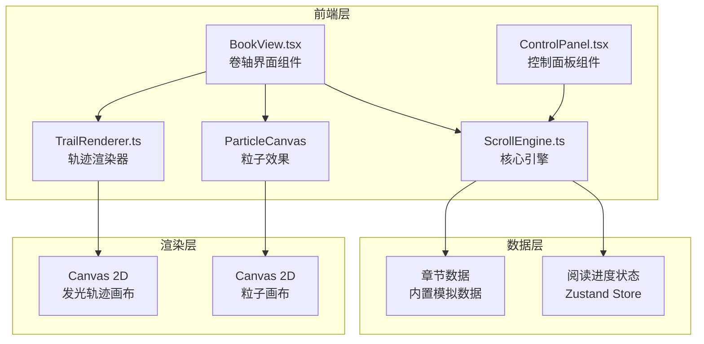

## 1. 架构设计



## 2. 技术说明

- **前端**：React@18 + TypeScript + Tailwind CSS + Vite
- **初始化工具**：vite-init (react-ts 模板)
- **后端**：无（纯前端，数据内置）
- **状态管理**：Zustand
- **动画**：Canvas 2D API + CSS Animation
- **字体**：Google Fonts（Noto Serif SC、Ma Shan Zheng）

## 3. 路由定义

| 路由 | 用途 |
|------|------|
| / | 主页面，包含卷轴阅读界面和控制面板 |

本项目为单页应用，无多路由需求。

## 4. 文件结构

```
src/
  ScrollEngine.ts      # 核心引擎：阅读进度管理、章节数据、轨迹生成与颜色映射
  TrailRenderer.ts     # 发光轨迹渲染器：Canvas 渲染、动画、章节间衔接过渡
  BookView.tsx          # 卷轴界面组件：卷轴动画、光点指示器、Canvas 容器
  ControlPanel.tsx      # 控制面板组件：进度显示、重置、跳转菜单
  App.tsx               # 应用根组件
  main.tsx              # 入口文件
  index.css             # 全局样式与粒子/卷轴动画样式
  store.ts              # Zustand 状态管理
```

## 5. 核心算法设计

### 5.1 颜色映射算法

阅读深度 0→1 映射到冷蓝→暖橙渐变：
- 起始色：HSL(210, 70%, 57%) 即 #4A90D9（冷蓝）
- 终止色：HSL(28, 80%, 60%) 即 #E8934A（暖橙）
- 插值方式：HSL 空间线性插值，保持饱和度渐变

### 5.2 轨迹布局算法

- 卷轴水平排列章节轨迹，每章等宽
- 轨迹宽度 = (卷轴总宽度 - 间距总和) / 章节总数
- 轨迹位置 = 起始偏移 + 章节索引 × (轨迹宽度 + 间距)
- 未读章节位置留空，已读章节绘制发光条纹

### 5.3 脉动光点算法

- 使用 CSS animation: pulse 2s ease-in-out infinite
- 光点位置由当前章节索引计算
- 光点尺寸：12px → 18px 循环脉动
- 辉光效果：box-shadow 多层扩散

### 5.4 粒子系统

- 粒子数量：60
- 粒子属性：x, y, size(1-3px), opacity(0.1-0.5), speedY(-0.2 ~ 0.2), speedX(-0.1 ~ 0.1)
- 生命周期：永久，到达边界后回绕
- 渲染：Canvas 2D fillRect，半透明白色

## 6. 性能优化策略

- 发光轨迹使用离屏 Canvas 缓存，仅在新章节完成时重绘
- 粒子系统独立 Canvas 层，使用 requestAnimationFrame 驱动
- 脉动光点使用纯 CSS animation，不占用 JS 线程
- 卷轴动画使用 CSS transition + transform，GPU 加速
- 使用 will-change 提示浏览器优化合成层
