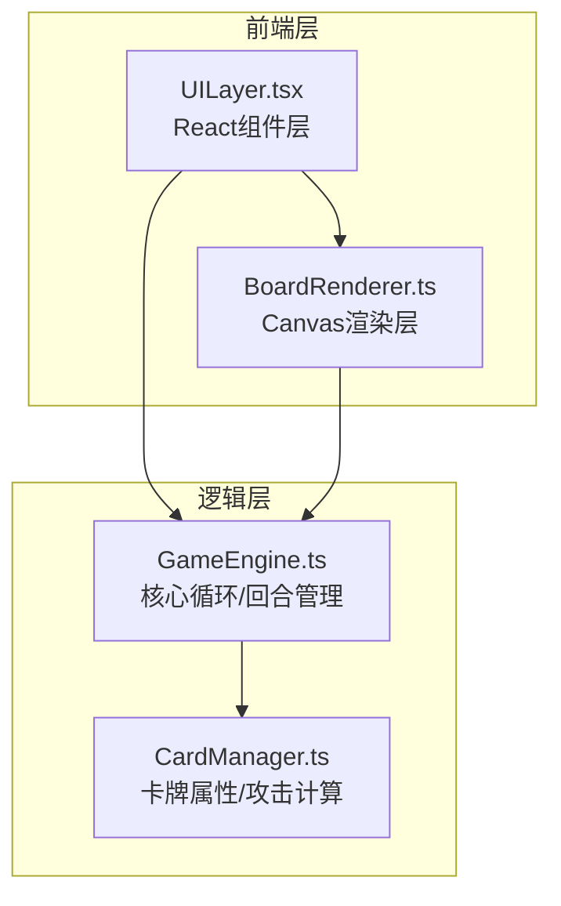

## 1. 架构设计



## 2. 技术说明

- **前端框架**：React@18 + TypeScript + Vite
- **状态管理**：Zustand（管理游戏全局状态）
- **样式方案**：Tailwind CSS + CSS Modules（动画特效）
- **动画方案**：CSS Transitions/Animations + requestAnimationFrame（粒子系统）
- **拖拽方案**：HTML5 Drag & Drop API + 自定义拖拽状态
- **构建工具**：Vite
- **后端**：无（纯前端，AI逻辑在客户端）

## 3. 文件结构

| 文件路径 | 职责 |
|----------|------|
| src/GameEngine.ts | 核心游戏循环、回合管理、胜负判定、AI决策 |
| src/CardManager.ts | 卡牌生成、攻击力计算、属性克制、元素爆发检测、特殊效果触发 |
| src/BoardRenderer.ts | 3×3网格渲染、卡牌拖拽交互、放置/攻击/消除动画、粒子特效 |
| src/UILayer.tsx | React根组件，生命值面板、手牌区、回合控制、克制提示 |
| src/store.ts | Zustand全局状态store |
| src/types.ts | TypeScript类型定义 |
| src/App.tsx | 应用入口 |
| src/main.tsx | 渲染入口 |
| src/index.css | 全局样式和动画关键帧 |

## 4. 核心数据模型

```typescript
interface Card {
  id: string;
  element: 'fire' | 'water' | 'wind' | 'earth';
  attack: number;
  name: string;
  statusEffects?: StatusEffect[];
}

interface StatusEffect {
  type: 'burn' | 'freeze' | 'knockback' | 'shield';
  duration: number;
  value: number;
}

interface BoardCell {
  row: number;
  col: number;
  card: Card | null;
  owner: 'player' | 'enemy' | null;
}

interface GameState {
  playerHP: number;
  enemyHP: number;
  playerBoard: (Card | null)[][];
  enemyBoard: (Card | null)[][];
  playerHand: Card[];
  enemyHand: Card[];
  currentTurn: 'player' | 'enemy';
  turnNumber: number;
  gamePhase: 'playing' | 'gameOver';
  winner: 'player' | 'enemy' | null;
}
```

## 5. 核心逻辑规则

### 5.1 属性克制关系
- 火 → 风（焚烧风暴）
- 风 → 土（风蚀岩石）
- 土 → 水（堤坝截流）
- 水 → 火（浇灭火焰）

克制方攻击力 ×1.5，被克制方攻击力 ×0.5

### 5.2 元素爆发（三连线）
- 横/竖/对角线三张同属性卡牌触发
- 火-灼烧：每回合对敌方造成2点额外伤害，持续2回合
- 水-冰冻：敌方下回合无法放置卡牌到被冰冻位置
- 风-击退：将敌方对应位置卡牌移除
- 土-护盾：为己方场上所有卡牌增加2点护盾值

### 5.3 攻击规则
- 玩家放置卡牌到(row, col)时，若敌方(row, col)有卡牌，则双方互攻
- 攻击力 = 卡牌基础攻击力 × 克制倍率
- 若敌方对应位置无卡牌，直接对敌方生命值造成伤害
- 护盾可抵消等量伤害

### 5.4 AI策略
- 优先放置克制敌方卡牌的属性
- 尝试凑同属性连线
- 避免将被克制的卡牌放到敌方卡牌对面
