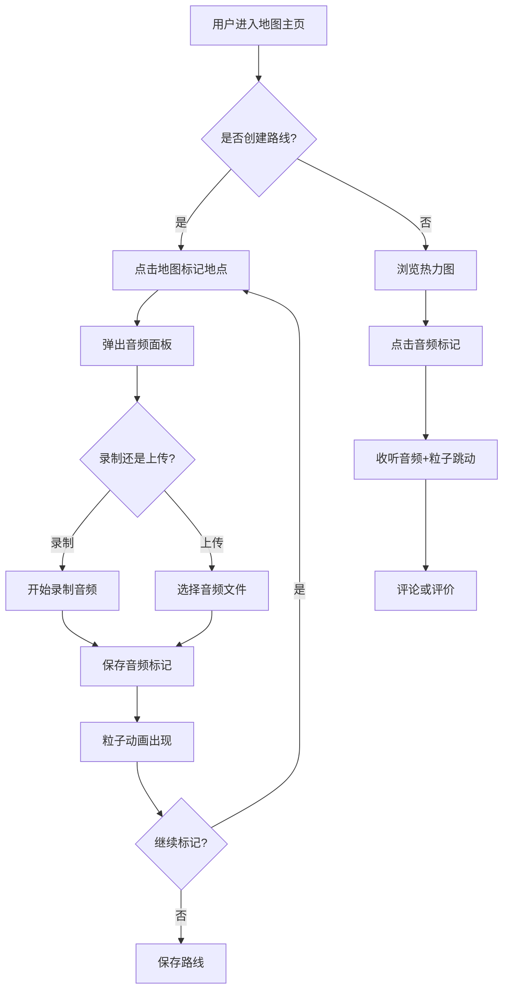

## 1. 产品概述

「音迹漫步」是一个在线音乐旅行日记平台，用户可以在交互式地图上创建旅行路线，并在每个地点记录音频片段（环境音、旋律等）。音频以声波粒子动画在地图上可视化，其他用户可漫游地图、收听音频并互动评论。系统自动分析音频特征，以热力图标示声音密度和类型。

- 目标用户：旅行爱好者、音乐创作者、声音记录者、地理文化探索者
- 核心价值：将旅行记忆与声音融合，创造沉浸式的地理声音地图体验

## 2. 核心功能

### 2.1 用户角色

| 角色 | 注册方式 | 核心权限 |
|------|----------|----------|
| 浏览者 | 无需注册 | 浏览地图、收听音频、查看热力图 |
| 创作者 | 邮箱注册 | 创建路线、录制/上传音频、评论评价 |
| 访客 | 无需登录 | 仅浏览和收听 |

### 2.2 功能模块

1. **地图主页**：交互式地图、路线显示、音频标记粒子动画、热力图叠加层、背景色渐变
2. **控制面板**：录制/停止按钮、播放控制、音量滑块、路线浏览列表
3. **音频标记详情**：音频播放、波形可视化、评论列表、评价功能

### 2.3 页面详情

| 页面名称 | 模块名称 | 功能描述 |
|----------|----------|----------|
| 地图主页 | 交互式地图 | 基于 Leaflet 的地图，支持点击标记地点、拖拽音频标记、缩放平移 |
| 地图主页 | 声波粒子动画 | 音频标记以粒子形式呈现，播放时粒子随音频节奏跳动 |
| 地图主页 | 背景色渐变 | 播放音频时地图背景渐变为该音频平均色调（暖色/冷色） |
| 地图主页 | 热力图叠加 | 根据音频密度和音量生成半透明热力图层，颜色从青绿渐变到橙红 |
| 地图主页 | 飘浮粒子背景 | 细小粒子（像花粉）在页面背景飘浮 |
| 控制面板 | 录制控制 | 录制/停止按钮，支持环境音和语音录制 |
| 控制面板 | 播放控制 | 播放/暂停/上一曲/下一曲，音量滑块 |
| 控制面板 | 路线列表 | 浏览已保存路线，点击跳转地图位置 |
| 音频详情 | 波形展示 | 实时音频波形可视化 |
| 音频详情 | 评论评价 | 对音频片段评论和评分 |

## 3. 核心流程

### 3.1 创建旅行路线流程
用户打开地图 → 点击地图标记地点 → 弹出录制/上传面板 → 录制或上传音频 → 音频标记以粒子动画出现在地图上 → 继续标记其他地点形成路线 → 保存路线

### 3.2 浏览和收听流程
用户进入地图 → 查看热力图了解声音分布 → 点击音频标记 → 粒子动画随节奏跳动 → 地图背景色渐变 → 收听音频 → 评论或评价

### 3.3 流程图

## 4. 用户界面设计

### 4.1 设计风格

- **主色调**：米白色 `#FAF8F5` 和淡绿色 `#E8F0E4` 为底色
- **强调色**：暖橙色 `#E8935A` 作为交互强调，青绿色 `#5AB8A8` 作为辅助
- **卡片风格**：毛玻璃效果（backdrop-filter: blur），圆角 16px，柔和阴影
- **字体**：展示字体 Noto Serif SC（标题），UI 字体 Noto Sans SC（正文）
- **布局风格**：地图为主体，左侧浮动控制面板（桌面端），底部抽屉（平板端）
- **动画**：页面切换缓动淡入（ease-out 300ms），粒子飘浮动画，音频播放节奏跳动
- **背景**：飘浮的细小粒子（像花粉），半透明白色，缓慢飘浮

### 4.2 页面设计概览

| 页面名称 | 模块名称 | UI元素 |
|----------|----------|--------|
| 地图主页 | 地图容器 | 全屏地图，毛玻璃叠加层，热力图半透明叠加 |
| 地图主页 | 音频标记 | 粒子动画圆点，点击弹出毛玻璃详情卡 |
| 地图主页 | 路线线条 | 淡绿色虚线连接标记点 |
| 控制面板 | 面板容器 | 毛玻璃卡片，左侧浮动（桌面）/ 底部抽屉（平板） |
| 控制面板 | 录制按钮 | 圆形红色按钮，录制时脉冲动画 |
| 控制面板 | 播放控制 | 播放/暂停图标按钮，进度条，音量滑块 |
| 控制面板 | 路线列表 | 纵向滚动列表，每项显示地点名和时长 |

### 4.3 响应式适配

- **桌面端（≥1024px）**：地图全屏为主体，左侧浮动毛玻璃控制面板（宽320px），热力图图例右下角
- **平板端（768px-1023px）**：地图全屏，控制面板折叠为底部抽屉，可上滑展开，热力图图例右上角
- **触控优化**：音频标记点击区域放大，滑块手势友好，底部抽屉滑动流畅

### 4.4 性能目标

- 地图滚动和缩放保持 60fps
- 音频数据分块加载，首屏不阻塞
- 热力图数据延迟渲染，缩放停止后 200ms 更新
- 粒子动画使用 requestAnimationFrame，限制最大粒子数 500
