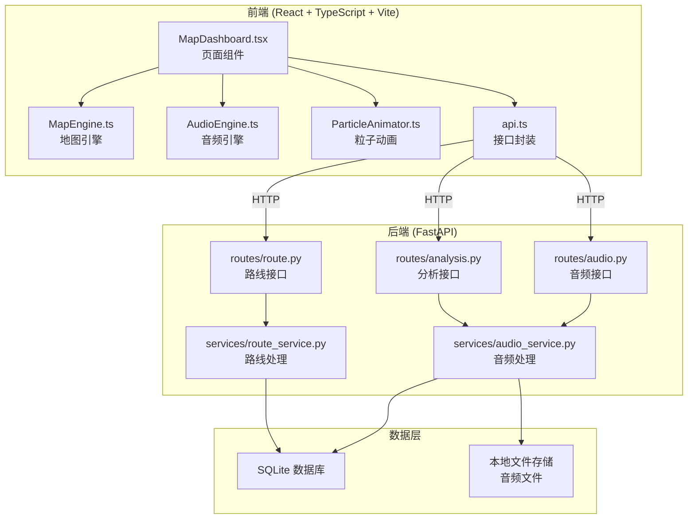
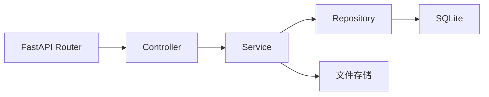
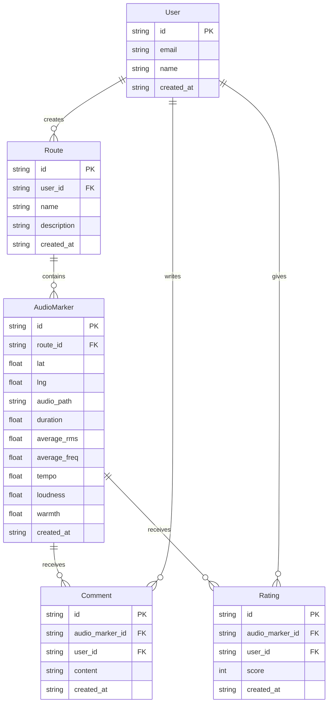

## 1. 架构设计



## 2. 技术说明

- **前端**：React@18 + TypeScript + Tailwind CSS@3 + Vite
- **地图库**：Leaflet（交互式地图、标记、路线绘制）
- **音频处理**：Tone.js（Web Audio API 封装，录制、播放、分析）
- **粒子动画**：Canvas 2D + requestAnimationFrame
- **热力图**：Leaflet.heat 插件
- **状态管理**：Zustand
- **初始化工具**：vite-init (react-ts 模板)
- **后端**：FastAPI + Uvicorn
- **数据库**：SQLite（轻量级，无需额外服务）
- **音频存储**：本地文件系统

## 3. 路由定义

| 路由 | 用途 |
|------|------|
| `/` | 地图主页，包含地图、控制面板、热力图 |

## 4. API 定义

### 4.1 音频相关

```typescript
interface AudioMarker {
  id: string;
  routeId: string;
  lat: number;
  lng: number;
  audioUrl: string;
  duration: number;
  features: AudioFeatures;
  createdAt: string;
}

interface AudioFeatures {
  averageRms: number;
  averageFreq: number;
  tempo: number;
  loudness: number;
  warmth: number;
}

interface UploadAudioRequest {
  routeId: string;
  lat: number;
  lng: number;
  audioBlob: Blob;
  locationName?: string;
}

interface UploadAudioResponse {
  id: string;
  audioUrl: string;
  features: AudioFeatures;
}
```

### 4.2 路线相关

```typescript
interface Route {
  id: string;
  name: string;
  description: string;
  markers: AudioMarker[];
  createdAt: string;
}

interface SaveRouteRequest {
  name: string;
  description?: string;
  markers: {
    lat: number;
    lng: number;
    audioId: string;
    order: number;
  }[];
}

interface SaveRouteResponse {
  id: string;
  name: string;
}
```

### 4.3 分析相关

```typescript
interface HeatmapData {
  points: {
    lat: number;
    lng: number;
    intensity: number;
    audioType: "warm" | "cool";
  }[];
  bounds: {
    north: number;
    south: number;
    east: number;
    west: number;
  };
}

interface AudioAnalysisResponse {
  features: AudioFeatures;
  dominantColor: string;
  heatmapIntensity: number;
}
```

### 4.4 评论评价

```typescript
interface Comment {
  id: string;
  audioMarkerId: string;
  userId: string;
  content: string;
  createdAt: string;
}

interface Rating {
  audioMarkerId: string;
  averageScore: number;
  totalCount: number;
}
```

## 5. 后端架构图



## 6. 数据模型

### 6.1 数据模型定义



### 6.2 数据定义语言

```sql
CREATE TABLE users (
    id TEXT PRIMARY KEY,
    email TEXT UNIQUE NOT NULL,
    name TEXT NOT NULL,
    created_at TEXT NOT NULL DEFAULT (datetime('now'))
);

CREATE TABLE routes (
    id TEXT PRIMARY KEY,
    user_id TEXT NOT NULL REFERENCES users(id),
    name TEXT NOT NULL,
    description TEXT DEFAULT '',
    created_at TEXT NOT NULL DEFAULT (datetime('now'))
);

CREATE TABLE audio_markers (
    id TEXT PRIMARY KEY,
    route_id TEXT NOT NULL REFERENCES routes(id),
    lat REAL NOT NULL,
    lng REAL NOT NULL,
    audio_path TEXT NOT NULL,
    location_name TEXT DEFAULT '',
    duration REAL DEFAULT 0,
    average_rms REAL DEFAULT 0,
    average_freq REAL DEFAULT 0,
    tempo REAL DEFAULT 0,
    loudness REAL DEFAULT 0,
    warmth REAL DEFAULT 0,
    created_at TEXT NOT NULL DEFAULT (datetime('now'))
);

CREATE TABLE comments (
    id TEXT PRIMARY KEY,
    audio_marker_id TEXT NOT NULL REFERENCES audio_markers(id),
    user_id TEXT NOT NULL REFERENCES users(id),
    content TEXT NOT NULL,
    created_at TEXT NOT NULL DEFAULT (datetime('now'))
);

CREATE TABLE ratings (
    id TEXT PRIMARY KEY,
    audio_marker_id TEXT NOT NULL REFERENCES audio_markers(id),
    user_id TEXT NOT NULL REFERENCES users(id),
    score INTEGER NOT NULL CHECK(score >= 1 AND score <= 5),
    created_at TEXT NOT NULL DEFAULT (datetime('now')),
    UNIQUE(audio_marker_id, user_id)
);

CREATE INDEX idx_audio_markers_route ON audio_markers(route_id);
CREATE INDEX idx_comments_marker ON comments(audio_marker_id);
CREATE INDEX idx_ratings_marker ON ratings(audio_marker_id);
```
