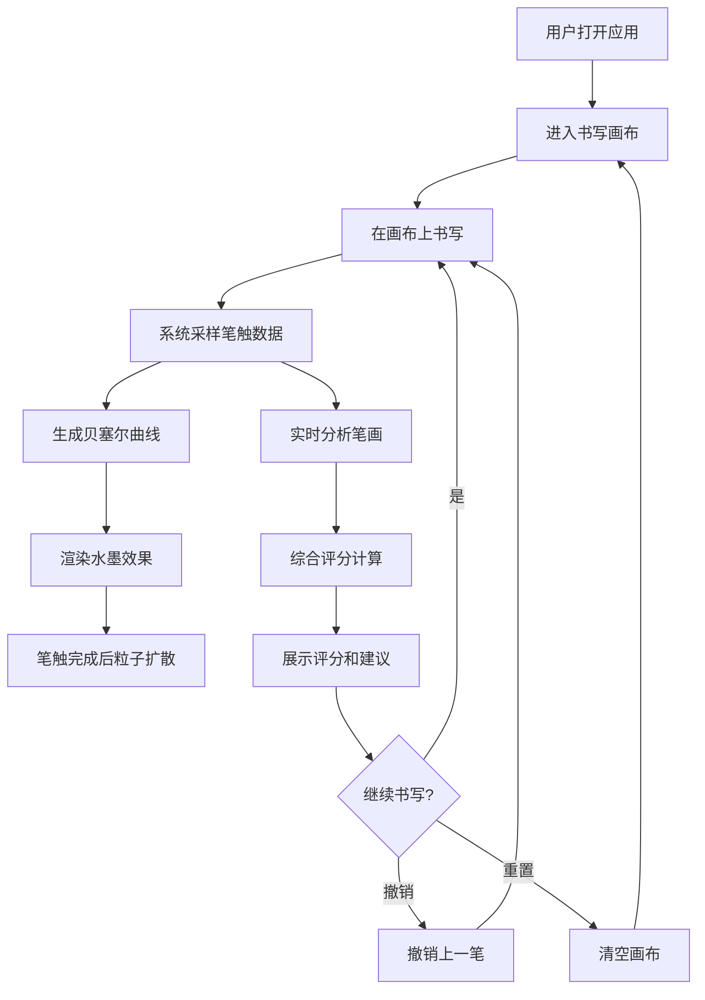

## 1. 产品概述

「墨韵流光」是一款基于 Web 的交互式书法练习工具，用户可在画布上用手指或鼠标书写汉字，系统实时分析笔画顺序、力度与速度，给出流畅度评分和修改建议。书写完成后，墨迹以水墨粒子动画的形式逐渐显现，笔触带有自然飞白和渐变效果，营造沉浸式的东方书写体验。

- 目标用户：书法爱好者、汉字学习者、传统文化推广人群
- 核心价值：将传统书法练习数字化，通过实时反馈和视觉特效降低入门门槛、提升练习乐趣

## 2. 核心功能

### 2.1 用户角色
| 角色 | 注册方式 | 核心权限 |
|------|----------|----------|
| 普通用户 | 无需注册 | 使用全部书写和评分功能 |

### 2.2 功能模块
1. **书写页面**：全屏书写画布、水墨粒子动画、实时笔触渲染
2. **分析面板**：评分展示、笔顺建议、力度/速度曲线、历史记录

### 2.3 页面详情
| 页面名称 | 模块名称 | 功能描述 |
|----------|----------|----------|
| 书写页面 | 书写画布 | 支持触摸和鼠标输入，50ms内响应笔触，实时绘制水墨笔画 |
| 书写页面 | 水墨粒子动画 | 笔触后粒子从笔画路径向外扩散，大小和透明度随机衰减，模拟自然飞白效果 |
| 书写页面 | 实时评分 | 每写一笔根据笔顺、力度和速度综合评分，显示在毛玻璃卡片中 |
| 书写页面 | 控制面板 | 画布下方包含重置、撤销按钮和评分显示区域 |
| 书写页面 | 帮助按钮 | 右上角半透明毛玻璃帮助按钮，点击展示操作指引 |
| 书写页面 | 背景粒子 | 缓慢飘浮的细小墨点粒子，模拟研磨时墨汁飞溅效果 |
| 书写页面 | 页面过渡 | 缓动淡入动画切换页面状态 |

## 3. 核心流程

用户打开应用 → 进入书写画布 → 选择书写模式 → 在画布上书写汉字 → 系统实时采样笔触数据 → 生成贝塞尔曲线并渲染水墨效果 → 笔触完成后粒子扩散动画 → 实时分析笔画并评分 → 展示评分和建议 → 可撤销或重置继续练习

## 4. 用户界面设计

### 4.1 设计风格
- 主色调：米白（#F5F0E8）作为宣纸底色，深灰（#3D3D3D）作为控制面板和文字色，墨黑（#1A1A1A）作为笔触和重点色，金色高亮（#C9A96E）作为评分和强调色
- 按钮风格：柔和圆角（8-12px）、轻微阴影、毛玻璃半透明背景（backdrop-filter: blur）
- 字体：使用衬线体展示标题（如 Noto Serif SC），无衬线体展示正文（如 Noto Sans SC）
- 布局风格：中央书写画布 + 底部控制面板 + 右上角悬浮帮助按钮
- 图标风格：线性简约图标，低饱和度，与东方雅致风格统一

### 4.2 页面设计概述
| 页面名称 | 模块名称 | UI元素 |
|----------|----------|--------|
| 书写页面 | 书写画布 | 米白宣纸底色、全屏画布、响应式缩放、水墨笔触渲染 |
| 书写页面 | 水墨粒子 | 粒子从笔触路径扩散、大小/透明度随机衰减、飞白效果、渐变消逝 |
| 书写页面 | 控制面板 | 底部居中、深灰毛玻璃背景、圆角12px、轻阴影、重置/撤销按钮、评分数字 |
| 书写页面 | 评分卡片 | 毛玻璃卡片、金色高亮评分数字、笔顺/力度/速度分项展示 |
| 书写页面 | 帮助按钮 | 右上角固定定位、半透明毛玻璃圆形按钮、hover 放大效果 |
| 书写页面 | 背景粒子 | 缓慢飘浮的细小墨点、低透明度、模拟研磨飞溅 |
| 书写页面 | 过渡动画 | 页面状态切换时缓动淡入淡出、300ms ease-in-out |

### 4.3 响应式适配
- 桌面端（≥1024px）：画布居中，控制面板底部固定，帮助按钮右上角
- 平板端（768-1023px）：画布自适应宽度，控制面板底部固定
- 移动端（<768px）：画布全屏，控制面板底部紧凑布局，触摸优化（增大按钮点击区域）
- 触摸优化：阻止默认滚动行为，支持多点触控笔触，设备像素比适配

### 4.4 3D场景指引
- 不适用（本项目为2D Canvas渲染）
