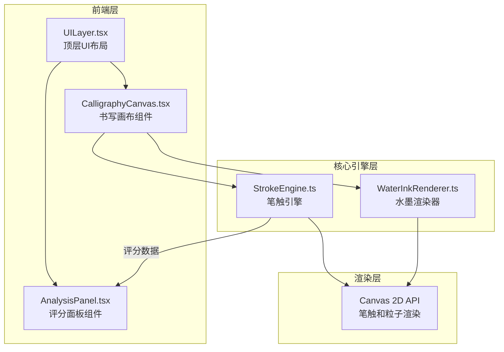

## 1. 架构设计



## 2. 技术说明
- 前端：React@18 + TypeScript + Vite
- 初始化工具：Vite
- 样式方案：CSS Modules + CSS Variables（不使用 Tailwind，以精细控制东方雅致风格）
- 后端：无（纯客户端应用）
- 数据库：无（评分历史使用 localStorage 持久化）
- 状态管理：React useState/useReducer（轻量级，无需 Redux）
- 动画：requestAnimationFrame 循环驱动 Canvas 渲染，CSS transitions 处理 UI 过渡

## 3. 路由定义
| 路由 | 用途 |
|------|------|
| / | 书写页面（唯一页面，所有功能集成于此） |

## 4. API定义
- 无后端 API，所有逻辑在客户端完成
- 标准字库数据内嵌在 StrokeEngine 中（预设常用汉字的标准笔画数据）

## 5. 服务器架构图
- 不适用（无服务器端）

## 6. 数据模型

### 6.1 数据模型定义

```mermaid
erDiagram
    "StrokePoint" {
        number x
        number y
        number pressure
        number timestamp
    }
    "Stroke" {
        string id
        "StrokePoint[]" points
        "BezierCurve[]" curves
        number avgSpeed
        number avgPressure
        number score
    }
    "Character" {
        string char
        "Stroke[]" strokes
        number totalScore
    }
    "Particle" {
        number x
        number y
        number vx
        number vy
        number size
        number opacity
        number life
        number maxLife
    }
    "AnalysisResult" {
        number strokeOrderScore
        number pressureScore
        number speedScore
        number overallScore
        string[] suggestions
    }
    "Stroke" ||--o{ "StrokePoint" : contains
    "Character" ||--o{ "Stroke" : contains
```

### 6.2 核心类型定义

```typescript
interface StrokePoint {
  x: number;
  y: number;
  pressure: number;
  timestamp: number;
}

interface BezierCurve {
  start: StrokePoint;
  control1: { x: number; y: number };
  control2: { x: number; y: number };
  end: StrokePoint;
}

interface Particle {
  x: number;
  y: number;
  vx: number;
  vy: number;
  size: number;
  opacity: number;
  life: number;
  maxLife: number;
}

interface AnalysisResult {
  strokeOrderScore: number;
  pressureScore: number;
  speedScore: number;
  overallScore: number;
  suggestions: string[];
}
```
