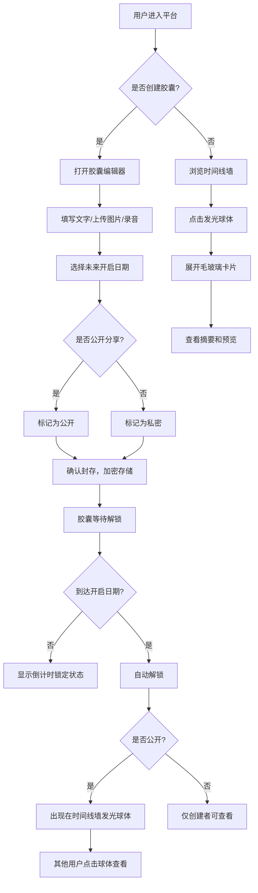

## 1. 产品概述

「时光驿站」是一个在线时间胶囊分享平台，用户可以创建数字时间胶囊，封装文字、图片和录音，设置未来开启日期，到期后自动解锁。公开胶囊会在「时间线墙」上以发光球体呈现，营造温暖怀旧的沉浸式体验。

- 核心价值：让人们在快节奏的数字时代，以一种仪式感的方式封存和传递记忆与情感
- 目标用户：希望为未来留下记忆的年轻人、情侣、家庭及社交分享爱好者

## 2. 核心功能

### 2.1 用户角色

| 角色 | 注册方式 | 核心权限 |
|------|----------|----------|
| 普通用户 | 邮箱注册 | 创建胶囊、查看已解锁胶囊、公开分享 |
| 访客 | 无需注册 | 浏览公开时间线墙、查看已解锁公开胶囊 |

### 2.2 功能模块

1. **时间线墙页面**：展示所有公开胶囊的发光球体，点击展开毛玻璃卡片
2. **胶囊创建页面**：编辑器表单，支持文字、图片、录音上传及日期选择
3. **胶囊详情页面**：已解锁胶囊的完整内容展示

### 2.3 页面详情

| 页面名称 | 模块名称 | 功能描述 |
|----------|----------|----------|
| 时间线墙 | 发光球体可视化 | 每个公开胶囊以发光球体呈现，从远处飞入并悬停，带光晕和呼吸动画 |
| 时间线墙 | 毛玻璃卡片 | 点击球体展开卡片，显示胶囊摘要、预览和开启倒计时 |
| 时间线墙 | 搜索筛选面板 | 按日期范围、关键词、标签筛选胶囊 |
| 时间线墙 | 背景粒子 | 缓慢飘浮的细小光点，模拟旧照片上的灰尘 |
| 胶囊创建 | 文字编辑区 | 富文本编辑，支持长文输入 |
| 胶囊创建 | 图片上传 | 支持多图上传，缩略图预览 |
| 胶囊创建 | 录音上传 | 录音录制或文件上传，波形预览 |
| 胶囊创建 | 日期选择器 | 选择未来开启日期，显示距离解锁的剩余时间 |
| 胶囊创建 | 公开设置 | 选择是否公开分享到时间线墙 |
| 胶囊详情 | 内容展示 | 已解锁胶囊的完整文字、图片、录音展示 |
| 胶囊详情 | 加密状态 | 未解锁胶囊显示加密锁定状态和倒计时 |

## 3. 核心流程

用户创建时间胶囊：填写内容 → 选择开启日期 → 设置是否公开 → 确认封存 → 胶囊加密存储 → 到期自动解锁 → 公开胶囊出现在时间线墙

## 4. 用户界面设计

### 4.1 设计风格

- 主色调：米白色 (#FDF8F0) 和淡黄色 (#FFF5E1) 底色
- 强调色：暖金色 (#D4A574) 用于交互元素和光晕
- 辅助色：淡棕色 (#C9B99A) 用于边框和分隔线
- 卡片风格：毛玻璃效果（backdrop-blur），柔和阴影，16px 圆角
- 字体：正文使用 Noto Serif SC（温暖怀旧衬线体），标题使用 ZCOOL XiaoWei（文艺中文字体）
- 布局风格：全屏沉浸式，顶部半透明导航栏，中心时间线墙
- 图标风格：线性图标，暖色调描边
- 动画：页面切换缓动横向滑动，球体飞入和呼吸动画，卡片展开缩放动画

### 4.2 页面设计概览

| 页面名称 | 模块名称 | UI元素 |
|----------|----------|--------|
| 时间线墙 | 发光球体区 | 深色星空背景，金色光晕球体带呼吸脉冲，从远处飞入缓动动画 |
| 时间线墙 | 毛玻璃卡片 | 半透明白色背景，backdrop-blur，圆角16px，柔和阴影，胶囊摘要文字 |
| 时间线墙 | 搜索筛选面板 | 右侧滑出面板，毛玻璃背景，日期范围选择器，标签多选 |
| 时间线墙 | 背景粒子 | Canvas全屏覆盖，缓慢飘浮的暖色微光点（模拟旧照片灰尘） |
| 时间线墙 | 导航栏 | 顶部固定，半透明背景，logo居左，搜索和创建按钮居右 |
| 胶囊创建 | 编辑器表单 | 居中卡片布局，文字区域占满宽度，图片缩略图网格，录音波形条 |
| 胶囊创建 | 日期选择器 | 自定义日历弹窗，暖色主题，选中日期高亮 |
| 胶囊详情 | 详情弹窗 | 全屏遮罩层上的大号毛玻璃卡片，文字/图片/音频内容排列 |

### 4.3 响应式设计

- 桌面端（≥1024px）：时间线墙全屏展示，球体分布更广，卡片宽度600px
- 平板端（768px-1023px）：球体密度适当增加，卡片宽度自适应至80%，导航栏简化
- 触控优化：球体点击区域扩大，卡片滑动关闭，表单输入区域增大

### 4.4 动效设计

- 球体飞入：使用 ease-out 缓动，从画布边缘飞入目标位置，持续1.2秒
- 球体悬停：微幅上下浮动 + 光晕呼吸脉冲，周期3秒
- 卡片展开：从球体位置缩放展开，使用 cubic-bezier(0.16, 1, 0.3, 1) 缓动
- 页面切换：横向滑动，使用 cubic-bezier(0.25, 0.1, 0.25, 1) 缓动，持续0.5秒
- 粒子飘浮：随机方向缓慢漂移，透明度渐变，requestAnimationFrame 驱动保持60fps
