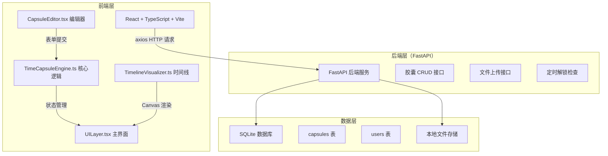
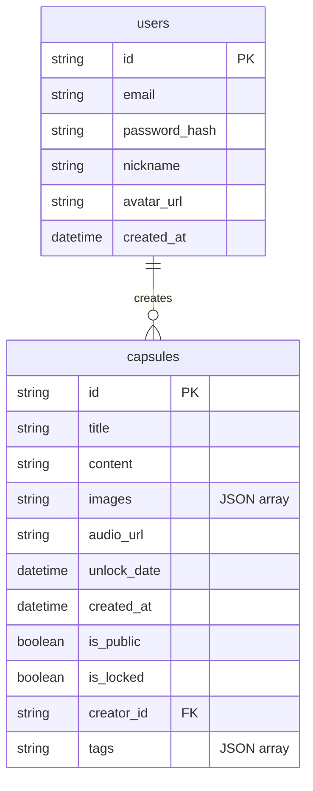

## 1. 架构设计



## 2. 技术说明

- 前端：React 18 + TypeScript + Vite + Tailwind CSS
- 初始化工具：vite-init（react-ts 模板）
- 后端：FastAPI（Python），独立运行，前后端分离
- 数据库：SQLite（开发阶段），通过 FastAPI 接口访问
- 当前阶段：前端为主，后端接口使用 Mock 数据模拟

## 3. 路由定义

| 路由 | 用途 |
|------|------|
| / | 时间线墙主页，展示公开胶囊的发光球体 |
| /create | 创建新胶囊的编辑器页面 |
| /capsule/:id | 胶囊详情页面 |

## 4. API 定义

### 4.1 TypeScript 类型定义

```typescript
interface Capsule {
  id: string;
  title: string;
  content: string;
  images: string[];
  audioUrl: string | null;
  unlockDate: string;
  createdAt: string;
  isPublic: boolean;
  isLocked: boolean;
  creatorId: string;
  tags: string[];
}

interface CreateCapsuleRequest {
  title: string;
  content: string;
  images: File[];
  audio: File | null;
  unlockDate: string;
  isPublic: boolean;
  tags: string[];
}

interface TimelineItem {
  id: string;
  title: string;
  summary: string;
  unlockDate: string;
  isLocked: boolean;
  tags: string[];
  color: string;
}
```

### 4.2 接口列表

| 方法 | 路径 | 描述 | 请求体 | 响应 |
|------|------|------|--------|------|
| GET | /api/capsules | 获取公开胶囊列表（时间线墙） | query: page, limit, tag, keyword | `{ items: TimelineItem[], total: number }` |
| POST | /api/capsules | 创建新胶囊 | FormData (multipart) | `{ capsule: Capsule }` |
| GET | /api/capsules/:id | 获取胶囊详情 | - | `{ capsule: Capsule }` |
| GET | /api/capsules/my | 获取当前用户的胶囊 | query: page, limit | `{ items: Capsule[], total: number }` |
| POST | /api/upload/image | 上传图片 | FormData (multipart) | `{ url: string }` |
| POST | /api/upload/audio | 上传录音 | FormData (multipart) | `{ url: string }` |

## 5. 数据模型

### 5.1 数据模型定义



### 5.2 前端核心模块

| 模块文件 | 职责 |
|----------|------|
| TimeCapsuleEngine.ts | 胶囊核心逻辑：创建、加密（CryptoJS AES）、解锁状态判断、倒计时计算 |
| TimelineVisualizer.ts | 时间线墙可视化：Canvas 渲染发光球体、飞入动画、悬停浮动、呼吸脉冲、点击检测 |
| CapsuleEditor.tsx | 胶囊编辑器组件：文字输入、图片上传预览、录音录制/上传、日期选择、公开设置 |
| UILayer.tsx | 主界面布局：导航栏、时间线墙视图、胶囊详情弹窗、搜索/筛选面板、页面路由 |

## 6. 关键技术实现

### 6.1 时间线墙可视化

- 使用 HTML5 Canvas 渲染发光球体，每帧 requestAnimationFrame 刷新保持 60fps
- 球体属性：位置(x,y)、大小(radius)、颜色(暖金渐变)、光晕强度、动画状态
- 飞入动画：球体从画布随机边缘位置出发，使用 ease-out 缓动飞向目标位置
- 悬停动画：球体微幅上下浮动(±4px) + 光晕呼吸脉冲(透明度0.3-0.7周期变化)
- 点击检测：监听 Canvas 的 mousedown 事件，计算点击坐标与球体位置的距离

### 6.2 加密与解锁

- 使用 CryptoJS AES 加密胶囊内容
- 封存时用用户设定的开启日期作为加密密钥的一部分
- 解锁判断：每分钟检查当前时间与胶囊开启日期，到达后自动标记为已解锁

### 6.3 背景粒子系统

- Canvas 全屏覆盖层，渲染50-80个微小光点
- 每个粒子：随机初始位置、缓慢漂移方向、暖色半透明(rgba(212,165,116,0.3-0.6))、2-4px大小
- 使用 requestAnimationFrame 驱动，与时间线墙共用渲染循环
