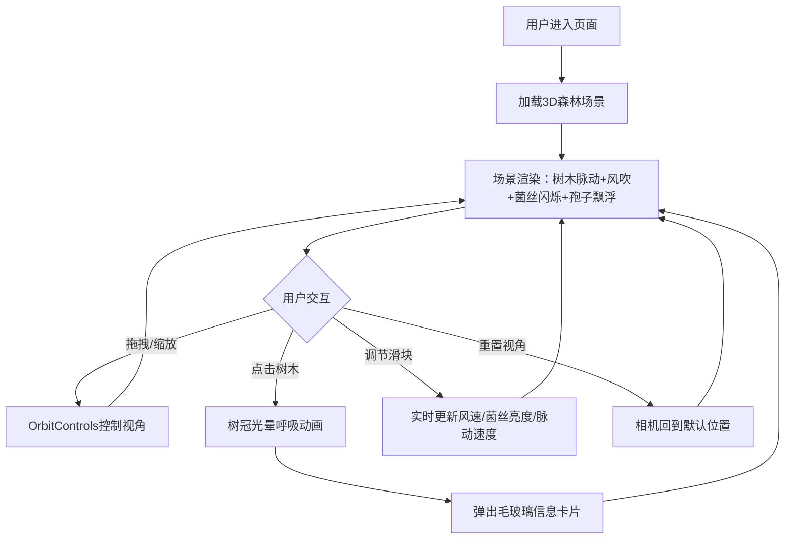

## 1. 产品概述

「森林心跳」是一个3D交互可视化项目，模拟一片古老森林中树木的生命脉搏。用户可以沉浸式地观察树干年轮脉动发光、枝叶随风摇曳、菌丝网络闪烁传递营养信号，还能点击树木触发光晕呼吸效果并查看信息卡片。

- 目标用户：对自然可视化、3D交互艺术感兴趣的体验者
- 核心价值：通过奇幻森林美学与流畅交互，呈现自然界隐含的生命律动之美

## 2. 核心功能

### 2.1 功能模块

1. **3D森林场景**：地面苔藓网格、多棵树木分布、菌丝网络闪烁、飘浮发光孢子
2. **树木交互**：点击树木触发树冠彩色光晕呼吸效果 + 毛玻璃信息卡片弹出
3. **控制面板**：风速/菌丝亮度/脉动速度三个滑块 + 重置视角按钮
4. **视角控制**：鼠标拖拽旋转、滚轮缩放、重置视角

### 2.2 页面详情

| 页面名称 | 模块名称 | 功能描述 |
|----------|----------|----------|
| 主场景 | 森林场景 | 包含15-20棵树木、苔藓地面、菌丝网络、飘浮孢子 |
| 主场景 | 树木交互 | 点击树木触发光晕动画、显示信息卡片（年龄/高度/菌丝活跃度） |
| 主场景 | 控制面板 | 右下角毛玻璃面板，3个滑块+1个重置按钮 |
| 主场景 | 视角控制 | OrbitControls拖拽旋转、滚轮缩放、重置视角 |

## 3. 核心流程

## 4. 用户界面设计

### 4.1 设计风格

- **主色调**：墨绿(#1a3a2a) → 深棕(#3d2b1f) 渐变树干
- **强调色**：翠绿(#00ff88)、金黄(#ffd700)、橙红(#ff6b35) 粒子渐变
- **菌丝光色**：淡蓝绿(#00ffc8) 闪烁
- **背景氛围**：深墨色(#0a0f0d)，雾气效果
- **面板风格**：毛玻璃(backdrop-filter: blur)、半透明深色背景
- **字体**：使用等宽字体显示数据，优雅衬线字体显示标题
- **布局**：全屏3D场景，右下角浮动控制面板，点击弹出信息卡片

### 4.2 页面设计概述

| 页面名称 | 模块名称 | UI元素 |
|----------|----------|--------|
| 主场景 | 森林场景 | 全屏Three.js画布，墨绿深棕色调，雾气氛围 |
| 主场景 | 树木 | 圆台叠加树干+半透明发光粒子树冠+年轮光带 |
| 主场景 | 菌丝网络 | 地面半透明网格线，淡蓝绿闪烁发光 |
| 主场景 | 飘浮孢子 | 小型发光粒子随机飘动，萤火虫效果 |
| 主场景 | 信息卡片 | 毛玻璃半透明卡片，显示树龄/高度/菌丝活跃度 |
| 主场景 | 控制面板 | 右下角毛玻璃面板，3滑块+1按钮 |

### 4.3 响应式

- 桌面优先设计，全屏3D画布自适应窗口大小
- 控制面板在移动端缩放适配

### 4.4 3D场景指引

- **环境**：深墨色雾气笼罩的古老森林，氛围神秘幽深
- **光照**：微弱环境光 + 点光源模拟孢子发光 + 树冠自发光
- **相机**：透视相机，45°俯视角度，OrbitControls交互
- **构图**：15-20棵树木随机分布，中央区域树木较密集
- **交互**：Raycaster点击检测，光晕呼吸动画，信息卡片弹出
- **动画**：树木脉动(0.5-2s周期)、风吹摇摆(正弦波)、菌丝闪烁(随机延迟传播)、孢子飘浮(柏林噪声)
- **后处理**：可选Bloom效果增强发光感
- **性能**：目标60fps，粒子总数控制在合理范围
