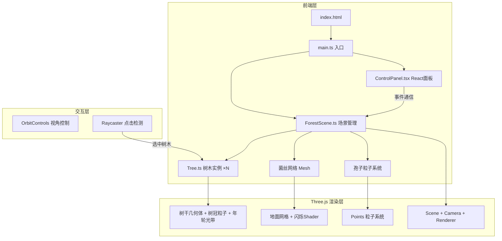

## 1. 架构设计



## 2. 技术说明

- **前端框架**：React 18 + Three.js + Vite + TypeScript
- **初始化工具**：vite-init (react-ts 模板)
- **3D渲染**：Three.js 原生 API（非React Three Fiber，保持用户指定架构）
- **UI组件**：React 仅用于控制面板和信息卡片叠加层
- **状态管理**：zustand（场景参数：风速、菌丝亮度、脉动速度）
- **后端**：无

## 3. 路由定义

| 路由 | 用途 |
|------|------|
| / | 全屏3D森林场景（单页应用） |

## 4. 文件结构

```
src/
├── main.ts              # 入口，初始化Three.js场景、相机、渲染器，动画循环
├── ForestScene.ts       # 森林场景：地面、树木分布、菌丝网络、动画管理
├── Tree.ts              # 单棵树木：树干(圆台叠加)、树冠(粒子)、年轮发光、点击
├── ControlPanel.tsx     # React毛玻璃控制面板：3滑块+重置按钮
├── Utils.ts             # 工具函数：随机位置、颜色插值、缓动
├── store.ts             # zustand状态管理
├── App.tsx              # React根组件
├── index.css            # 全局样式
└── vite-env.d.ts        # 类型声明
```

## 5. 核心类设计

### Tree.ts
- `constructor(x, z, params)` — 根据位置和参数创建树木
- `trunk: Group` — 多段CylinderGeometry圆台叠加，ShaderMaterial年轮光带
- `canopy: Points` — BufferGeometry粒子系统，翠绿/金黄/橙红渐变
- `ringGlow: Mesh` — 年轮环形光带，随时间脉动
- `update(time, windSpeed, pulseSpeed)` — 更新风吹摇摆、脉动、粒子运动
- `triggerGlow()` — 点击触发光晕呼吸效果
- `getInfo()` — 返回树龄/高度/菌丝活跃度数据

### ForestScene.ts
- `constructor(scene)` — 创建地面、菌丝网络、孢子粒子、所有树木
- `trees: Tree[]` — 15-20棵树木实例
- `mycelium: Group` — 菌丝网络网格线
- `spores: Points` — 飘浮孢子粒子系统
- `ground: Mesh` — 苔藓质感地面
- `update(time)` — 更新所有动画
- `onTreeClick(callback)` — 树木点击回调

### ControlPanel.tsx
- React组件，覆盖在Three.js画布上方
- 毛玻璃效果：`backdrop-filter: blur(16px); background: rgba(10,15,13,0.6)`
- 三个Range滑块绑定zustand store
- 重置视角按钮

## 6. 性能策略

- 树冠粒子使用BufferGeometry + Points，避免独立Mesh
- 菌丝网络使用LineSegments，自定义Shader控制闪烁
- 孢子使用单一Points系统
- 年轮发光使用ShaderMaterial，避免每帧更新CPU端数据
- 树木摇摆使用Vertex Shader实现，减少CPU计算
- 渲染器使用antialias + 合理pixelRatio
- ResizeObserver监听窗口变化自适应
