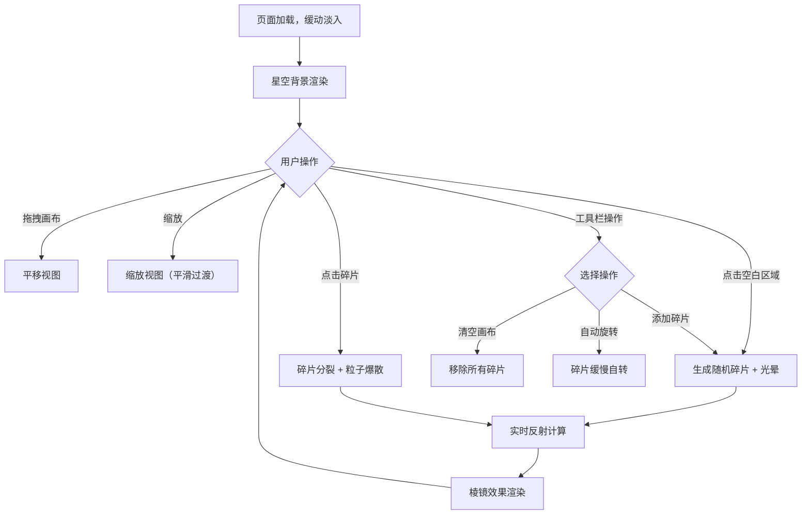

## 1. 产品概述

「镜花水月」是一款交互式递归艺术画廊应用，用户可在无尽画布上放置镜面碎片，碎片会反射周围环境的颜色与图案，形成万花筒般的视觉效果。产品面向创意工作者、数字艺术爱好者和视觉体验探索者，旨在提供一种沉浸式的生成艺术创作与探索体验。

## 2. 核心功能

### 2.1 功能模块

1. **无尽画布**: 支持无限拖拽与缩放的画布空间，用户可自由探索和放置碎片
2. **镜面碎片系统**: 点击画布生成随机形状的半透明彩色多边形碎片，碎片边缘带霓虹光晕
3. **递归分裂**: 点击已有碎片将其分裂为两个更小的碎片，伴随粒子爆散特效
4. **实时反射**: 碎片实时反射周围碎片和背景的渐变颜色，颜色随角度变化产生棱镜效果
5. **星空背景**: 缓慢飘浮的细小光点营造深邃星空氛围
6. **交互控制面板**: 毛玻璃工具栏，含添加碎片、清空画布、自动旋转开关

### 2.2 页面详情

| 页面名称 | 模块名称 | 功能描述 |
|---------|---------|---------|
| 主画布页面 | 无尽画布 | 支持鼠标/触屏拖拽、缩放，碎片平滑过渡 |
| 主画布页面 | 碎片创建 | 点击空白区域生成随机形状碎片，带柔和光晕 |
| 主画布页面 | 碎片分裂 | 点击碎片触发分裂动画和粒子爆散特效 |
| 主画布页面 | 实时反射 | 碎片反射周围颜色，棱镜效果 |
| 主画布页面 | 信息面板 | 左上角显示碎片数量和缩放比例 |
| 主画布页面 | 工具栏 | 右下角毛玻璃工具栏，缓动展开动画 |
| 主画布页面 | 星空背景 | 缓慢飘浮光点，营造深空氛围 |

## 3. 核心流程

1. 用户打开页面，看到深黑底色上的星空背景，页面缓动淡入
2. 点击画布空白区域，生成一个随机形状的镜面碎片，碎片边缘有霓虹光晕
3. 碎片自动反射周围环境的渐变颜色，颜色随角度变化呈现棱镜效果
4. 用户可拖拽画布浏览，也可缩放查看细节或全局
5. 点击已有碎片，碎片分裂为两个更小碎片，同时产生粒子爆散特效
6. 分裂后的碎片继续反射周围颜色，形成递归的万花筒视觉效果
7. 通过右下角工具栏可添加碎片、清空画布或开启自动旋转
8. 左上角实时显示碎片数量和缩放比例

## 4. 用户界面设计

### 4.1 设计风格

- **主色调**: 深黑底色（#0a0a0f），碎片使用半透明彩色多边形
- **光晕风格**: 碎片边缘霓虹光晕，颜色基于碎片色相偏移
- **字体**: 信息面板使用纤细等宽字体（JetBrains Mono / Source Code Pro）
- **布局**: 全屏画布，叠加半透明 UI 层
- **图标**: 线性图标风格（Lucide）
- **动画**: 所有交互都有缓动动画和弹性效果

### 4.2 页面设计概览

| 页面名称 | 模块名称 | UI 元素 |
|---------|---------|---------|
| 主画布页面 | 画布区域 | 深黑底色，星空光点，全屏 Canvas |
| 主画布页面 | 碎片 | 半透明多边形，霓虹边缘光晕，反射渐变 |
| 主画布页面 | 信息面板 | 左上角，毛玻璃背景，白色细字，显示碎片数/缩放比 |
| 主画布页面 | 工具栏 | 右下角，毛玻璃背景，3个图标按钮，缓动展开 |
| 主画布页面 | 粒子特效 | 分裂时爆散的小光点，渐隐消失 |

### 4.3 响应式适配

- **桌面端**: 鼠标点击创建/分裂碎片，滚轮缩放，拖拽平移
- **移动端**: 触摸点击创建/分裂，双指缩放，单指拖拽，手势操作
- **自适应布局**: 工具栏和信息面板在小屏幕上缩小但保持可用

### 4.4 性能目标

- 碎片数量 ≤ 200 时保持 60fps
- 碎片数量 > 200 时自动降低反射计算复杂度
- 缩放时碎片保持平滑过渡
- 触屏手势流畅响应
