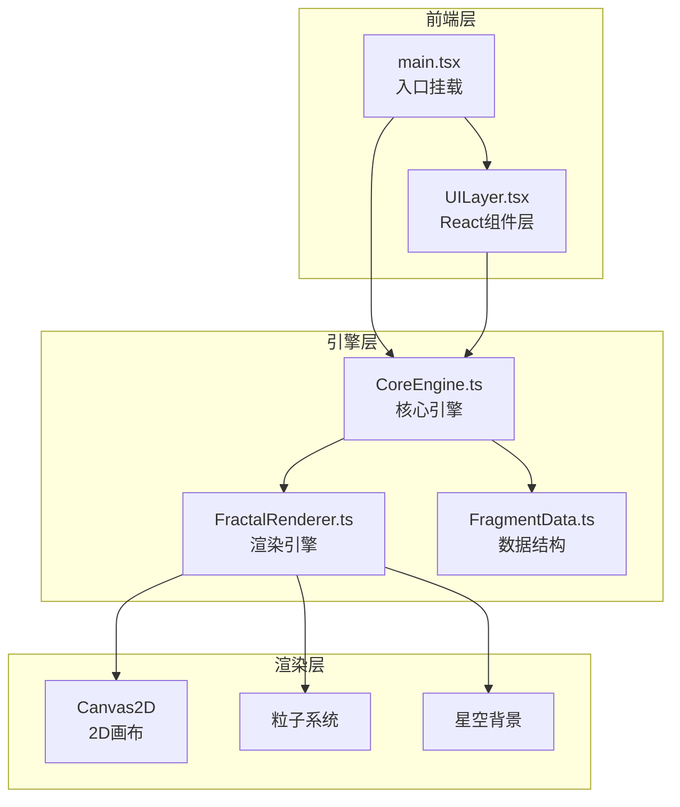

## 1. 架构设计



## 2. 技术说明

- **前端框架**: React 18 + TypeScript
- **构建工具**: Vite + @vitejs/plugin-react
- **状态管理**: Zustand（管理碎片列表、缩放、画布偏移等全局状态）
- **渲染方式**: Canvas2D（碎片、反射、粒子、星空全在 Canvas 上绘制）
- **动画**: requestAnimationFrame 驱动主循环，缓动函数实现平滑过渡
- **样式**: Tailwind CSS（UI 层组件样式）
- **初始化工具**: vite-init (react-ts 模板)

## 3. 路由定义

| 路由 | 用途 |
|------|------|
| / | 主画布页面，包含所有交互功能 |

本项目为单页应用，只有一个主画布页面。

## 4. 核心模块设计

### 4.1 FragmentData.ts — 数据结构

```typescript
interface FragmentData {
  id: string;
  x: number;           // 世界坐标 X
  y: number;           // 世界坐标 Y
  rotation: number;    // 旋转角度（弧度）
  scale: number;       // 缩放比例
  vertices: number[][]; // 多边形顶点（相对中心）
  hue: number;         // 基础色相
  opacity: number;     // 透明度
  reflectIntensity: number; // 反射强度
  generation: number;  // 分裂代数（用于缩小和降低复杂度）
  autoRotate: boolean; // 是否自动旋转
  rotateSpeed: number; // 旋转速度
  birthTime: number;   // 创建时间（用于入场动画）
}
```

### 4.2 CoreEngine.ts — 核心引擎

职责：
- 管理碎片的创建与分裂算法
- 计算碎片的反射颜色（采样周围碎片的色相和背景渐变）
- 处理画布的无限拖拽和缩放逻辑
- 维护碎片列表，性能优化（超过200个碎片时降低反射精度）
- 提供碎片分裂时的粒子数据

### 4.3 FractalRenderer.ts — 渲染引擎

职责：
- Canvas2D 绘制所有碎片（半透明多边形 + 霓虹光晕）
- 实时反射渲染：对每个碎片根据角度采样周围颜色，绘制棱镜效果渐变
- 粒子系统：分裂爆散粒子，带渐隐和重力
- 星空背景：缓慢飘浮的光点
- 缩放和偏移变换

### 4.4 UILayer.tsx — React UI层

职责：
- 工具栏组件（添加碎片、清空画布、自动旋转开关）
- 信息面板（碎片数量、缩放比例）
- 毛玻璃效果和缓动动画
- 事件处理（点击、拖拽、缩放）

## 5. 性能优化策略

1. **反射复杂度降级**: 碎片 > 200 时，反射采样从每帧全量计算降为每3帧计算一次
2. **离屏碎片剔除**: 视口外的碎片跳过渲染
3. **粒子池复用**: 预分配粒子对象池，避免频繁 GC
4. **缩放插值**: 缩放目标值通过缓动函数平滑过渡，避免突变
5. **Canvas 分层**: 星空背景使用低帧率更新（30fps），碎片和粒子使用 60fps
