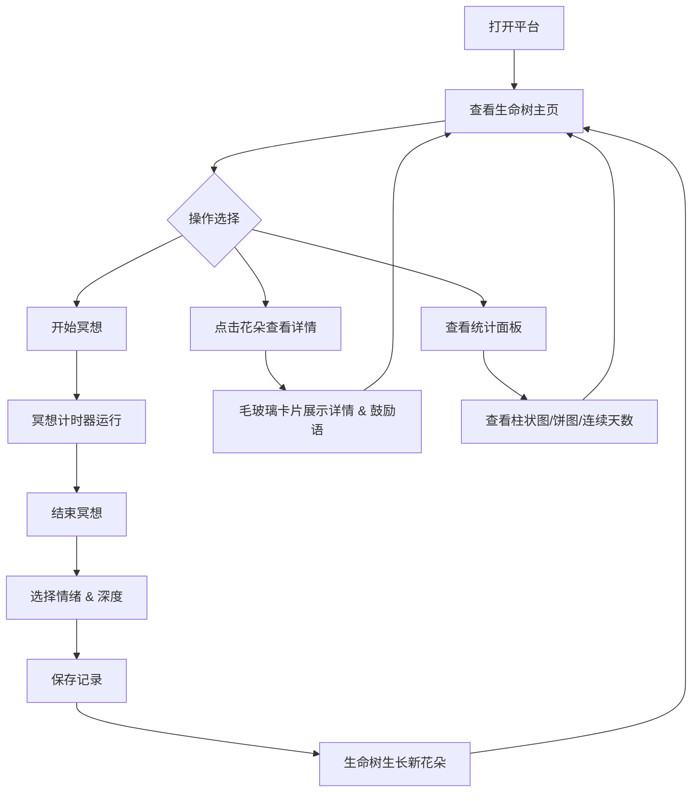

## 1. 产品概述

「呼吸回响」是一款在线冥想引导与情绪追踪平台，帮助用户通过冥想练习培养正念习惯，并以动态生长的「生命树」可视化呈现冥想历程。
- 目标用户：希望培养冥想习惯、关注心理健康的都市人群
- 核心价值：将抽象的冥想数据转化为直观、可交互的生命树视觉叙事，激励用户持续练习

## 2. 核心功能

### 2.1 用户角色
| 角色 | 注册方式 | 核心权限 |
|------|----------|----------|
| 普通用户 | 邮箱注册 | 记录冥想、查看生命树、查看统计 |

### 2.2 功能模块
1. **生命树页面**：动态生长的 Canvas 生命树、花朵交互、毛玻璃卡片详情
2. **冥想记录页面**：冥想计时器、情绪选择、深度记录
3. **统计面板页面**：柱状图、饼图、连续冥想天数

### 2.3 页面详情
| 页面名称 | 模块名称 | 功能描述 |
|----------|----------|----------|
| 生命树页面 | 生命树画布 | 根据历史冥想数据动态生长，树根延伸、树冠开花，花朵颜色代表情绪（宁静蓝、喜悦黄、焦虑橙） |
| 生命树页面 | 花朵交互 | 点击花朵展开毛玻璃卡片，显示该次冥想的详细记录和自动生成的鼓励语 |
| 冥想记录页面 | 冥想计时器 | 支持开始/暂停/结束冥想，实时显示冥想时长 |
| 冥想记录页面 | 情绪与深度录入 | 冥想结束后选择情绪状态和冥想深度，保存记录 |
| 统计面板页面 | 柱状图 | 展示最近一周每日冥想时长 |
| 统计面板页面 | 饼图 | 展示情绪分布比例 |
| 统计面板页面 | 连续冥想天数 | 显示当前连续冥想天数打卡 |

## 3. 核心流程

用户打开平台后进入生命树主页面，可以看到自己基于历史数据生长的生命树。用户可以点击「开始冥想」进入冥想模式，计时器开始运行。冥想结束后，用户选择情绪状态和深度，系统保存记录并更新生命树——新的花朵在树冠上绽放，颜色对应情绪。用户可以点击任意花朵查看冥想详情和鼓励语。用户也可切换到统计面板查看数据概览。

## 4. 用户界面设计

### 4.1 设计风格
- 主色调：米白色（#FAF8F5）背景 + 浅木色（#D4B896）装饰
- 强调色：宁静蓝（#6BA3BE）、喜悦黄（#F2C94C）、焦虑橙（#E8A87C）
- 按钮风格：圆角（16px）、柔和阴影、hover 时微缩放
- 字体：标题使用 Noto Serif SC（衬线），正文使用 Noto Sans SC
- 布局风格：居中单栏布局、毛玻璃卡片、宽松留白
- 背景：缓慢飘浮的细小光点（模拟森林晨雾），Canvas 渲染

### 4.2 页面设计概览
| 页面名称 | 模块名称 | UI元素 |
|----------|----------|--------|
| 生命树页面 | 生命树画布 | Canvas 绘制树干/树根/花朵，背景光点粒子动画，花朵 hover 发光 |
| 生命树页面 | 花朵详情卡片 | 毛玻璃背景（backdrop-blur）、圆角、柔和阴影、淡入动画 |
| 冥想记录页面 | 计时器 | 大字体数字显示、环形进度条、开始/暂停/结束按钮 |
| 冥想记录页面 | 情绪选择 | 三个色彩圆圈（蓝/黄/橙），点击选中带缩放反馈 |
| 统计面板页面 | 柱状图 | CSS 绘制柱状图，柱体带圆角顶部，hover 显示具体数值 |
| 统计面板页面 | 饼图 | CSS/SVG 绘制，颜色对应情绪，hover 显示比例 |
| 统计面板页面 | 连续天数 | 数字 + 火焰图标，大字体展示 |

### 4.3 响应式
- 桌面优先设计，适配 1920px ~ 1024px 宽度
- 平板适配：768px ~ 1024px，画布缩放、布局调整为单栏
- 所有交互支持触摸操作，按钮最小触摸目标 44px

### 4.4 动画与性能
- 页面切换：缓动淡入动画（ease-out, 300ms）
- 光点粒子：Canvas requestAnimationFrame 渲染，60fps
- 生命树生长：渐进式动画，花朵绽放带缩放 + 旋转
- 毛玻璃卡片：展开带 scale + opacity 过渡
- 所有动画使用 transform/opacity 属性，避免重排重绘
