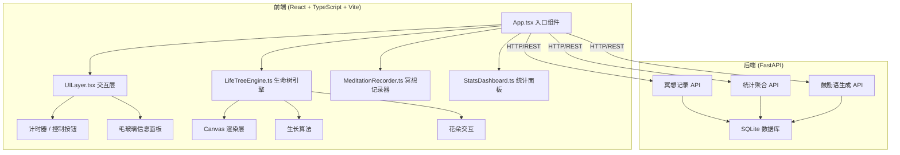
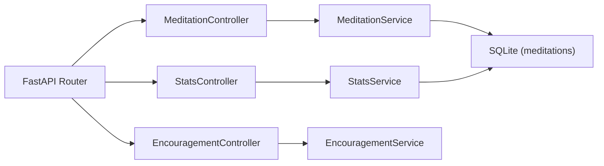
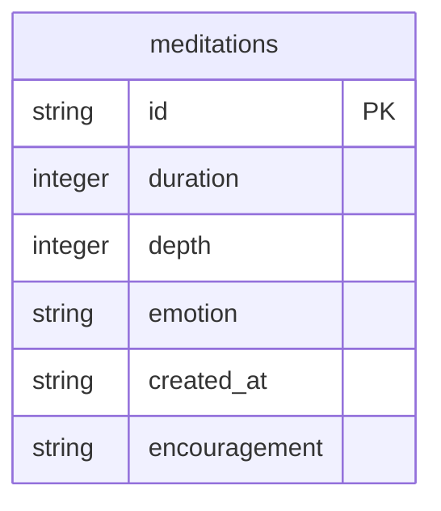

## 1. 架构设计



## 2. 技术说明
- 前端：React@18 + TypeScript + Vite + Tailwind CSS
- 初始化工具：vite-init（react-ts 模板）
- 后端：FastAPI (Python 3.10+)
- 数据库：SQLite（轻量本地存储，适合个人冥想记录）
- 状态管理：Zustand
- 图表：纯 CSS/SVG 实现（柱状图、饼图），不引入第三方图表库
- Canvas 渲染：原生 Canvas API（生命树、粒子效果）

## 3. 路由定义
| 路由 | 用途 |
|------|------|
| / | 生命树主页面，展示动态生命树和花朵交互 |
| /meditate | 冥想记录页面，计时器和情绪录入 |
| /stats | 统计面板页面，柱状图、饼图、连续天数 |

## 4. API 定义

### 4.1 数据类型
```typescript
interface MeditationRecord {
  id: string;
  duration: number;
  depth: number;
  emotion: 'calm' | 'joy' | 'anxiety';
  createdAt: string;
  encouragement: string;
}

interface MeditationSession {
  startTime: string;
  endTime?: string;
  isActive: boolean;
}

interface DailyStats {
  date: string;
  totalDuration: number;
  sessionCount: number;
}

interface EmotionDistribution {
  calm: number;
  joy: number;
  anxiety: number;
}

interface StreakInfo {
  currentStreak: number;
  longestStreak: number;
}
```

### 4.2 API 端点
| 方法 | 路径 | 请求体 | 响应 |
|------|------|--------|------|
| GET | /api/meditations | - | MeditationRecord[] |
| POST | /api/meditations | { duration, depth, emotion } | MeditationRecord |
| GET | /api/stats/daily?days=7 | - | DailyStats[] |
| GET | /api/stats/emotions | - | EmotionDistribution |
| GET | /api/stats/streak | - | StreakInfo |
| GET | /api/encouragement?emotion={emotion} | - | { message: string } |

## 5. 服务端架构图



## 6. 数据模型

### 6.1 数据模型定义



### 6.2 数据定义语言
```sql
CREATE TABLE meditations (
    id TEXT PRIMARY KEY,
    duration INTEGER NOT NULL,
    depth INTEGER NOT NULL CHECK(depth BETWEEN 1 AND 5),
    emotion TEXT NOT NULL CHECK(emotion IN ('calm', 'joy', 'anxiety')),
    created_at TEXT NOT NULL DEFAULT (datetime('now')),
    encouragement TEXT NOT NULL
);

CREATE INDEX idx_meditations_created_at ON meditations(created_at);
CREATE INDEX idx_meditations_emotion ON meditations(emotion);
```
