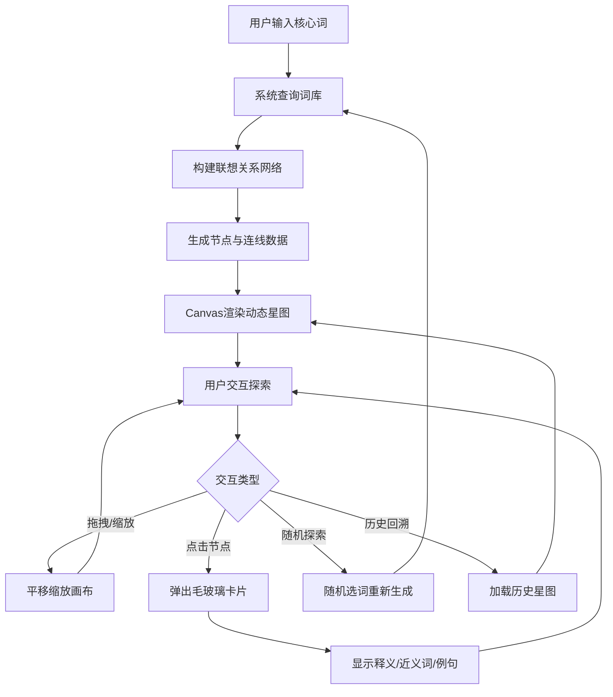

## 1. 产品概述

「语汇星图」是一个在线词汇联想与视觉化平台，用户输入核心词后系统生成动态联想星图，以知识宇宙风格呈现词汇关系网络。
- 解决传统词汇学习缺乏直观关联展示的问题，通过交互式星图让用户探索词汇之间的语义联系
- 面向语言学习者、写作工作者和知识探索爱好者，提供沉浸式词汇发现体验

## 2. 核心功能

### 2.1 用户角色
| 角色 | 注册方式 | 核心权限 |
|------|----------|----------|
| 访客 | 无需注册 | 浏览并使用全部功能 |

### 2.2 功能模块
1. **星图主页**: 搜索输入、星图画布、随机探索按钮、重置视角
2. **节点详情**: 毛玻璃信息卡片、释义、近义词、例句展示
3. **搜索历史**: 历史面板、回溯之前的联想图

### 2.3 页面详情
| 页面名称 | 模块名称 | 功能描述 |
|----------|----------|----------|
| 星图主页 | 搜索框 | 输入核心词，触发联想星图生成，支持回车和点击搜索 |
| 星图主页 | 星图画布 | Canvas渲染动态星图，节点发光、连线渐变、背景星点飘浮 |
| 星图主页 | 随机探索按钮 | 从词库随机选词生成星图，带缓动动画过渡 |
| 星图主页 | 重置视角按钮 | 将画布视图恢复到初始缩放和位置 |
| 节点详情 | 毛玻璃信息卡片 | 点击节点弹出，显示释义、近义词、例句，带涟漪放大动画 |
| 搜索历史 | 历史面板 | 侧边栏展示搜索历史列表，点击可回溯对应星图 |

## 3. 核心流程

用户输入核心词 → 系统查询词库并构建联想关系网络 → 生成节点和连线数据 → Canvas渲染动态星图 → 用户通过拖拽/缩放探索 → 点击节点查看详情 → 搜索历史自动记录 → 可随时回溯或随机探索

## 4. 用户界面设计

### 4.1 设计风格
- **主色调**: 深蓝紫渐变背景（#0a0a2e → #1a0a3e）
- **节点颜色**: 名词-蓝(#4a9eff)、动词-橙(#ff8c42)、形容词-绿(#4ade80)、其他-紫(#a78bfa)
- **按钮风格**: 圆角半透明毛玻璃风格，悬停时发光加强
- **字体**: 标题使用 "Orbitron"（科技感），正文使用 "Noto Sans SC"（中文友好）
- **布局**: 全屏画布 + 顶部浮动搜索栏 + 左侧历史面板 + 右下角操作按钮
- **图标风格**: 线条风格(lucide-react)，半透明白色

### 4.2 页面设计概览
| 页面名称 | 模块名称 | UI元素 |
|----------|----------|--------|
| 星图主页 | 搜索框 | 毛玻璃背景、圆角、发光边框、搜索图标、居中浮动于顶部 |
| 星图主页 | 星图画布 | 全屏Canvas、深蓝紫渐变背景、飘浮星点粒子、发光节点和渐变连线 |
| 星图主页 | 随机探索按钮 | 右下角圆形按钮、骰子图标、脉冲动画提示 |
| 星图主页 | 重置视角按钮 | 随机按钮旁、十字准星图标、简洁圆角方形 |
| 节点详情 | 毛玻璃卡片 | 居中弹出、backdrop-blur、词性色标、释义/近义词/例句三段式布局 |
| 搜索历史 | 历史面板 | 左侧滑出、毛玻璃背景、时间戳列表、悬停高亮、删除按钮 |

### 4.3 响应式适配
- 桌面端（≥1024px）: 全屏画布 + 完整侧边历史面板
- 平板端（768px-1023px）: 全屏画布 + 可折叠历史面板（点击图标展开）
- 触控优化: 支持双指缩放、单指拖拽、长按触发节点详情

### 4.4 动画与交互
- 页面加载: 缓动淡入（ease-out 0.6s）
- 节点出现: 从中心向外扩散，带弹性动画
- 节点点击: 放大 + 涟漪扩散动画（3层涟漪，间隔0.15s）
- 连线绘制: 从中心节点向关联节点逐步延伸
- 背景星点: 缓慢飘浮，半透明闪烁
- 面板切换: 滑入/滑出 + 毛玻璃模糊过渡
- 性能目标: 始终保持60fps
