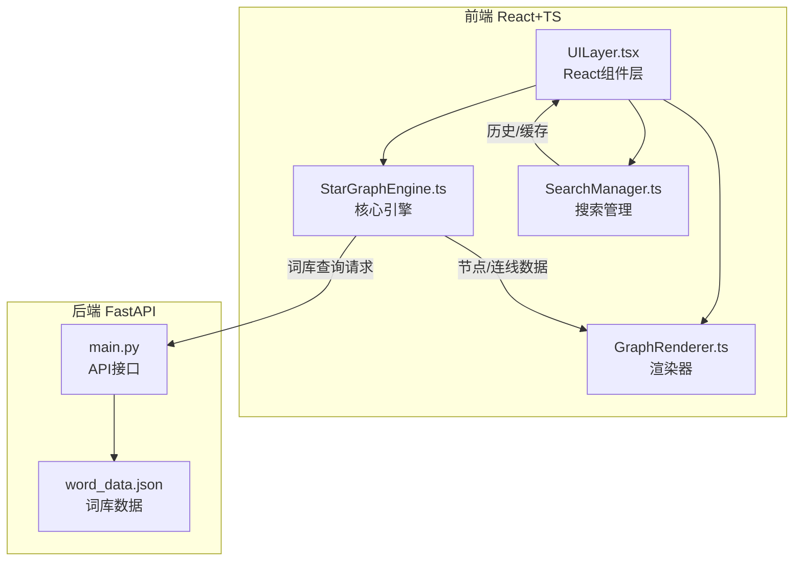
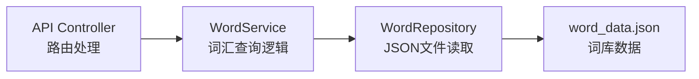
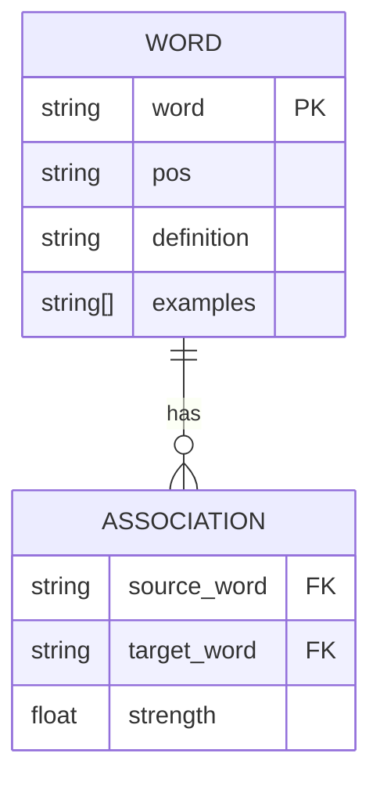

## 1. 架构设计



## 2. 技术说明
- **前端**: React@18 + TypeScript + Vite + TailwindCSS + Zustand
- **初始化工具**: vite-init（react-ts模板）
- **后端**: FastAPI（Python）
- **数据库**: 无数据库，使用 word_data.json 静态词库文件
- **渲染**: Canvas 2D API（高性能60fps渲染）
- **状态管理**: Zustand（轻量级，管理搜索历史和UI状态）

## 3. 路由定义
| 路由 | 用途 |
|------|------|
| / | 星图主页，包含搜索、画布、历史面板等全部功能 |

## 4. API定义

### 4.1 获取词汇联想
```
GET /api/word/associations?word={word}
Response: {
  word: string
  pos: "noun" | "verb" | "adj" | "other"
  definition: string
  examples: string[]
  associations: {
    word: string
    pos: string
    strength: number  // 0-1 关联强度
  }[]
}
```

### 4.2 随机获取词汇
```
GET /api/word/random
Response: {
  word: string
  pos: string
  definition: string
  examples: string[]
  associations: {
    word: string
    pos: string
    strength: number
  }[]
}
```

### 4.3 搜索词汇
```
GET /api/word/search?q={query}
Response: {
  results: {
    word: string
    pos: string
    definition: string
  }[]
}
```

## 5. 服务器架构图



## 6. 数据模型

### 6.1 数据模型定义



### 6.2 数据定义

word_data.json 结构:
```json
{
  "words": [
    {
      "word": "思维",
      "pos": "noun",
      "definition": "人脑对客观事物间接的概括的反映",
      "examples": ["创造性思维是解决问题的关健"],
      "associations": [
        { "word": "思考", "strength": 0.9 },
        { "word": "逻辑", "strength": 0.7 }
      ]
    }
  ]
}
```

## 7. 前端核心模块

### 7.1 StarGraphEngine.ts
- 职责: 管理词库载入、联想关系网络构建、节点和连线数据生成
- 核心方法:
  - `loadWordData()`: 从后端加载词库
  - `buildGraph(word: string)`: 构建以该词为核心的星图数据
  - `getNodePosition(index: number, total: number)`: 计算节点在星图中的位置
  - `getAssociations(word: string)`: 获取关联词列表

### 7.2 GraphRenderer.ts
- 职责: Canvas渲染星图，处理交互和动画
- 核心方法:
  - `init(canvas: HTMLCanvasElement)`: 初始化Canvas和事件监听
  - `render(graphData: GraphData)`: 渲染星图（节点、连线、背景粒子）
  - `handleDrag()`: 处理节点拖拽
  - `handleZoom()`: 处理画布缩放
  - `animateRipple(node: Node)`: 触发涟漪动画
  - `animateBackground()`: 背景星点飘浮动画

### 7.3 SearchManager.ts
- 职责: 管理搜索历史、随机探索、节点信息缓存
- 核心方法:
  - `addHistory(word: string, graphData: GraphData)`: 添加搜索记录
  - `getHistory()`: 获取历史列表
  - `clearHistory()`: 清空历史
  - `randomExplore()`: 随机选词并生成星图
  - `cacheNodeInfo(word: string)`: 缓存节点详情

### 7.4 UILayer.tsx
- 职责: React组件，包含搜索框、历史面板、随机按钮、毛玻璃信息卡片、重置视角按钮
- 核心组件:
  - `SearchBar`: 搜索输入框
  - `HistoryPanel`: 搜索历史侧边栏
  - `NodeInfoCard`: 毛玻璃信息卡片
  - `ActionButtons`: 随机探索和重置视角按钮
  - `StarGraphApp`: 主应用组件，整合所有模块
