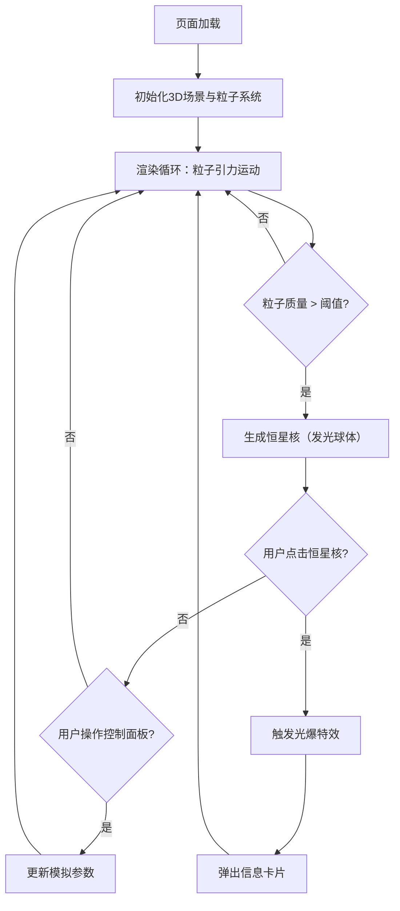

## 1. 产品概述

「星尘回响」是一款基于 Web 的3D交互可视化应用，模拟星云中尘埃粒子在引力作用下聚合并形成新恒星的动态过程。用户可自由旋转缩放视角观察粒子流、碰撞和凝聚效果，点击恒星核触发光爆并查看其物理属性信息。

- 目标用户：天文爱好者、视觉艺术创作者、科学教育场景
- 核心价值：将天体物理中恒星诞生的抽象过程转化为沉浸式、可交互的视觉体验

## 2. 核心功能

### 2.1 功能模块

1. **星云可视化场景**：3D粒子系统模拟星云尘埃，粒子在引力作用下运动、碰撞、凝聚
2. **恒星核生成与交互**：粒子凝聚到阈值后形成恒星核（发光球体），点击触发光爆特效并弹出信息卡片
3. **控制面板**：调节引力强度、粒子密度、光晕强度的滑块，以及重置视角按钮
4. **信息卡片**：毛玻璃半透明卡片，显示恒星核质量、温度、预估寿命

### 2.2 页面详情

| 页面名称 | 模块名称 | 功能描述 |
|----------|----------|----------|
| 主场景 | 星云粒子系统 | 数千粒子在3D空间中受引力运动，半透明彩色光点随距离变化大小和透明度 |
| 主场景 | 恒星核 | 粒子凝聚后生成发光球体，表面有动态纹理流动效果 |
| 主场景 | 光爆特效 | 点击恒星核后粒子向外喷涌并消散的动画 |
| 主场景 | 背景星点 | 飘浮的细小星点营造深空氛围 |
| 主场景 | 控制面板 | 右下角毛玻璃面板，3个滑块+1个重置按钮 |
| 主场景 | 信息卡片 | 点击恒星核弹出的毛玻璃卡片，显示质量/温度/寿命 |

## 3. 核心流程

用户打开页面后进入纯黑深空场景，星云粒子已在引力作用下缓慢运动。用户可拖拽旋转视角、滚轮缩放观察。当粒子自然凝聚形成恒星核后，用户可点击恒星核触发光爆特效（粒子喷涌消散），同时弹出信息卡片显示该恒星核物理数据。用户也可通过控制面板实时调节引力强度、粒子密度和光晕强度，改变模拟行为。点击重置视角按钮恢复默认相机位置。

## 4. 用户界面设计

### 4.1 设计风格

- **主色调**：纯黑背景 (#000000)，粒子蓝紫 (#6366f1 → #a855f7)、粉紫 (#d946ef)、橙黄 (#f59e0b → #fbbf24) 渐变
- **UI风格**：毛玻璃（backdrop-filter: blur），半透明深色面板 rgba(10,10,30,0.6)
- **字体**：Orbitron（科幻感显示字体）+ Exo 2（清晰UI字体）
- **布局**：全屏3D场景，右下角浮动控制面板，点击弹出的居中信息卡片
- **交互反馈**：滑块拖动实时改变场景，恒星核hover发光增强，光爆有震动反馈

### 4.2 页面设计概览

| 页面名称 | 模块名称 | UI元素 |
|----------|----------|--------|
| 主场景 | 星云粒子 | Points几何体，自定义ShaderMaterial，蓝紫/粉紫/橙黄渐变色，半透明 |
| 主场景 | 恒星核 | SphereGeometry + 自定义ShaderMaterial（动态纹理流动），外层光晕Sprite |
| 主场景 | 背景星点 | 小型Points，白色/淡蓝色，随机分布 |
| 主场景 | 控制面板 | 毛玻璃面板，圆角12px，3个Range滑块（自定义样式），重置按钮 |
| 主场景 | 信息卡片 | 毛玻璃卡片，显示质量/温度/寿命，Orbitron字体标题，淡入动画 |

### 4.3 响应式设计

- 桌面优先，全屏3D场景
- 控制面板在小屏时收起为可展开按钮
- 信息卡片固定尺寸，居中弹出

### 4.4 3D场景指引

- **环境/氛围**：纯黑深空，无HDRI，通过粒子颜色和发光营造氛围
- **光照**：无方向光，恒星核自发光（PointLight），环境光极暗
- **相机**：PerspectiveCamera，OrbitControls控制，初始距离30，FOV 60°
- **构图**：星云居中，粒子分布半径约20，恒星核在星云核心区域生成
- **交互**：OrbitControls（拖拽旋转、滚轮缩放），Raycaster点击检测恒星核
- **后处理**：UnrealBloomPass泛光效果增强发光感
- **性能预算**：粒子总数5000-8000，恒星核同时存在3-5个，目标60fps
