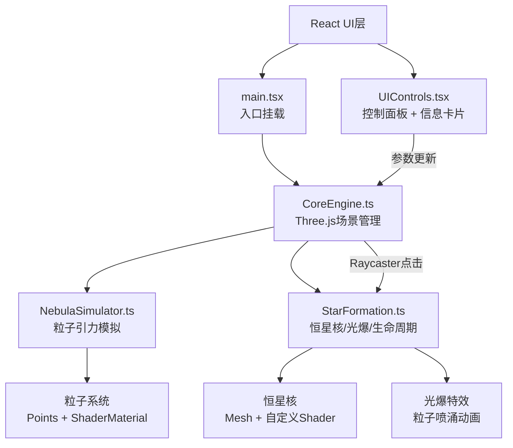

## 1. 架构设计



## 2. 技术说明

- **前端框架**：React 18 + TypeScript
- **3D引擎**：Three.js（直接使用，非R3F，以便精细控制渲染循环和粒子系统）
- **UI层**：React + Tailwind CSS（毛玻璃面板、滑块、卡片）
- **状态管理**：Zustand（共享模拟参数：引力强度、粒子密度、光晕强度）
- **构建工具**：Vite
- **后端**：无
- **数据库**：无

### 关键依赖

| 包名 | 用途 |
|------|------|
| three | 3D渲染引擎 |
| @types/three | TypeScript类型 |
| react | UI框架 |
| react-dom | React DOM渲染 |
| zustand | 轻量状态管理 |
| tailwindcss | 样式 |

## 3. 路由定义

本项目为单页面应用，无路由。

| 路由 | 用途 |
|------|------|
| / | 主场景页面，3D可视化 + 控制面板 |

## 4. 文件结构

```
├── index.html
├── package.json
├── tsconfig.json
├── vite.config.ts
├── tailwind.config.js
├── postcss.config.js
├── src/
│   ├── main.tsx              # 入口：挂载React + 初始化3D引擎
│   ├── CoreEngine.ts         # 核心引擎：场景、相机、渲染循环、粒子系统管理
│   ├── NebulaSimulator.ts    # 粒子引力运动、碰撞检测、凝聚逻辑
│   ├── StarFormation.ts      # 恒星核生成、光爆特效、生命周期管理
│   ├── UIControls.tsx        # React组件：控制面板、信息卡片
│   ├── store.ts              # Zustand状态管理
│   ├── shaders/
│   │   ├── nebulaParticle.ts # 星云粒子Shader（顶点/片元）
│   │   ├── starCore.ts       # 恒星核Shader（动态纹理流动）
│   │   └── burstParticle.ts  # 光爆粒子Shader
│   └── index.css             # 全局样式 + Tailwind
```

## 5. 核心模块设计

### 5.1 CoreEngine

- 创建Three.js Scene、PerspectiveCamera、WebGLRenderer
- 添加OrbitControls用于视角控制
- 添加EffectComposer + UnrealBloomPass后处理
- 管理渲染循环（requestAnimationFrame）
- 管理NebulaSimulator和StarFormation实例
- 处理Raycaster点击检测恒星核
- 管理背景星点（小Points）
- 监听Zustand store变化更新参数

### 5.2 NebulaSimulator

- 管理粒子BufferGeometry（position、color、size、velocity属性）
- 自定义ShaderMaterial渲染半透明彩色粒子
- 每帧更新粒子位置：应用引力加速度、速度衰减、边界回弹
- 检测粒子凝聚：当一定范围内的粒子密度超过阈值，通知StarFormation生成恒星核
- 粒子密度参数控制活跃粒子数量

### 5.3 StarFormation

- 恒星核：SphereGeometry + 自定义ShaderMaterial（动态纹理流动）
- 外层光晕：Sprite + 径向渐变纹理
- 点光源：PointLight附加在恒星核上
- 生命周期：生成 → 成长（半径/亮度渐增）→ 稳定
- 光爆特效：点击时创建粒子群向外喷涌并消散（透明度渐减）
- 信息数据：根据恒星核大小和周围粒子数量计算质量、温度、寿命

### 5.4 UIControls

- 控制面板组件：毛玻璃背景、3个自定义滑块、重置按钮
- 信息卡片组件：毛玻璃背景、显示质量/温度/寿命
- 通过Zustand store读取和更新参数
- 信息卡片通过回调控制显示/隐藏

## 6. 数据模型

### 6.1 Zustand Store

```typescript
interface SimParams {
  gravityStrength: number;   // 0.1 - 5.0, 默认 1.0
  particleDensity: number;   // 1000 - 8000, 默认 5000
  glowIntensity: number;     // 0.1 - 3.0, 默认 1.0
}

interface StarInfo {
  mass: number;       // 太阳质量单位
  temperature: number; // 开尔文
  lifespan: number;    // 百万年
}
```
