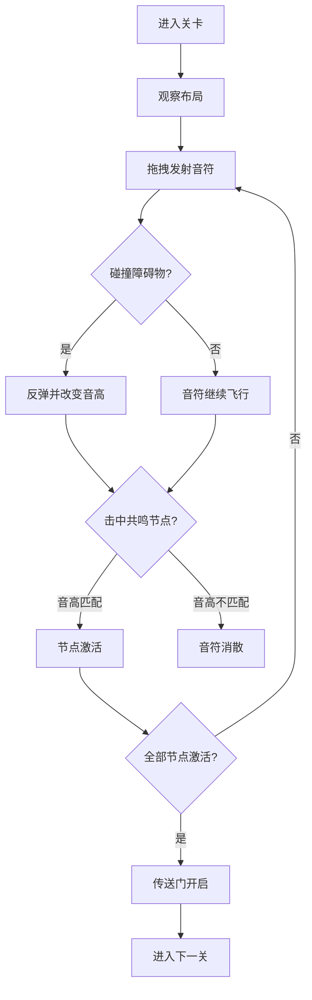

## 1. 产品概述

「音域迷雾」是一款2D节奏解谜游戏，玩家在声波粒子构成的迷雾地图中通过发射音符、利用反弹和音高变化来激活共鸣节点，解锁传送门通往下一层。
- 核心玩法：音符物理反弹 + 音高变化 + 共鸣节点激活，融合节奏感与空间解谜
- 目标用户：喜欢音乐游戏、解谜游戏、独立游戏的玩家，追求迷幻视觉体验

## 2. 核心功能

### 2.1 功能模块

1. **游戏主画面**：声波粒子迷雾地图、玩家控制、音符发射与反弹、障碍物与共鸣节点交互
2. **关卡系统**：多关卡递进，障碍物布局与共鸣节点位置随机生成，难度递增

### 2.2 页面详情

| 页面名称 | 模块名称 | 功能描述 |
|---------|---------|---------|
| 游戏主画面 | 迷雾地图 | Canvas绘制的声波粒子背景，玩家可拖拽发射音符 |
| 游戏主画面 | 音符物理系统 | 音符发射后碰撞障碍物反弹并改变音高，部分音符分裂为低频分身 |
| 游戏主画面 | 共鸣节点 | 音符以正确音高击中共鸣节点可激活，全部激活后开启传送门 |
| 游戏主画面 | 障碍物系统 | 不同布局的障碍物，部分带时间衰减属性（定时消失） |
| 游戏主画面 | 传送门 | 所有共鸣节点激活后出现，带螺旋扭曲光纹动画 |
| UI层 | 关卡信息 | 左上角显示当前关卡编号和已收集共鸣数 |
| UI层 | 重置按钮 | 右下角毛玻璃风格重置按钮，点击重置当前关卡 |
| UI层 | 提示按钮 | 右下角毛玻璃风格提示按钮，高亮最近的未激活节点 |

## 3. 核心流程

玩家进入关卡 → 观察障碍物与共鸣节点布局 → 拖拽发射音符 → 音符碰撞障碍物反弹并改变音高 → 以正确音高击中共鸣节点激活 → 全部节点激活 → 传送门开启（螺旋光纹动画） → 进入下一关

## 4. 用户界面设计

### 4.1 设计风格

- **视觉风格**：迷幻电子风，深灰渐变背景，发光粒子效果
- **主色调**：深灰渐变背景（#0a0a0f → #1a1a2e），发光粒子根据音高变色（低音红紫#e040fb/#ff1744、中音青绿#00e5ff/#69f0ae、高音金黄#ffd740/#ffab00）
- **按钮风格**：毛玻璃（backdrop-filter: blur），圆角，半透明白色边框
- **字体**：Orbitron（科技感标题）+ Rajdhani（UI文字）
- **布局**：全屏Canvas游戏区域，UI叠加层覆盖其上

### 4.2 页面设计概览

| 页面名称 | 模块名称 | UI元素 |
|---------|---------|--------|
| 游戏主画面 | 迷雾地图 | 深灰渐变Canvas，声波粒子发光圆点+拖尾光晕 |
| 游戏主画面 | 音符 | 发光圆形，颜色随音高变化，碰撞时环状冲击波+粒子爆散 |
| 游戏主画面 | 共鸣节点 | 未激活：暗淡脉冲圆环；激活时：逐渐扩大的光晕+闪烁 |
| 游戏主画面 | 传送门 | 螺旋扭曲光纹动画，由内向外旋转扩散 |
| 游戏主画面 | 障碍物 | 矩形/圆形几何体，带时间衰减的有透明度渐变消失效果 |
| UI层 | 关卡信息 | 左上角半透明面板，Orbitron字体显示关卡号和共鸣数 |
| UI层 | 操作按钮 | 右下角毛玻璃按钮组，重置+提示 |

### 4.3 响应式设计

- 桌面优先设计，Canvas自适应窗口大小
- 拖拽发射支持鼠标和触摸
- UI层使用绝对定位叠加，响应式缩放

### 4.4 动画与特效

- **粒子拖尾**：音符和背景粒子均带拖尾光晕（alpha渐变）
- **冲击波**：音符碰撞障碍物时环状扩散波纹（半径增大+alpha递减）
- **粒子爆散**：碰撞点微小粒子向四周扩散并消失
- **共鸣激活**：节点处光晕逐渐扩大+闪烁效果
- **传送门**：螺旋扭曲光纹，多条光纹由中心向外旋转
- **时间衰减障碍物**：透明度渐变消失，消失时有微小粒子散落
