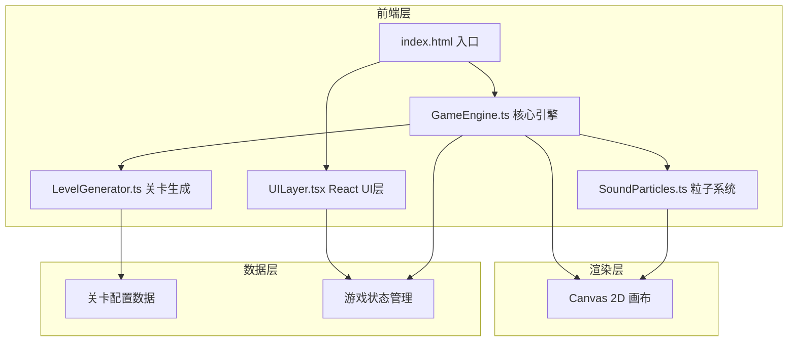

## 1. 架构设计



## 2. 技术说明

- **前端框架**：React 18 + TypeScript
- **构建工具**：Vite
- **样式方案**：CSS Modules + 内联样式（毛玻璃效果等）
- **渲染引擎**：Canvas 2D API（requestAnimationFrame 60fps循环）
- **状态管理**：游戏内部状态由GameEngine管理，UI状态通过React useState同步
- **无后端**：纯前端游戏，关卡数据内嵌

## 3. 路由定义

| 路由 | 用途 |
|-----|------|
| / | 游戏主页面（单页应用，无路由切换） |

## 4. 模块职责

### 4.1 GameEngine.ts
- 核心游戏循环（requestAnimationFrame 60fps）
- 关卡管理（加载、重置、通关判定）
- 音符物理系统（发射、运动、碰撞检测）
- 碰撞响应（反弹、音高变化、分裂）
- 共鸣节点激活判定
- 传送门开启逻辑
- 游戏状态回调（通知UI层更新）

### 4.2 SoundParticles.ts
- 声波粒子系统（背景迷雾粒子生成与管理）
- 拖尾动画（粒子轨迹alpha渐变）
- 音高映射到颜色（低音红紫、中音青绿、高音金黄）
- 特效渲染：冲击波、粒子爆散、光晕、闪烁
- 传送门螺旋光纹动画

### 4.3 LevelGenerator.ts
- 随机生成障碍物布局
- 随机生成共鸣节点位置
- 难度递增（障碍物数量、节点数量、时间衰减障碍物比例）
- 确保关卡可解性（验证路径可达）

### 4.4 UILayer.tsx
- React组件：关卡信息显示（关卡号、共鸣数）
- 毛玻璃重置按钮
- 毛玻璃提示按钮（高亮最近未激活节点）
- 响应式布局

## 5. 核心数据结构

```typescript
interface Note {
  x: number;
  y: number;
  vx: number;
  vy: number;
  pitch: number;
  radius: number;
  isSplit: boolean;
  trail: Array<{x: number; y: number; alpha: number}>;
  active: boolean;
}

interface Obstacle {
  x: number;
  y: number;
  width: number;
  height: number;
  type: 'rect' | 'circle';
  decayTimer?: number;
  maxTimer?: number;
  active: boolean;
}

interface ResonanceNode {
  x: number;
  y: number;
  targetPitch: number;
  activated: boolean;
  activationRadius: number;
  glowRadius: number;
  pulsePhase: number;
}

interface Portal {
  x: number;
  y: number;
  radius: number;
  active: boolean;
  rotation: number;
  spiralPhase: number;
}

interface Level {
  id: number;
  obstacles: Obstacle[];
  nodes: ResonanceNode[];
  portal: Portal;
  playerStart: {x: number; y: number};
}
```

## 6. 渲染管线

每帧渲染顺序：
1. 清除画布 → 绘制深灰渐变背景
2. 绘制声波粒子背景（发光圆点+拖尾）
3. 绘制障碍物（含时间衰减透明度）
4. 绘制共鸣节点（脉冲光圈/激活光晕）
5. 绘制音符（发光圆+拖尾光晕）
6. 绘制特效（冲击波、粒子爆散）
7. 绘制传送门（螺旋光纹）
8. UI层由React独立渲染在Canvas之上
