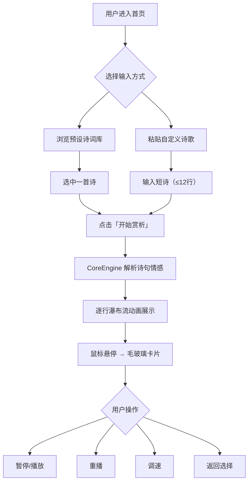

## 1. 产品概述

「潮汐诗笺」是一款交互式古风诗歌可视化工具，将中国传统诗词与动态视觉艺术融合。用户选择或粘贴短诗后，系统自动解析每行情感，以水墨淡彩风逐行呈现——文字浮动淡入，配以情绪色彩和墨点粒子，悬停展开毛玻璃信息卡片。

- 目标用户：古诗词爱好者、文学创作者、视觉艺术欣赏者
- 核心价值：让诗歌阅读成为沉浸式的视听体验，以数字水墨美学重新诠释经典

## 2. 核心功能

### 2.1 功能模块

1. **诗歌选择与输入页**：预设诗词库浏览搜索 + 自定义粘贴面板
2. **瀑布流可视化页**：逐行浮动展示，情感色彩渲染，背景墨点粒子
3. **悬停交互层**：毛玻璃信息卡片，含情感浓度、意象标签、推荐配乐

### 2.2 页面详情

| 页面名称 | 模块名称 | 功能描述 |
|----------|----------|----------|
| 诗歌选择与输入页 | 预设诗词库 | 提供6-8首经典古诗词，支持搜索筛选，点击即选 |
| 诗歌选择与输入页 | 自定义粘贴面板 | 文本域粘贴短诗（最多12行），带字数/行数提示 |
| 瀑布流可视化页 | 逐行动画引擎 | 文字从底部向上浮动并淡入，间隔800ms逐行展示 |
| 瀑布流可视化页 | 情感色彩映射 | 根据每行情感关键词自动匹配颜色（悲→靛蓝、喜→朱砂、思→藤紫、寂→墨灰） |
| 瀑布流可视化页 | 背景墨点粒子 | 缓慢飘浮的细小墨点，模拟研磨飞溅效果 |
| 瀑布流可视化页 | 底部控制栏 | 播放/暂停、重播、速度调节、返回选择 |
| 悬停交互层 | 毛玻璃信息卡片 | 鼠标悬停某行时放大该行，弹出卡片显示情感浓度百分比、意象标签、推荐配乐 |

## 3. 核心流程

用户打开页面 → 浏览预设诗词库或粘贴自定义诗歌 → 点击"开始赏析" → 诗歌逐行以瀑布流形式展示（浮动淡入+情感色彩） → 背景墨点粒子持续飘浮 → 鼠标悬停某行查看详情卡片 → 可通过底部控制栏暂停/重播/调速

## 4. 用户界面设计

### 4.1 设计风格

- **主色调**：米白仿宣纸底色（#F5F0E8），深灰毛玻璃工具栏（rgba(40,40,40,0.6)）
- **情感色彩**：悲→靛蓝(#4A6FA5)、喜→朱砂(#C84B31)、思→藤紫(#8B6AA0)、寂→墨灰(#6B6B6B)
- **字体**：标题与诗句使用 Ma Shan Zheng（Google Fonts 毛笔字体），UI文字使用 Noto Serif SC
- **布局风格**：居中瀑布流，顶部工具栏，底部控制栏，四周留白营造留白意境
- **按钮风格**：圆角矩形，半透明毛玻璃质感，悬停时轻微上浮 + 发光
- **动画**：缓动淡入（ease-out），墨点粒子使用 requestAnimationFrame 保持 60fps

### 4.2 页面设计概览

| 页面名称 | 模块名称 | UI元素 |
|----------|----------|--------|
| 诗歌选择与输入页 | 诗词库网格 | 宣纸质感卡片，悬停微浮，每张卡显示诗名+作者+首句预览 |
| 诗歌选择与输入页 | 粘贴面板 | 毛玻璃文本域，右下角行数计数器，超过12行提示 |
| 瀑布流可视化页 | 诗句展示区 | 每行诗句居中，Ma Shan Zheng字体，字号28px，行间距60px |
| 瀑布流可视化页 | 情感色彩条 | 每行左侧2px竖线，颜色随情感变化 |
| 瀑布流可视化页 | 背景墨点 | Canvas层，30-50个微小墨点缓慢飘浮，透明度0.1-0.3 |
| 悬停交互层 | 信息卡片 | 毛玻璃背景(blur(20px))，圆角16px，包含情感浓度进度条、意象标签chip、配乐名 |

### 4.3 响应式适配

- 桌面端（≥1024px）：诗句居中展示，字号28px，卡片宽度360px
- 平板端（768-1023px）：诗句居中，字号24px，卡片宽度300px，工具栏简化
- 触控优化：悬停改为长按触发信息卡片，控制栏按钮增大触控区域

### 4.4 性能要求

- 帧率保持 60fps，Canvas粒子使用 requestAnimationFrame
- 动画优先使用 CSS transform/opacity（GPU加速）
- 粒子数量自适应屏幕尺寸
