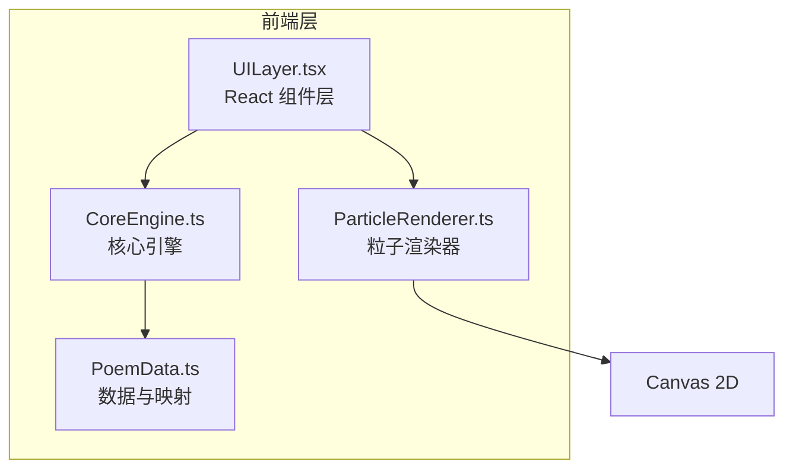

## 1. 架构设计



## 2. 技术说明

- **前端框架**：React@18 + TypeScript
- **构建工具**：Vite
- **样式方案**：CSS Modules + CSS Variables（主题色）
- **动画**：CSS transitions/animations + Canvas 2D requestAnimationFrame
- **字体**：Google Fonts（Ma Shan Zheng、Noto Serif SC）
- **无后端**：纯前端应用，所有数据内嵌

## 3. 路由定义

本项目为单页应用，无需路由库，通过组件状态切换视图：

| 视图状态 | 用途 |
|----------|------|
| `select` | 诗词选择/粘贴输入界面 |
| `display` | 瀑布流可视化展示界面 |

## 4. 模块职责

### 4.1 CoreEngine.ts
- 解析输入诗句（按行分割，最多12行）
- 对每行进行情感关键词匹配（悲/喜/思/寂及扩展词库）
- 计算每行情感浓度（0-1）
- 提取意象标签
- 匹配推荐配乐
- 返回 `AnalyzedPoem` 结构化数据

### 4.2 ParticleRenderer.ts
- 管理 Canvas 粒子系统
- 生成背景飘浮墨点（30-50个，缓慢随机运动）
- 控制文字淡入动画时序
- 处理鼠标悬停放大效果
- requestAnimationFrame 驱动渲染循环
- 自适应屏幕尺寸

### 4.3 PoemData.ts
- 定义 TypeScript 接口：Poem、PoemLine、Emotion、AnalyzedPoem、AnalyzedLine
- 预设6-8首古诗词数据
- 情感关键词映射表
- 情感-颜色映射表
- 情感-配乐映射表
- 意象关键词映射表

### 4.4 UILayer.tsx
- `App` 根组件：管理视图状态
- `PoemSelector` 组件：诗词库网格 + 搜索
- `PastePanel` 组件：粘贴文本域 + 行数校验
- `WaterfallDisplay` 组件：瀑布流展示区
- `InfoCard` 组件：毛玻璃信息卡片
- `ControlBar` 组件：底部播放控制

## 5. 数据模型

### 5.1 核心数据结构

```typescript
type EmotionType = "悲" | "喜" | "思" | "寂";

interface Poem {
  id: string;
  title: string;
  author: string;
  dynasty: string;
  lines: string[];
}

interface EmotionColorMap {
  [key: string]: { primary: string; secondary: string; glow: string };
}

interface AnalyzedLine {
  text: string;
  emotion: EmotionType;
  intensity: number;
  tags: string[];
  music: string;
  color: { primary: string; secondary: string; glow: string };
  delay: number;
}

interface AnalyzedPoem {
  title: string;
  author: string;
  lines: AnalyzedLine[];
}
```

## 6. 文件结构

```
├── index.html
├── package.json
├── tsconfig.json
├── vite.config.js
└── src/
    ├── main.tsx            # React 入口
    ├── index.css           # 全局样式
    ├── CoreEngine.ts       # 核心引擎
    ├── ParticleRenderer.ts # 粒子渲染器
    ├── PoemData.ts         # 数据与映射
    └── UILayer.tsx         # React 组件层
```
