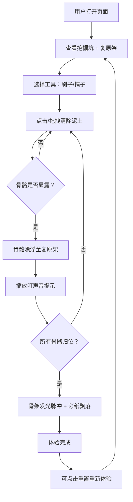

## 1. 产品概述

「数字化石」是一款交互式数字考古工具，让用户在虚拟挖掘坑中体验化石发掘过程。玩家通过刷子和镐子两种工具逐层清理泥土，慢慢显露出埋藏的恐龙骨骼碎片，每块骨骼自动归位到右侧复原架，最终拼成完整的恐龙骨架。
- 目标用户：考古爱好者、科普教育受众、休闲游戏玩家
- 产品价值：以沉浸式互动体验传递古生物学知识，将枯燥的化石发掘过程游戏化

## 2. 核心功能

### 2.1 用户角色

| 角色 | 注册方式 | 核心权限 |
|------|----------|----------|
| 访客 | 无需注册 | 直接体验完整挖掘流程 |

### 2.2 功能模块

1. **挖掘页面**：8×8 挖掘网格、工具切换、泥土清除交互、骨骼显露、粒子特效
2. **复原架区域**：骨骼归位动画、进度追踪、完成庆祝特效

### 2.3 页面详情

| 页面名称 | 模块名称 | 功能描述 |
|----------|----------|----------|
| 挖掘页面 | 挖掘网格 | 8×8 网格，每格有不同厚度泥土，支持刷子/镐子两种工具交互 |
| 挖掘页面 | 工具切换栏 | 刷子（柔和渐隐清除薄层）和镐子（震动+裂纹敲碎厚层）的切换 |
| 挖掘页面 | 骨骼显露系统 | 清除相邻格子时骨骼逐渐浮现，完成后自动漂浮至复原架 |
| 挖掘页面 | 粒子特效 | 尘土飞散粒子、背景漂浮尘埃、镐子裂纹特效 |
| 挖掘页面 | 复原架展示区 | 右侧垂直布局，骨骼按正确位置排列，带缓动+弹性归位动画 |
| 挖掘页面 | 进度条 | 显示已发掘骨骼数/总骨骼数 |
| 挖掘页面 | 完成庆祝 | 骨架发光脉冲动画 + 彩纸飘落特效 |
| 挖掘页面 | 重置按钮 | 一键重置所有挖掘进度 |

## 3. 核心流程

用户打开页面后，看到左侧8×8的泥土挖掘坑和右侧的空复原架。用户选择工具（刷子或镐子），点击或拖拽网格格子清除泥土。刷子适合薄层泥土（渐隐效果），镐子适合厚层泥土（震动+裂纹效果）。当某一区域泥土被清除后，骨骼逐渐显露出来。骨骼完全显露后，自动带弹性动画漂浮到右侧复原架对应位置，并播放叮的声音提示。当所有骨骼归位，恐龙骨架拼合完成，触发发光脉冲和彩纸飘落庆祝特效。

## 4. 用户界面设计

### 4.1 设计风格

- **主色调**：米黄色（#F5E6C8）和浅棕色（#D4A574）为底色
- **辅助色**：旧铜色（#8B6914）用于工具图标描边，深棕色（#5C3D2E）用于文字
- **按钮风格**：圆角矩形，毛玻璃效果（backdrop-blur），旧铜色描边，悬浮放大效果
- **字体**：使用有考古手稿感的衬线字体（如 Playfair Display 作为标题字体，Noto Serif SC 作为中文正文字体）
- **布局风格**：左右分栏，左侧挖掘坑，右侧复原架，顶部工具栏
- **图标风格**：旧铜色描边线条图标，带轻微锈蚀质感
- **阴影**：柔和投影，模拟探照灯光照效果
- **特效**：背景缓慢飘浮的细小尘埃粒子（像探照灯下的扬尘）

### 4.2 页面设计概览

| 页面名称 | 模块名称 | UI元素 |
|----------|----------|--------|
| 挖掘页面 | 挖掘网格 | 像素化泥土纹理、8×8格子、每格不同土色深浅、鼠标悬停高亮 |
| 挖掘页面 | 工具切换栏 | 顶部毛玻璃面板、刷子/镐子图标按钮、选中态旧铜色描边、悬浮放大 |
| 挖掘页面 | 复原架 | 右侧垂直面板、骨骼占位轮廓、归位动画（缓动+弹性）、完成后发光脉冲 |
| 挖掘页面 | 进度条 | 底部细长条、旧铜色填充、显示 x/N 文字 |
| 挖掘页面 | 粒子特效 | Canvas层：尘土飞散、背景扬尘、裂纹线条、彩纸飘落 |
| 挖掘页面 | 重置按钮 | 底部居中、旧铜色描边圆角按钮、悬浮放大 |

### 4.3 响应式适配

- 桌面端（≥1024px）：左右分栏布局，挖掘坑 480px、复原架 320px
- 平板端（768-1023px）：上下布局或缩小间距，挖掘坑和复原架各占 50%
- 触摸优化：支持手指拖拽清除、工具切换按钮加大触摸区域
- 帧率：所有动画保持 60fps，使用 requestAnimationFrame 和 Canvas 硬件加速

### 4.4 3D场景指引

本项目不使用3D场景，所有渲染基于2D Canvas + HTML/CSS实现。
