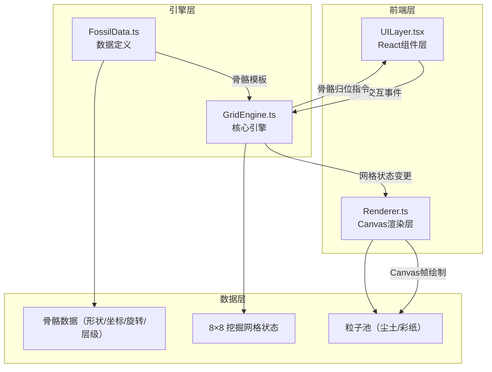
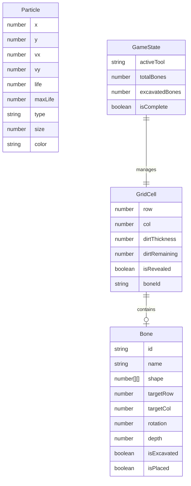

## 1. 架构设计

## 2. 技术说明

- **前端框架**：React 18 + TypeScript（严格模式）
- **构建工具**：Vite + @vitejs/plugin-react
- **状态管理**：Zustand（管理挖掘状态、工具选择、进度等全局状态）
- **渲染方案**：2D Canvas（挖掘坑和粒子特效）+ React DOM（UI层和复原架）
- **动画方案**：requestAnimationFrame 驱动 Canvas 渲染循环 + CSS transition/animation 处理UI动画
- **音效方案**：Web Audio API 生成程序化音效（叮声、敲击声），无需外部音频文件
- **CSS方案**：Tailwind CSS + 自定义CSS变量（考古风格主题色）
- **后端**：无（纯前端项目）

## 3. 路由定义

| 路由 | 用途 |
|------|------|
| / | 单页应用，包含挖掘坑、复原架和所有交互 |

## 4. API定义

无后端API，所有数据在前端本地生成和管理。

## 5. 服务器架构图

无后端服务器。

## 6. 数据模型

### 6.1 数据模型定义

### 6.2 数据定义

**GridCell（网格单元）**：
- `row`, `col`：网格坐标（0-7）
- `dirtThickness`：初始泥土厚度（1-5，镐子一次清3层，刷子一次清1层）
- `dirtRemaining`：剩余泥土层数
- `isRevealed`：泥土是否已完全清除
- `boneId`：该格子包含的骨骼ID（可为空）

**Bone（骨骼）**：
- `id`：唯一标识
- `name`：骨骼名称（如"头骨"、"左前肢"等）
- `shape`：二维布尔数组，定义骨骼在网格中的形状
- `targetRow`, `targetCol`：复原架上的目标位置
- `rotation`：旋转角度（度）
- `depth`：埋藏深度层级
- `isExcavated`：是否已完全发掘
- `isPlaced`：是否已归位到复原架

**Particle（粒子）**：
- `x`, `y`：位置
- `vx`, `vy`：速度
- `life`, `maxLife`：生命周期
- `type`：粒子类型（dust/crack/confetti）
- `size`：粒子大小
- `color`：粒子颜色
