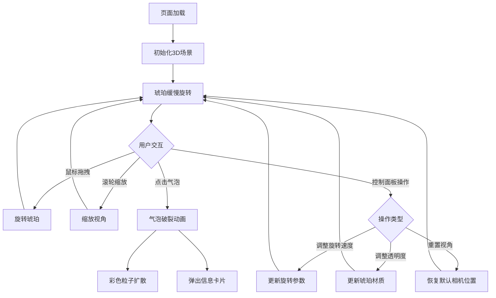

## 1. 产品概述

**风吟琥珀** — 一款3D交互式琥珀化石探索工具，让用户沉浸式观察半透明琥珀内部被树脂包裹的远古生物。
- 核心目标：通过精细的3D可视化和直觉式交互，呈现琥珀化石的微观世界，兼具科普与美学体验
- 目标用户：古生物爱好者、自然科学教育场景、3D交互体验探索者

## 2. 核心功能

### 2.1 功能模块
1. **琥珀3D场景页**：琥珀主体渲染、内部包裹物展示、气泡交互、粒子特效、信息卡片弹出

### 2.2 页面详情
| 页面名称 | 模块名称 | 功能描述 |
|----------|----------|----------|
| 琥珀3D场景页 | 琥珀主体渲染 | 半透明橙黄渐变琥珀球体，缓慢自旋转，表面光泽反射与微细裂纹纹理 |
| 琥珀3D场景页 | 内部包裹物 | 小蚁、孢子、羽毛等远古生物以发光半透明粒子表示，被包裹在树脂中随琥珀旋转 |
| 琥珀3D场景页 | 气泡系统 | 琥珀内随机分布若干细小气泡，点击气泡触发破裂动画 |
| 琥珀3D场景页 | 粒子特效 | 气泡破裂后释放彩色粒子，向四周扩散并渐隐 |
| 琥珀3D场景页 | 信息卡片 | 气泡破裂后弹出半透明毛玻璃卡片，显示包裹物名称、年代、保存状态 |
| 琥珀3D场景页 | 交互控制 | 鼠标拖拽旋转、滚轮缩放、右下角控制面板（旋转速度滑块、透明度滑块、重置视角按钮） |

## 3. 核心流程

用户打开页面后，看到一颗缓慢旋转的半透明琥珀悬浮在深棕色背景中。用户可以拖拽旋转观察琥珀各角度，滚轮缩放远近。琥珀内部散布着发光的包裹物粒子和细小气泡。当用户点击某个气泡时，气泡破裂，释放彩色粒子向四周扩散，同时弹出毛玻璃信息卡片展示包裹物详情。用户可通过右下角控制面板调整旋转速度和琥珀透明度，或重置视角。

## 4. 用户界面设计

### 4.1 设计风格
- **主色调**：暖金琥珀色 (#D4A017, #FF8C00, #B8860B)，深棕色背景 (#1A0F00 → #2D1B0E 渐变)
- **按钮风格**：圆角胶囊按钮，半透明毛玻璃质感 (backdrop-filter: blur)
- **字体**：标题使用衬线体 (Playfair Display)，正文使用无衬线体 (DM Sans)
- **布局风格**：全屏沉浸式3D场景，右下角浮动控制面板
- **图标风格**：Lucide 线性图标，金色描边

### 4.2 页面设计概览
| 页面名称 | 模块名称 | UI元素 |
|----------|----------|--------|
| 琥珀3D场景页 | 3D画布 | 全屏Canvas，深棕渐变背景，琥珀主体居中，边缘柔和光晕 |
| 琥珀3D场景页 | 琥珀主体 | 半透明球体，橙黄渐变材质，表面裂纹纹理贴图，Phong光照 |
| 琥珀3D场景页 | 包裹物粒子 | 发光半透明点状粒子，琥珀色/金色/琥珀白 |
| 琥珀3D场景页 | 气泡 | 透明球体，表面微反射，悬浮在琥珀内部 |
| 琥珀3D场景页 | 粒子特效 | 彩色粒子环，从气泡位置向外扩散，渐隐消失 |
| 琥珀3D场景页 | 信息卡片 | 毛玻璃面板，圆角，金色边框，显示包裹物名称/年代/保存状态 |
| 琥珀3D场景页 | 控制面板 | 右下角毛玻璃面板，旋转速度滑块、透明度滑块、重置按钮 |

### 4.3 响应式
- 桌面优先设计，全屏沉浸式3D体验
- 移动端支持触摸拖拽旋转和双指缩放
- 控制面板在小屏幕下自动收缩为可展开图标

### 4.4 3D场景指引
- **环境/氛围**：深棕色渐变背景，无HDRI，使用程序化光照
- **光照设置**：主光（暖金色点光源，从右上方照射），辅助光（暗棕色环境光），琥珀内部自发光
- **相机设置**：透视相机，FOV 45°，初始距离约5个单位，OrbitControls 限制缩放范围
- **构图与焦点**：琥珀居中，略偏上，气泡和包裹物散布内部
- **交互与动画**：拖拽旋转、滚轮缩放、气泡点击破裂、粒子扩散、琥珀自旋转
- **后处理效果**：UnrealBloomPass 辉光效果，增强琥珀内发光粒子视觉效果
- **性能预算**：60fps，粒子总数不超过2000个

## 5. 非功能性需求
- 性能：维持60fps流畅帧率
- 兼容性：Chrome/Edge/Firefox 最新版
- 交互响应：点击气泡后50ms内触发动画，粒子特效持续1.5秒
- 3D渲染：WebGL 2.0，Three.js r160+
