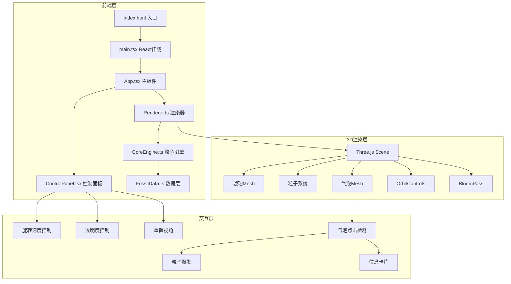

## 1. 架构设计



## 2. 技术说明
- **前端框架**：React 18 + TypeScript
- **构建工具**：Vite 5
- **3D引擎**：Three.js + @react-three/fiber + @react-three/drei + @react-three/postprocessing
- **状态管理**：Zustand（管理旋转速度、透明度、气泡状态等全局状态）
- **样式方案**：Tailwind CSS 3 + 自定义CSS（毛玻璃效果）
- **无后端**：纯前端应用，数据内置在 FossilData.ts

## 3. 路由定义
| 路由 | 用途 |
|------|------|
| / | 琥珀3D场景主页（唯一页面） |

## 4. 数据模型

### 4.1 包裹物数据 (FossilInclusion)
```typescript
interface FossilInclusion {
  id: string;
  name: string;          // 包裹物名称，如"远古小蚁"
  era: string;           // 年代，如"白垩纪晚期"
  preservationStatus: string;  // 保存状态，如"完整"
  position: [number, number, number];  // 琥珀内3D位置
  type: 'ant' | 'spore' | 'feather' | 'pollen' | 'mosquito';
  glowColor: string;     // 发光颜色
  scale: number;         // 缩放
}
```

### 4.2 气泡数据 (Bubble)
```typescript
interface Bubble {
  id: string;
  position: [number, number, number];
  radius: number;        // 气泡半径
  isIncluded: boolean;   // 是否包裹了生物
  inclusionId?: string;  // 关联的包裹物ID
  isPopped: boolean;     // 是否已破裂
}
```

### 4.3 全局状态 (AmberStore)
```typescript
interface AmberStore {
  rotationSpeed: number;    // 0-2，默认0.5
  transparency: number;     // 0.1-1.0，默认0.6
  bubbles: Bubble[];
  poppedBubbleId: string | null;
  activeInclusion: FossilInclusion | null;
  setRotationSpeed: (speed: number) => void;
  setTransparency: (alpha: number) => void;
  popBubble: (id: string) => void;
  setActiveInclusion: (inclusion: FossilInclusion | null) => void;
  resetView: () => void;
}
```

## 5. 文件结构

```
src/
├── CoreEngine.ts          # 核心引擎：琥珀旋转、粒子系统、交互逻辑
├── FossilData.ts          # 包裹物和气泡数据结构与初始数据
├── Renderer.ts            # Three.js渲染：琥珀模型、粒子、特效
├── ControlPanel.tsx       # React组件：控制面板+毛玻璃信息卡片
├── App.tsx                # 主组件，整合3D场景与UI叠加
├── main.tsx               # React入口
└── index.css              # 全局样式
package.json
tsconfig.json
vite.config.js
index.html
```

## 6. 核心渲染策略

### 琥珀主体
- 使用 `SphereGeometry` (64段精度) 创建琥珀球体
- 自定义 `ShaderMaterial`：半透明橙黄渐变 + 内部散射效果
- 表面裂纹纹理：程序化生成 CanvasTexture 叠加

### 内部包裹物
- 使用 `Points` (粒子系统) 渲染发光点
- 每种包裹物类型有不同的粒子形状和颜色
- `PointsMaterial` 设置 sizeAttenuation + 透明度

### 气泡
- 使用小尺寸 `SphereGeometry` + `MeshPhysicalMaterial` (transmission: 0.9)
- Raycaster 实现点击检测
- 破裂动画：scale 缩小到0 + 透明度渐变

### 粒子爆发
- 气泡破裂时在该位置生成100-200个粒子
- 粒子从中心向球面均匀扩散
- 颜色渐变：金色 → 橙色 → 透明
- 生命周期1.5秒后自动移除

### 后处理
- `EffectComposer` + `UnrealBloomPass`：增强内部发光效果
- Bloom 参数：strength 0.8, radius 0.5, threshold 0.6

### 性能优化
- 使用 `BufferGeometry` 代替普通 Geometry
- 粒子系统使用 `Float32Array` 批量更新
- 气泡使用 InstancedMesh（如果数量多）
- requestAnimationFrame 驱动渲染循环
- 目标帧率：60fps
