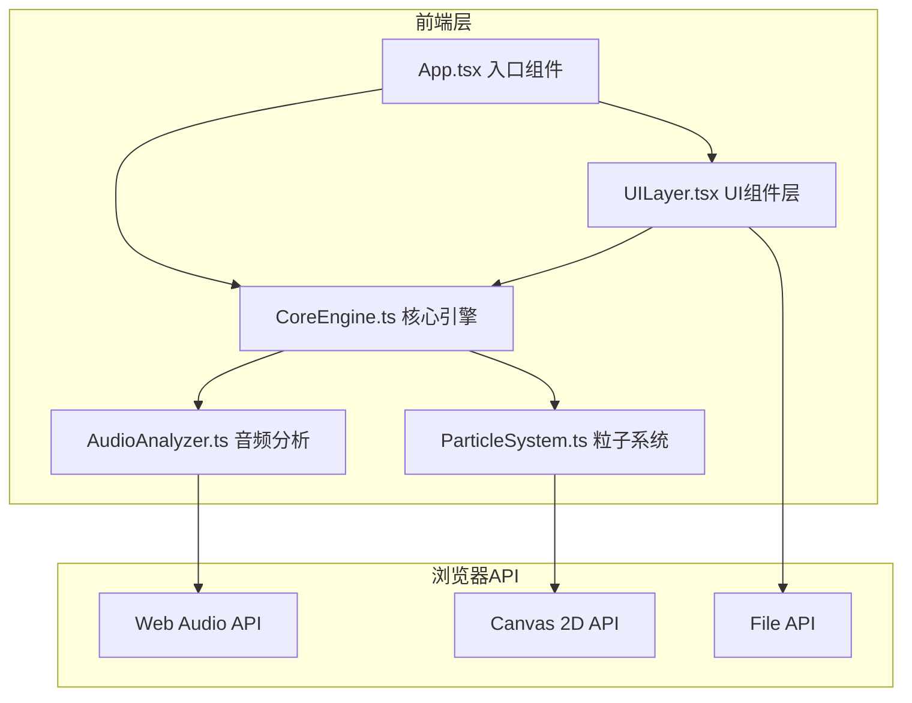
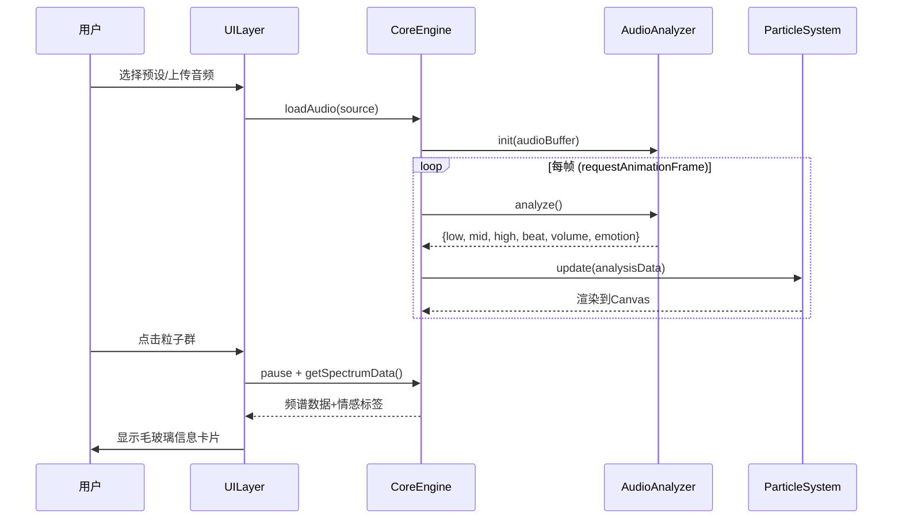

## 1. 架构设计

## 2. 技术说明
- **前端框架**：React 18 + TypeScript + Vite
- **状态管理**：Zustand
- **样式方案**：Tailwind CSS + CSS Variables（毛玻璃特效）
- **音频处理**：Web Audio API（AudioContext + AnalyserNode FFT）
- **渲染引擎**：Canvas 2D API（requestAnimationFrame 60fps循环）
- **图标**：lucide-react
- **无后端**：纯前端项目，音频在浏览器端解码与分析

## 3. 路由定义
| 路由 | 用途 |
|------|------|
| / | 主视觉页面，包含粒子画布、音频控制、选择面板 |

> 本项目为单页应用，无需多路由。音频选择面板作为侧边栏浮层展示。

## 4. 模块职责

### 4.1 AudioAnalyzer.ts
- 使用 Web Audio API 的 AnalyserNode 进行实时FFT分析
- 提取频率数据（分为低/中/高三个频段）
- 检测节奏强拍（基于能量突变阈值）
- 计算音量级别（RMS）
- 计算情感标签（基于频谱特征：如低频主导→深沉，高频主导→明亮，强节奏→激昂等）

### 4.2 ParticleSystem.ts
- 管理粒子池（对象池模式避免GC）
- 粒子沿圆形轨道运动（参数化角度+半径）
- 不同频段对应不同颜色粒子
- 强拍时触发爆散效果（粒子瞬间径向外移+环形光晕扩散）
- 光晕效果（径向渐变圆环，随时间衰减透明度）
- 3D视角变换（通过2D投影模拟：旋转矩阵+缩放）

### 4.3 CoreEngine.ts
- 管理音频加载（预设URL或用户上传File）
- 协调AudioAnalyzer与ParticleSystem的更新循环
- 管理Canvas尺寸与DPI适配
- 处理鼠标交互（拖拽旋转、滚轮缩放、点击选中）
- 提供 Zustand store 接口供UI层读写状态

### 4.4 UILayer.tsx
- 毛玻璃控制面板（音频播放控制、音量、进度）
- 预设选择列表侧边栏
- 文件上传组件（拖拽上传+按钮上传，时长校验≤30秒）
- 毛玻璃信息卡片（频谱柱状图+情感标签）
- 背景星点动画层

### 4.5 App.tsx
- 初始化CoreEngine
- 挂载Canvas与UI层
- 处理页面加载淡入动画
- 全局键盘快捷键（空格播放/暂停等）

## 5. 数据流

## 6. 性能策略
- **粒子对象池**：预分配粒子数组，复用而非新建
- **Canvas分层**：背景星点独立Canvas层，仅在resize时重绘
- **FFT精度**：fftSize=2048，频率分辨率约21.5Hz(@48kHz)
- **帧率控制**：requestAnimationFrame + deltaTime平滑
- **粒子数量**：根据屏幕面积动态计算，上限约2000个粒子
- **离屏渲染**：光晕效果使用离屏Canvas预渲染，drawImage复用
