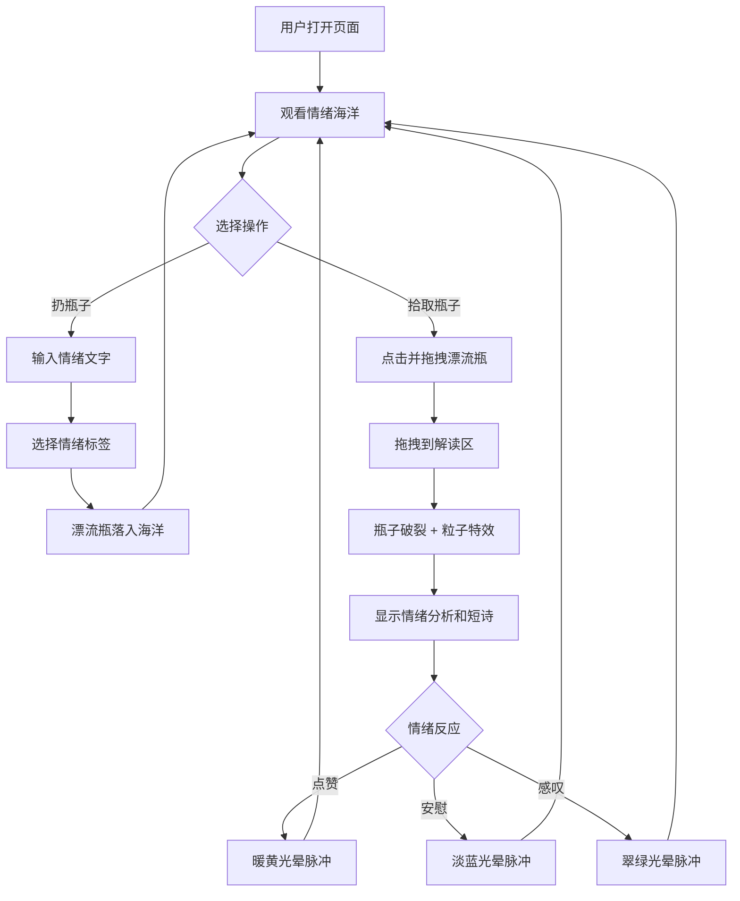

## 1. 产品概述

「情绪漂流瓶」是一个在线匿名情绪分享平台，用户可以将自己的情绪文字封装成漂流瓶扔进动态的「情绪海洋」中，其他用户可以拾取漂流瓶、阅读情绪文字、获得情绪分析和鼓励语，并对瓶子进行情绪反应。整体风格温暖治愈，旨在为用户提供一个安全、匿名的情感表达和共鸣空间。

- 目标用户：需要情感表达与倾诉的匿名用户群体
- 核心价值：通过匿名和仪式感（漂流瓶、海洋、粒子特效）降低情感表达门槛，营造温暖治愈的社区氛围

## 2. 核心功能

### 2.1 用户角色

| 角色 | 注册方式 | 核心权限 |
|------|----------|----------|
| 匿名用户 | 无需注册 | 扔瓶子、拾取瓶子、情绪反应 |
| 访客 | 无需注册 | 观看海洋、浏览漂流瓶 |

### 2.2 功能模块

1. **情绪海洋页面**：动态3D海洋场景、漂流瓶漂浮与交互、发布漂流瓶、拾取与解读、情绪反应

### 2.3 页面详情

| 页面名称 | 模块名称 | 功能描述 |
|----------|----------|----------|
| 情绪海洋 | 3D海洋场景 | Three.js渲染的动态渐变海洋，浪花粒子和星点光斑，漂浮的白色光点 |
| 情绪海洋 | 漂流瓶系统 | 瓶子随机生成在海面上，受虚拟海浪影响缓缓漂浮，颜色根据情绪标签变化（快乐-暖黄、忧伤-淡蓝、愤怒-橙红、平静-翠绿、恐惧-紫灰） |
| 情绪海洋 | 发布面板 | 右下角毛玻璃发布按钮，情绪选择下拉框，文字输入框（最多200字） |
| 情绪海洋 | 拖拽交互 | 点击瓶子后拖拽到岸边解读区，拖拽中瓶子放大并出现光晕 |
| 情绪海洋 | 解读区面板 | 岸边解读区，显示情绪关键词分析和生成的短诗/鼓励语，瓶子破裂粒子特效 |
| 情绪海洋 | 情绪反应 | 点赞、安慰、感叹三种反应，触发脉冲光晕动画，实时计数更新 |
| 情绪海洋 | 统计信息 | 左上角显示当前情绪标签分布和瓶子数量统计 |

## 3. 核心流程

**扔瓶子流程**：用户点击发布按钮 → 输入情绪文字（≤200字） → 选择情绪标签 → 系统生成对应颜色漂流瓶 → 瓶子以抛物线动画落入海洋随机位置 → 瓶子开始随波漂浮

**拾取瓶子流程**：用户点击海洋中的漂流瓶 → 按住拖拽到岸边解读区 → 松开后触发分析 → 系统匹配情绪关键词并生成短诗/鼓励语 → 瓶子破裂释放粒子特效 → 解读面板显示分析结果

**情绪反应流程**：用户在解读面板或瓶子旁选择反应类型 → 触发对应颜色脉冲光晕 → 反应计数实时更新

## 4. 用户界面设计

### 4.1 设计风格

- **主色调**：海洋蓝渐变（从浅蓝 #87CEEB 到深蓝 #1a365d 缓慢过渡）
- **辅助色**：情绪标签色（暖黄 #F6C344、淡蓝 #7EB8DA、橙红 #E8734A、翠绿 #48BB78、紫灰 #8B7E9B）
- **按钮风格**：毛玻璃质感（backdrop-blur + 半透明白色背景 + 柔和圆角 + 半透明阴影）
- **字体**：标题使用 ZCOOL XiaoWei（站酷小薇体），正文使用 Noto Sans SC
- **布局风格**：全屏沉浸式3D场景，UI元素浮于场景之上（HUD风格）
- **图标风格**：Lucide图标库，线条风格，与毛玻璃UI统一

### 4.2 页面设计概述

| 页面名称 | 模块名称 | UI元素 |
|----------|----------|--------|
| 情绪海洋 | 3D海洋场景 | 全屏Canvas，动态渐变海洋，浪花粒子，漂浮光点，星空背景 |
| 情绪海洋 | 漂流瓶 | 发光毛玻璃质感瓶形，柔和圆角，半透明阴影，颜色随情绪变化，轻微上下浮动 |
| 情绪海洋 | 发布面板 | 右下角固定定位，毛玻璃卡片，渐变按钮，下拉选择框，文字输入区 |
| 情绪海洋 | 解读区 | 左侧岸边区域，毛玻璃卡片，情绪关键词标签，短诗/鼓励语文字，破裂粒子动画 |
| 情绪海洋 | 统计面板 | 左上角固定定位，毛玻璃卡片，情绪标签色圆点+计数，总瓶子数 |
| 情绪海洋 | 反应按钮 | 解读面板内，三个反应图标按钮，hover放大效果，点击触发光晕 |

### 4.3 响应式适配

- 桌面端（≥1024px）：全屏3D场景，左右分栏布局（海洋+解读区）
- 平板端（768px-1023px）：全屏3D场景，解读区以抽屉形式从底部滑出
- 触摸优化：拖拽操作支持触摸手势，按钮和交互区域增大触控面积

### 4.4 3D场景指引

- **环境/氛围**：夜空下的温暖海洋，远处有微光地平线，营造治愈感
- **灯光设置**：环境光（淡蓝，强度0.4）+ 方向光（暖黄，强度0.6，模拟月光）+ 点光源（跟随漂流瓶，营造发光效果）
- **摄像机**：透视摄像机，45°俯角，从斜上方俯瞰海面，固定位置但有轻微晃动
- **构图**：海面占画面70%，上方留白给星空和漂浮光点，岸边区域在左侧
- **交互与动画**：瓶子漂浮受正弦波影响，拖拽时瓶子放大1.3倍+光晕，破裂时粒子向外扩散
- **后处理**：Bloom效果增强发光感，Vignette增强氛围
- **性能预算**：粒子总数≤300，使用InstancedMesh渲染瓶子，保持60fps
