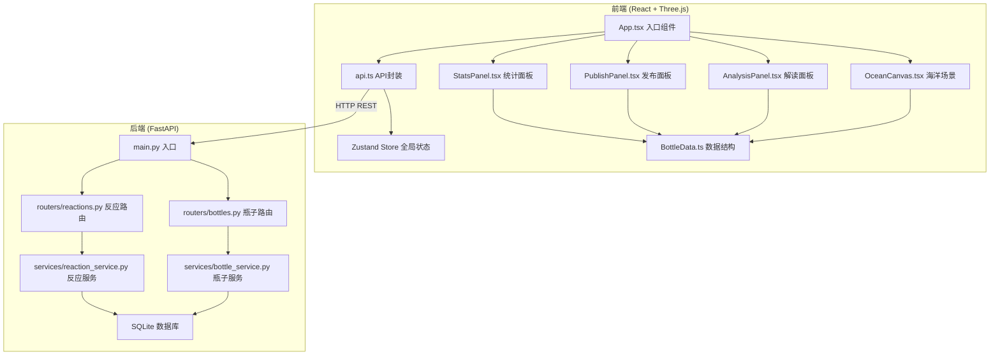
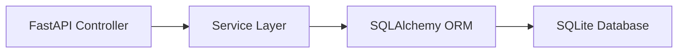
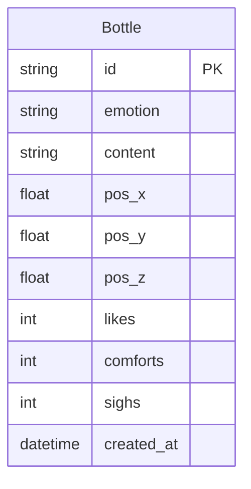

## 1. 架构设计



## 2. 技术说明

- **前端**：React@18 + TypeScript + Three.js + @react-three/fiber + @react-three/drei + @react-three/postprocessing + Tailwind CSS + Zustand
- **初始化工具**：vite-init (react-ts 模板)
- **后端**：FastAPI + SQLite + Uvicorn
- **数据库**：SQLite（轻量级，无需额外服务），通过 SQLAlchemy ORM 操作
- **3D渲染**：Three.js + @react-three/fiber（React Three.js绑定）+ @react-three/drei（工具库）+ @react-three/postprocessing（后处理）

## 3. 路由定义

| 路由 | 用途 |
|------|------|
| / | 情绪海洋主页面（唯一页面，单页应用） |

## 4. API定义

### 4.1 瓶子相关API

```typescript
interface Bottle {
  id: string;
  emotion: "happy" | "sad" | "angry" | "calm" | "fear";
  content: string;
  color: string;
  position: { x: number; y: number; z: number };
  reactions: { like: number; comfort: number; sigh: number };
  created_at: string;
}

// 创建漂流瓶
POST /api/bottles
Request: { emotion: string; content: string }
Response: Bottle

// 获取所有漂流瓶
GET /api/bottles
Response: Bottle[]

// 获取单个漂流瓶
GET /api/bottles/{id}
Response: Bottle
```

### 4.2 反应相关API

```typescript
// 发送情绪反应
POST /api/bottles/{id}/reactions
Request: { type: "like" | "comfort" | "sigh" }
Response: { like: number; comfort: number; sigh: number }
```

### 4.3 情绪分析API

```typescript
// 情绪分析（前端本地实现，无需后端API）
// 从预设词库匹配情绪关键词，生成短诗/鼓励语
interface AnalysisResult {
  keywords: string[];
  poem: string;
  emotion: string;
}
```

## 5. 服务器架构图



## 6. 数据模型

### 6.1 数据模型定义



### 6.2 数据定义语言

```sql
CREATE TABLE bottles (
    id TEXT PRIMARY KEY,
    emotion TEXT NOT NULL CHECK(emotion IN ('happy', 'sad', 'angry', 'calm', 'fear')),
    content TEXT NOT NULL CHECK(length(content) <= 200),
    pos_x REAL NOT NULL DEFAULT 0,
    pos_y REAL NOT NULL DEFAULT 0,
    pos_z REAL NOT NULL DEFAULT 0,
    likes INTEGER NOT NULL DEFAULT 0,
    comforts INTEGER NOT NULL DEFAULT 0,
    sighs INTEGER NOT NULL DEFAULT 0,
    created_at TIMESTAMP DEFAULT CURRENT_TIMESTAMP
);
```

## 7. 情绪词库与短诗预设

### 7.1 情绪关键词映射

| 情绪 | 关键词 |
|------|--------|
| 快乐 | 阳光、希望、笑容、温暖、幸福、喜悦、灿烂、美好、期待、欢笑 |
| 忧伤 | 孤独、失落、思念、眼泪、寂寞、遗憾、离别、沉默、彷徨、无奈 |
| 愤怒 | 不公、愤怒、委屈、不甘、抗议、抗争、愤慨、怒火、压迫、反抗 |
| 平静 | 安宁、宁静、释然、从容、淡然、自在、恬静、悠然、清澈、舒展 |
| 恐惧 | 迷茫、害怕、未知、黑暗、不安、焦虑、忐忑、慌张、无助、惶恐 |

### 7.2 短诗/鼓励语预设

每种情绪预设10条短诗/鼓励语，系统根据匹配到的关键词随机选取一条。例如：

- **快乐**：「愿你心中的阳光，照亮每一个平凡的日子。」
- **忧伤**：「大海会收下你的眼泪，在远方化作温柔的浪花。」
- **愤怒**：「风暴过后，大地会更加坚强，你也是。」
- **平静**：「在宁静中，你找到了最真实的自己。」
- **恐惧**：「黑暗中总有一束光，在等你勇敢地走向它。」
