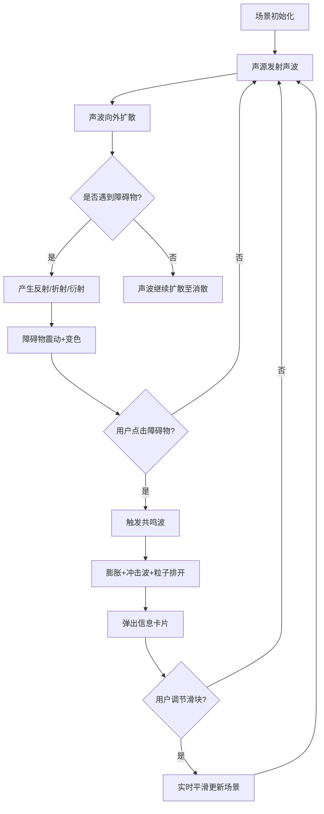

# 音浪幻境 - 产品需求文档

## 1. 产品概述
「音浪幻境」是一款基于 WebGL 的 3D 交互可视化项目，模拟声音在三维空间中以波浪和粒子形式传播的沉浸式场景。用户可自由旋转视角、缩放场景，观察声波与漂浮几何体之间的物理交互。
- 目标用户：创意开发者、数字艺术爱好者、音频可视化研究者
- 核心价值：提供沉浸式的声波可视化体验，展现声波反射、折射、衍射等物理现象

## 2. 核心功能

### 2.1 用户角色
无需角色区分，所有访客均可完整体验所有功能。

### 2.2 功能模块
1. **3D 场景页面**：声波传播可视化、障碍物交互、粒子系统、控制面板

### 2.3 页面详情
| 页面名称 | 模块名称 | 功能描述 |
|----------|----------|----------|
| 3D 场景页面 | 中心声源 | 从场景中心持续发射彩色同心圆环声波，声波以半透明发光材质向外扩散 |
| 3D 场景页面 | 声波传播 | 声波以同心圆环形式向外扩散，带有粒子尾迹效果 |
| 3D 场景页面 | 障碍物系统 | 漂浮的低多边形几何体（立方体、球体、环面），颜色在粉/蓝/紫之间渐变 |
| 3D 场景页面 | 声波交互 | 声波遇到障碍物产生反射、折射和衍射效果，障碍物随声波触发轻微震动并改变颜色 |
| 3D 场景页面 | 共鸣波 | 点击障碍物触发急速膨胀 + 彩色冲击波放射，周围粒子被排开 |
| 3D 场景页面 | 信息卡片 | 半透明毛玻璃卡片，显示障碍物的频率、波长和反射次数 |
| 3D 场景页面 | 控制面板 | 右下角半透明毛玻璃面板，包含声波速度、粒子密度、反射强度三个滑块 |
| 3D 场景页面 | 粒子系统 | 模拟声尘和光点悬浮的粒子效果 |
| 3D 场景页面 | 视角控制 | 鼠标拖拽旋转视角、滚轮缩放 |

## 3. 核心流程
1. 用户进入场景，自动从中心声源开始发射彩色声波同心圆环
2. 声波向外扩散，带有粒子尾迹
3. 声波碰到障碍物后产生反射、折射、衍射效果
4. 障碍物受声波影响产生震动和颜色变化
5. 用户点击障碍物，触发共鸣波特效并弹出信息卡片
6. 用户通过控制面板调节参数，场景实时平滑变化

## 4. 用户界面设计

### 4.1 设计风格
- **主色调**：深灰(#0a0a1a)到暗蓝(#0a1628)渐变背景
- **强调色**：霓虹粉(#ff2d95)、霓虹蓝(#00d4ff)、霓虹紫(#a855f7)
- **按钮/控件风格**：半透明毛玻璃(glassmorphism)，圆角，backdrop-filter: blur
- **字体**：Orbitron (标题/数据) + Rajdhani (正文/标签)，赛博朋克科技感
- **布局**：全屏 3D 场景，右下角浮动控制面板，点击障碍物弹出信息卡片
- **图标风格**：线性霓虹风格

### 4.2 页面设计概述
| 页面名称 | 模块名称 | UI 元素 |
|----------|----------|---------|
| 3D 场景页面 | 声波 | 半透明发光圆环、粒子尾迹、霓虹色渐变 |
| 3D 场景页面 | 障碍物 | 低多边形几何体、粉蓝紫渐变色、轻微震动动画 |
| 3D 场景页面 | 共鸣波 | 急速膨胀动画、彩色冲击波环、粒子排开效果 |
| 3D 场景页面 | 信息卡片 | 毛玻璃背景、霓虹边框、频率/波长/反射次数数据 |
| 3D 场景页面 | 控制面板 | 毛玻璃面板、三个霓虹滑块、弹性缓动动画、标签+数值 |

### 4.3 响应式设计
- 桌面优先设计，3D 场景全屏自适应
- 控制面板在小屏幕上可折叠
- 触摸设备支持拖拽和双指缩放

### 4.4 3D 场景指导
- **环境/氛围**：深色赛博朋克空间，深灰到暗蓝渐变，无环境贴图，依赖灯光和自发光
- **灯光设置**：中心点光源(霓虹色调) + 微弱环境光 + 障碍物自发光
- **相机设置**：透视相机，初始距离适中，OrbitControls 支持拖拽旋转和滚轮缩放
- **构图与焦点**：中心声源为焦点，障碍物散布在声波扩散路径上
- **交互与动画**：声波持续扩散动画、障碍物震动、共鸣波膨胀冲击、粒子流动
- **后处理效果**：Bloom 辉光效果增强霓虹发光感
- **性能预算**：保持 60fps，粒子数量动态调整，使用 instanced mesh 优化
